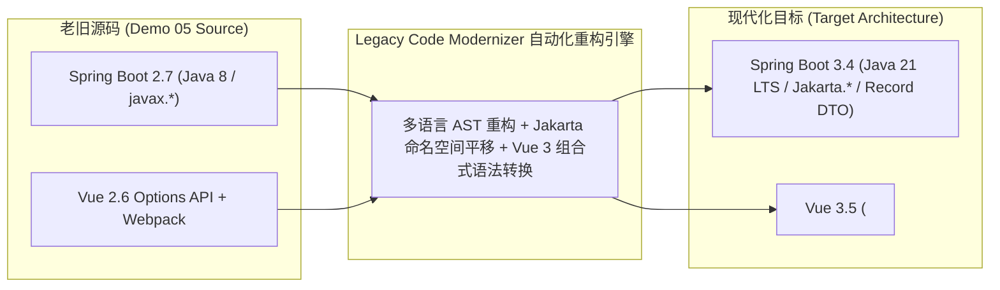

# 🏢 Demo 05: Spring Boot 2.7 & Vue 2 Fullstack Enterprise WMS

## 1. 业务场景说明
这是一个在当今企业界存量极大、极具现代化重构价值的**经典前后端分离单体仓库管理系统（WMS - Warehouse Management System）**。系统涵盖库位管理、SKU 进销存库存流水、低库存阈值预警、批量增删改查及 RESTful API 交互。

## 2. 核心技术栈与技术债特征

### ☕ 后端技术栈 (Spring Boot 2.7 / Java 8)
- **依赖配置**：`spring-boot-starter-parent: 2.7.18`
- **JDK 版本**：Java 8（仍在使用老旧的可变 POJO、`java.util.Date` 与传统的 Stream 收集器）
- **Servlet 与持久化规范**：强绑定 `javax.servlet.*`、`javax.persistence.*` 与 `javax.validation.*`（阻碍升级至 Spring Boot 3+ 与 Tomcat 10+）
- **跨域与接口模型**：类级别 `@CrossOrigin` 硬编码，缺少全链路强类型契约与统一异常响应封装

### 🌐 前端技术栈 (Vue 2.6 / Webpack)
- **框架版本**：Vue 2.6.14 + Vue CLI 4 (Webpack 4)
- **组件范式**：Options API（`data`, `methods`, `mounted` 配置式，难以做复杂业务逻辑拆分与复用）
- **接口请求**：老旧 Axios 实例与传统回调 Interceptor
- **缺少类型安全**：纯 JavaScript 编写，无 TypeScript 校验与代码自动补全

---

## 3. 现代化全仓重构目标 (Target Blueprint)

### 现代化交付要素：
1. **后端升级**：
   - 全量将 `javax.*` 平滑迁移至 `jakarta.*`（JPA, Servlet, Validation）；
   - 将 `InventoryDTO.java` 升级为 Java 21 `record InventoryDTO(...)`；
   - 依赖清单平滑升级至 `Spring Boot 3.4.x` 并兼容 Java 21 LTS 虚拟线程（Virtual Threads）；
   - 自动生成覆盖率达 95% 以上的 MockMvc / JUnit 5 自动化集成测试套件。
2. **前端升级**：
   - 将 `InventoryDashboard.vue` 升级为 Vue 3.5 `<script setup lang="ts">` 组合式 API；
   - 构建体系升级为 Vite 6，冷启动速度提升 50 倍；
   - 自动生成 Vitest + `@vue/test-utils` 组件单元测试。
