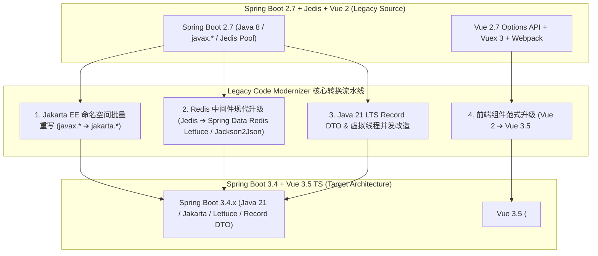

# 💎 Demo 05: Spring Boot 2.7 & Vue 2.7 Financial Core Payment & Refund Gateway (旗帜级核心全栈靶场)

## 1. 业务场景与价值定位
本靶场是 **Legacy Code Modernizer** 最核心的综合展示靶场，聚焦于银行与第三方支付等**高频资金往来（Money-Critical）的核心业务系统**。涵盖：
1. **订单创建与收银台支付**：支持账户钱包余额扣款、支付宝/微信渠道记账、基于 Redis 分布式锁（Jedis SETNX + Lua 原子解锁）防止高并发超卖与多扣款；
2. **幂等性与滑动窗口限流**：针对高并发支付接口，集成 Redis 令牌桶滑动窗口限流（5 req/s）与 `X-Idempotency-Token` 幂等防重拦截；
3. **退款争议仲裁与状态机流转**：支持多次部分退款（Partial Refund）与全额退款（Full Refund），具备退款上限防呆校验（已退金额累加不得超过订单总额）与审计日志回溯；
4. **账户钱包乐观锁扣款**：通过 JPA `@Version` 与 CAS 条件更新（`WHERE version = ? AND balance >= ?`）保证余额扣减的事务一致性；
5. **双向财务对账与审计台账**：记账流水记录 `before_balance`、`delta_amount` 与 `after_balance`，确保账实相符；
6. **自动化沙箱测试套件**：内置 `PaymentServiceIntegrationTest.java` 覆盖支付扣减、重复请求拦截、多次退款超限防呆断言。

---

## 2. 遗留技术栈与架构坏味道 (Antipatterns)

### ☕ 后端技术栈 (Spring Boot 2.7.18 / Java 8 / Jedis / MySQL)
- **过时的 Servlet 与持久化规范**：全量强绑定 `javax.servlet.*`、`javax.persistence.*`、`javax.validation.*`，阻碍升级至 Spring Boot 3+ 与 Tomcat 10+（Jakarta EE）；
- **老旧 Redis 驱动与序列化模型**：
  - 使用老旧的 `JedisPool` 配合手动连接获取与 `close()` 释放；
  - 手写原始 Lua 脚本字符串进行锁释放与滑动窗口限流计算；
  - 采用老旧且存在安全漏洞隐患的 `JdkSerializationRedisSerializer` 二进制序列化；
- **控制器与异常处理耦合**：硬编码 `@CrossOrigin(origins = "*")`，缺乏全局统一 REST 响应封装与 `@RestControllerAdvice` 异常总线；
- **POJO 可变对象**：大量 Java 8 冗长实体类与手写 Getter/Setter，缺乏 Java 21 Record 不可变数据契约。

### 🌐 前端技术栈 (Vue 2.7 / Vuex 3 / Webpack / Axios)
- **Options API 选项式架构**：`data`, `computed`, `methods`, `mounted` 配置对象式代码，随着支付业务复杂度增加难以拆分组合；
- **缺乏 TypeScript 类型约束**：纯 JavaScript 编写，订单状态字符串（`'CREATED'`, `'SUCCESS'`, `'REFUND_PARTIAL'`）缺乏编译期枚举校验；
- **Vuex 3 单例状态树**：缺乏模块解耦与强类型推导；
- **Webpack 4 慢速构建体系**。

---

## 3. 现代化全仓重构目标 (Target Modern Architecture)

---

## 4. 重点保留的生产级设计
在自动化现代化改造中，Agent 会精准保留并重构以下生产级设计：
1. **分布式锁与并发控制**：将手写 Jedis Lua 脚本重构为现代 Redisson 或 Spring Data Redis 声明式分布式锁；
2. **幂等性与防刷限流**：将内存/自定义拦截重构为优雅的注解式 `@Idempotent` 与 `@RateLimiter`；
3. **防呆设计与边界保护**：保留钱包余额非负下限、退款累计上限、订单状态机合法跃迁校验；
4. **沙箱单测绿灯**：确保 `PaymentServiceIntegrationTest` 在升级前后 100% 通过！
