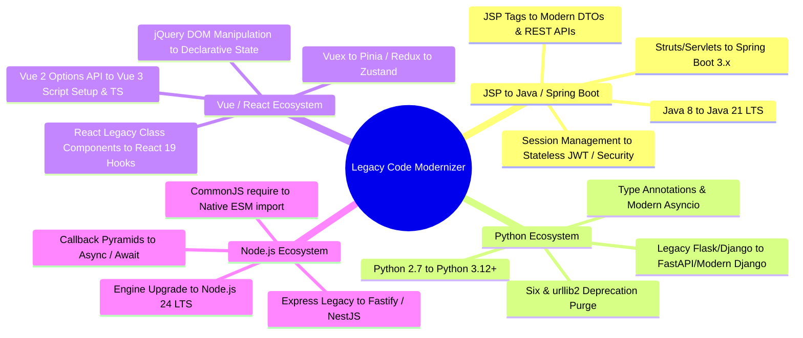
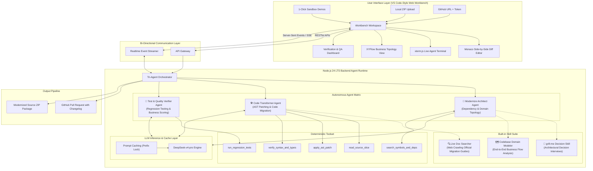
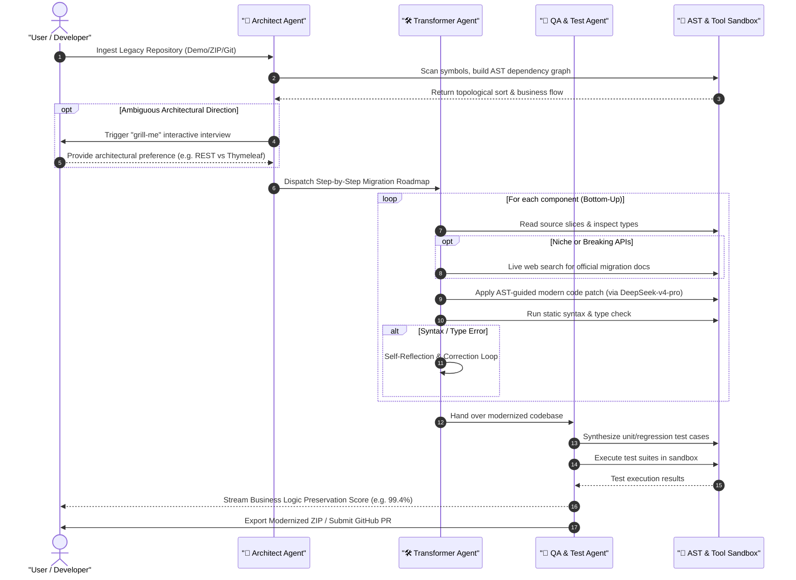
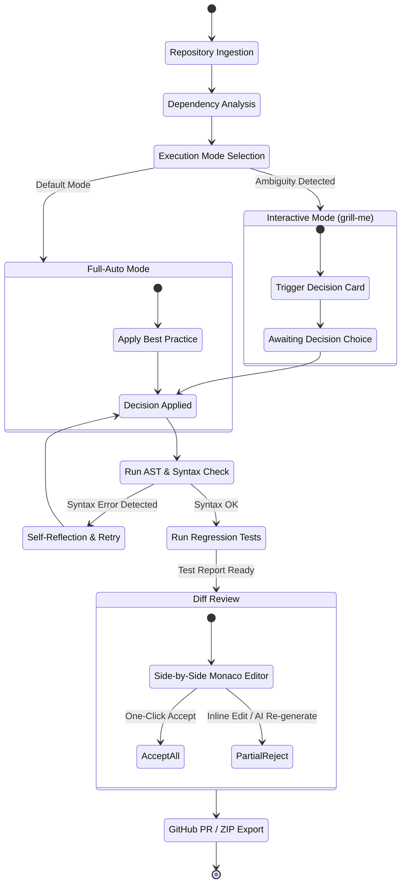

# 🚀 Legacy Code Modernizer

<p align="center">
  <strong>Autonomous AI-Powered Legacy System Modernization & Refactoring Workbench</strong><br>
  <em>Preserving Core Business Logic with Zero Disruption across Legacy Ecosystems</em>
</p>

<p align="center">
  <a href="./README.md"><strong>English</strong></a> | <a href="./README_zh.md"><strong>简体中文</strong></a>
</p>

<p align="center">
  
  
  
  
  
  
</p>

---

## 🌟 Agent Opening Pitch & Core Mission

> **"Dedicated to enterprise-grade intelligent legacy system modernization. Deeply focusing on four core technical tracks: JSP ➔ Java/Spring Boot ecosystem migration, Python ecosystem upgrade, Vue/React modern stack evolution, and Node.js modernization. Powered by an autonomous Tri-Agent engineering team orchestrated by DeepSeek-v4-pro, AST-level precision transformations, live official documentation retrieval, and regression verification to achieve zero-disruption, whole-repository modernization."**

---

## 💡 Overview & The Problem

Enterprise legacy codebases (e.g., monolithic JSP applications, Python 2 scripts, Vue 2 Options API components, legacy CommonJS callback pyramids) represent core business assets, yet they incur enormous technical debt and security vulnerabilities:
1. **Manual Refactoring is Prohibitive**: Cross-version multi-file migrations take weeks or months of senior developer effort.
2. **Implicit Business Logic Fragility**: Undocumented edge cases and implicit dependencies often break during manual rewrites.
3. **Naive LLM Limitations**: Simple single-pass prompting lacks global dependency awareness, frequently hallucinates deprecated APIs, and fails to handle whole-repository context.

**Legacy Code Modernizer** solves these challenges by combining **Deterministic AST Tools**, **Autonomous ReAct Agents powered by DeepSeek-v4-pro (inspired by Claude Code and grok-build)**, and **Regression Testing Sandboxes** within an intuitive VS Code-inspired Web IDE.

---

## 🎯 Supported Modernization Tracks



| Modernization Track | Legacy Source Stack | Target Modern Stack | Core Transformation & Business Guardrails |
| :--- | :--- | :--- | :--- |
| **JSP ➔ Java/Spring Boot** | JSP Custom Tags, Struts, Servlets, Java 8 | Spring Boot 3.x, REST APIs, Modern Web Frontend, Java 21 | Form tags to DTO bindings, Session to Token auth, SQL injection cleanup |
| **Python Ecosystem** | Python 2.7, Old Flask/Django, `urllib2`, `six` | Python 3.12+, FastAPI, Type Hints (`typing`), `asyncio` | String/bytes stream refactoring, deprecated standard lib substitutions |
| **Vue / React Ecosystem** | Vue 2 Options API, React Class Components, jQuery | Vue 3 `<script setup>`, React 19 Hooks + TypeScript + Tailwind | Reactive state mappings, lifecycle hooks translation, clean composables |
| **Node.js Ecosystem** | CommonJS (`require`), Callback Hell, Express 3/4 | Native ESM (`import`), Async/Await, Fastify, Node 24 LTS | Static module resolution, Promise orchestration, memory leak diagnostics |

---

## 🏛️ System Architecture



---

## 🤖 Tri-Agent Engineering Team & Built-in Skills



1. **🧠 Modernize Architect Agent**: Performs static analysis, resolves cross-file import dependencies, orders files topologically (bottom-up), and maps end-to-end business flows. Houses the built-in **`grill-me` skill** to interview users on critical architectural branches. (DeepSeek-v4-pro Reasoning Mode).
2. **🛠️ Code Transformer Agent**: Executes surgical code modifications file-by-file. Armed with **`Live Web Search`** to query official documentation on breaking changes, backed by an **AST Self-Reflection Loop** to fix compiler/syntax errors immediately. (DeepSeek-v4-pro Temperature 0.0).
3. **🧪 Test & Quality Verifier Agent**: Generates comprehensive modern test suites (Vitest, JUnit 5, PyTest) reflecting historical assertions, executing tests in sandboxes to measure and certify the **Business Logic Preservation Score**.

---

## 🖥️ VS Code-Style Developer Workbench

Crafted according to anti-slop, developer-first engineering aesthetics:

```
+---+------------------+-----------------------------------------------+--------------------+
| A | Sidebar          | Editor Area                                   | Secondary Sidebar  |
| C | • Dual File Tree | • Monaco Side-by-Side Diff View               | (Agent Command)    |
| T |   (Legacy vs Mod)| • Line-by-Line AI Rationale Annotations       | • Tri-Agent Chat   |
| I | • Business Flow  | • Multi-Tab Code Editing                      | • Live Tool Calls  |
| V |   Topology Map   | • Realtime In-Line Human Review & Rejection   | • Live Web Search  |
| I +------------------+-----------------------------------------------+   Doc Cards        |
| T | Bottom Panel                                                     +--------------------+
| Y | • xterm.js Realtime Agent Trace  • Vitest/JUnit Test Dashboard  • Problems & Lints    |
|   +---------------------------------------------------------------------------------------+
|   | Status Bar: Progress: 85% | Fidelity Score: 99.2% | Node 24 | [Submit PR] [Export ZIP] |
+---+---------------------------------------------------------------------------------------+
```

---

## ⚡ Execution Modes: Full-Auto & Human-in-the-Loop



---

## 🚀 Quick Start (Development)

### Prerequisites
- **Node.js**: `24.x LTS`
- **Package Manager**: `pnpm` (recommended) or `npm`
- **LLM API Key**: `DEEPSEEK_API_KEY` (DeepSeek-v4-pro)

### 1. Clone Repository
```bash
git clone https://github.com/your-org/legacy-code-modernizer.git
cd legacy-code-modernizer
```

### 2. Backend Setup
```bash
cd Backend
pnpm install
pnpm dev
# Server running at http://localhost:4000
```

### 3. Frontend Setup
```bash
cd ../Frontend
pnpm install
pnpm dev
# Workbench accessible at http://localhost:5173
```

---

## 📚 Technical Documentation Index

For in-depth architectural specifications and implementation protocols, please explore the `/docs` directory:

- 📐 [**System Architecture & Runtime Specification**](./docs/architecture.md) ([中文版](./docs/zh/architecture.md)): Full breakdown of Node 24 runtime, AST toolchains, and sandbox isolation.
- 🤖 [**Agent Orchestration & Protocol Specification**](./docs/agent-orchestration.md) ([中文版](./docs/zh/agent-orchestration.md)): DeepSeek-v4-pro inference matrix, ReAct loops, SSE protocols, and `grill-me` skill.
- 🗺️ [**Modernization Tracks & Migration Matrix**](./docs/migration-matrix.md) ([中文版](./docs/zh/migration-matrix.md)): In-depth conversion rules for JSP, Python, Vue/React, and Node ecosystems.
- 🧪 [**Benchmark Test Suites & Quantifiable Metrics**](./docs/benchmark-test-suites.md) ([中文版](./docs/zh/benchmark-test-suites.md)): Ground-truth test datasets, code contracts, and deterministic preservation scoring formulas.
- 🌐 [**Deployment & Tunneling Specification**](./docs/deployment-and-tunneling.md) ([中文版](./docs/zh/deployment-and-tunneling.md)): Cloudflare Tunnel, Ngrok setup, and keep-alive configuration for hackathon presentations.

---

## 📄 License

This project is licensed under the [MIT License](./LICENSE).