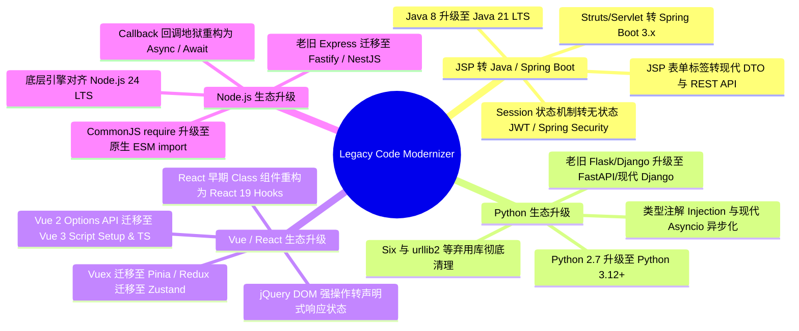
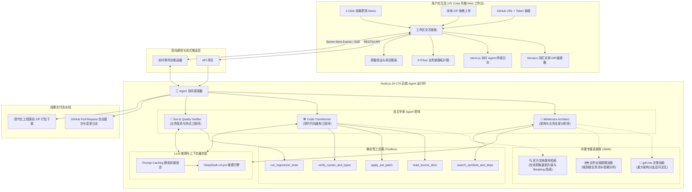
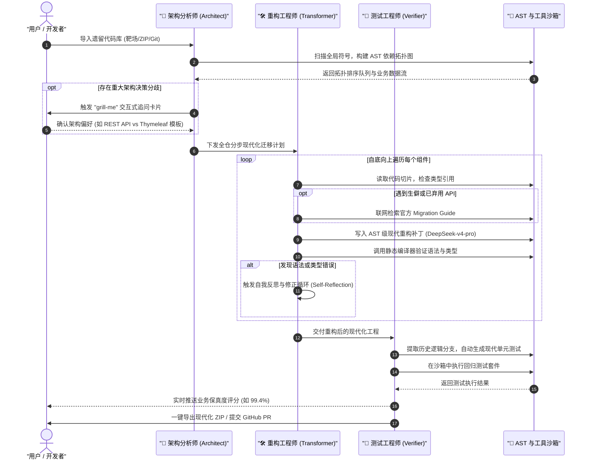
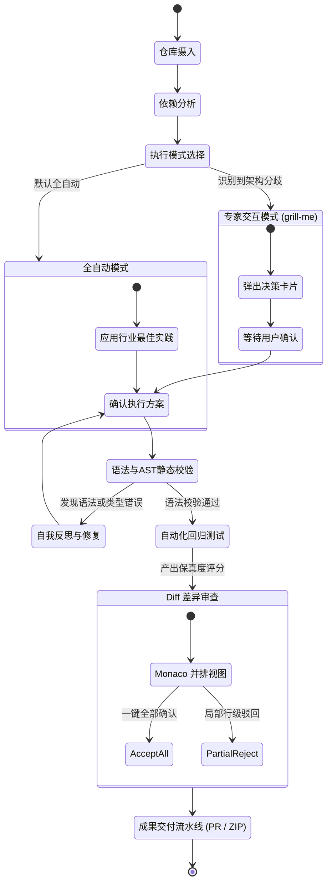

# 🚀 Legacy Code Modernizer (遗留系统智能现代化迁移与重构工作台)

<p align="center">
  <strong>自主驱动的企业级遗留系统现代化重构与智能迁移工作台</strong><br>
  <em>确保核心业务逻辑零破坏，实现跨生态全仓自动化升级</em>
</p>

<p align="center">
  <a href="./README.md"><strong>English</strong></a> | <a href="./README_zh.md"><strong>简体中文</strong></a>
</p>

<p align="center">
  
  
  
  
  
  
</p>

---

## 🌟 Agent 开场白与核心定位

> **“专注企业级遗留系统智能现代化改造，深度聚焦 JSP ➔ Java/Spring Boot 生态升级、Python 生态升级、Vue/React 生态升级与 Node 生态升级四大技术赛道。基于 DeepSeek-v4-pro 大模型底座，驱动三 Agent 专家团队、AST 级精准代码转换、官方文档实时联网检索与回归测试沙箱验证，实现业务逻辑零破坏的自动化全仓重构。”**

---

## 💡 痛点与核心价值

企业老旧代码库（如 JSP 单体模板、Python 2 脚本、Vue 2 Options 组件、Node CommonJS 回调地狱）承载着核心业务，却伴随着沉重的技术债与安全隐患：
1. **人工重构成本极高**：跨版本、多文件的全仓迁移通常耗费资深工程师数周乃至数月的时间；
2. **隐式业务逻辑脆弱**：历史边缘场景（Edge Cases）缺少文档与完备测试，人工重写极易漏掉隐式依赖而引发线上事故；
3. **传统 AI 辅助的局限性**：简单的单次 Prompt 或 Copilot 补全无法理解全仓依赖拓扑，极易幻觉出已弃用的 API，且无法处理大仓跨文件上下文。

**Legacy Code Modernizer** 选用 **DeepSeek-v4-pro** 作为全栈推理底座，结合 **Prompt Caching 前缀锁定**、**确定性 AST 工具链** 与 **轻量测试验证沙箱**，提供开箱即用的专业 VS Code 风格 Web 工作台。

---

## 🎯 四大核心现代化赛道



| 现代化赛道 | 典型源技术栈 (Legacy) | 目标现代化栈 (Target) | 核心转换能力与业务保真保障 |
| :--- | :--- | :--- | :--- |
| **JSP ➔ Java/Spring Boot** | JSP 标签、Struts、Servlet、Java 8 | Spring Boot 3.x、RESTful API、现代前端组件、Java 21 | 表单标签转现代 DTO、Session 机制转 Token 鉴权、SQL 注入与弃用 API 清理 |
| **Python 生态升级** | Python 2.7、老旧 Flask/Django、`urllib2`、`six` | Python 3.12+、FastAPI、类型注解 (`typing`)、`asyncio` | 字符串/字节流转换、弃用标准库平滑替换、异步并发重构 |
| **Vue / React 生态升级** | Vue 2 Options API、React Class 组件、jQuery | Vue 3 `<script setup>`、React 19 Hooks + TypeScript + Tailwind | 响应式语法精准迁移、生命周期钩子对齐、状态管理平滑升级 |
| **Node.js 生态升级** | CommonJS (`require`)、Callback 地狱、Express 3/4 | 原生 ESM (`import`)、Async/Await、Fastify、Node 24 LTS | 静态模块解析重构、Promise 流程编排、内存泄漏排查 |

---

## 🏛️ 系统架构



---

## 🤖 三 Agent 专家团队与技能协同



---

## 🖥️ VS Code 风格开发者工作台

遵循低视觉干扰、高信息密度的专业工程化设计：

```
+---+------------------+-----------------------------------------------+--------------------+
| A | 侧边栏 (Sidebar) | 主编辑区 (Editor Area)                        | 辅助栏 (Agent Hub) |
| C | • 双工程文件对比树 | • Monaco Side-by-Side Diff 差异高亮视图       | • 3 个 Agent 对话/ |
| T | • 业务链路拓扑图 | • 行级重构原因批注 (AI Rationale)             |   实时思考与决策   |
| I | • 迁移任务清单   | • 顶部多标签管理                              | • 联网搜索文档卡片 |
| V +------------------+-----------------------------------------------+   • grill-me 决策  |
| I | 底部面板 (Bottom Panel)                                          +--------------------+
| T | • Xterm.js 实时 Agent 终端日志  • 单元测试与保真度看板 (Vitest/JUnit)  • 静态诊断 (Problems) |
| Y +---------------------------------------------------------------------------------------+
|   | 底部状态栏 (Status Bar): 迁移进度 85% | 业务保真度: 99.2% | Node 24 | [一键提交 PR] [下载 ZIP] |
+---+---------------------------------------------------------------------------------------+
```

---

## ⚡ 执行模式：一键全自动 vs 人机协同介入 (HITL)



---

## 🚀 本地开发快速上手

### 环境要求
- **Node.js**：`24.x LTS`
- **包管理器**：`pnpm`（推荐）或 `npm`
- **大模型 API Key**：`DEEPSEEK_API_KEY` (DeepSeek-v4-pro)

### 1. 克隆代码仓库
```bash
git clone https://github.com/your-org/legacy-code-modernizer.git
cd legacy-code-modernizer
```

### 2. 后端服务启动
```bash
cd Backend
pnpm install
pnpm dev
# 后端服务运行于 http://localhost:4000
```

### 3. 前端工作台启动
```bash
cd ../Frontend
pnpm install
pnpm dev
# 浏览器访问 http://localhost:5173 即可进入工作台
```

---

## 📚 技术规范文档索引

详细的底层设计细节、通信协议与基准测试集请查阅 `/docs` 目录：

- 📐 [**系统架构与运行时规范**](./docs/zh/architecture.md) ([English](./docs/architecture.md))：Node.js 24 运行时架构、AST 解析器工具链与沙箱隔离时序。
- 🤖 [**Agent 协同机制与协议规范**](./docs/zh/agent-orchestration.md) ([English](./docs/agent-orchestration.md))：DeepSeek-v4-pro 推理矩阵、ReAct 状态机、SSE 流式事件协议与 `grill-me` 技能交互。
- 🗺️ [**现代化赛道与转换矩阵**](./docs/zh/migration-matrix.md) ([English](./docs/migration-matrix.md))：四大赛道 AST 转换规则、弃用 API 映射与业务保真守卫。
- 🧪 [**基准测试集与量化指标规范**](./docs/zh/benchmark-test-suites.md) ([English](./docs/benchmark-test-suites.md))：四大赛道端到端基准源码、测试断言与数学保真度评分计算公式。

---

## 📄 开源许可证

本项目基于 [MIT License](./LICENSE) 开源协议。
