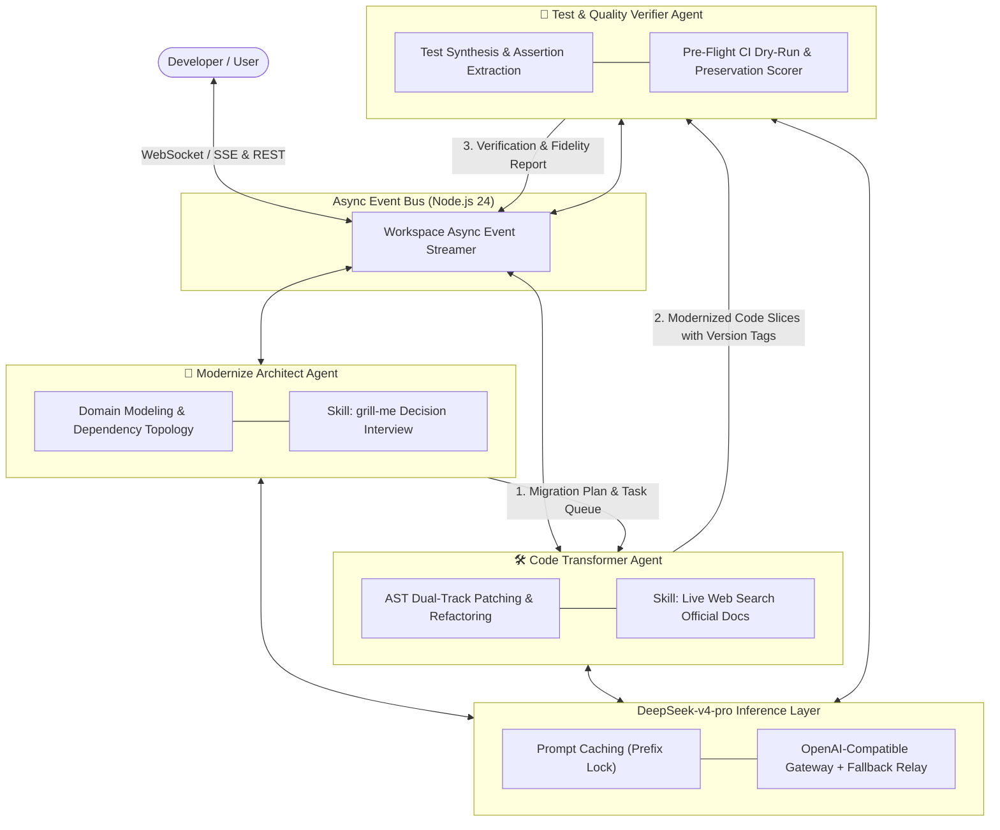
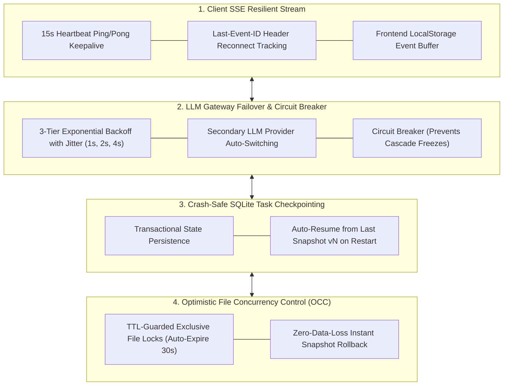
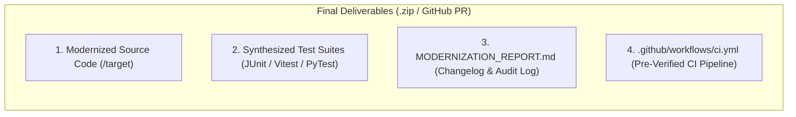

# 🤖 Agent Orchestration & Protocol Specification

<p align="center">
  <a href="./agent-orchestration.md">English Version</a> | <a href="./zh/agent-orchestration.md">简体中文版</a>
</p>

---

## 1. Tri-Agent Team & Division of Responsibilities

Inspired by modern autonomous coding agents (`Claude Code`, `grok-build`), the modernization engine coordinates three specialized agents operating in an asynchronous ReAct (Reasoning + Acting) loop powered by **DeepSeek-v4-pro**.



---

## 2. ReAct Agent Lifecycle & State Machine

```mermaid
stateDiagram-v2
    [*] --> IDLE

    IDLE --> SCANNING: Ingestion Triggered
    state "Dependency Scanning" as SCANNING {
        [*] --> ParseASTSymbols
        ParseASTSymbols: Parse Global AST Symbols
        ParseASTSymbols --> ConstructDepGraph
        ConstructDepGraph: Construct Dependency Graph
        ConstructDepGraph --> DetectBranches
        DetectBranches: Detect Architectural Branches
    }

    SCANNING --> GRILL_ME_INTERVIEW: Major Decision Ambiguity Detected
    state "Decision Interview (grill-me)" as GRILL_ME_INTERVIEW {
        [*] --> EmitCard
        EmitCard: Emit Multi-Option Tradeoff Card
        EmitCard --> AwaitChoice
        AwaitChoice: Await User Selection
        AwaitChoice --> FreezePlan
        FreezePlan: Freeze Modernization Roadmap
    }

    SCANNING --> DISPATCH_PLAN: Clean Dependency Graph Ready
    GRILL_ME_INTERVIEW --> DISPATCH_PLAN

    state "Plan Dispatch" as DISPATCH_PLAN {
        [*] --> TopoSort
        TopoSort: Bottom-Up Topological Sort
        TopoSort --> QueueTasks
        QueueTasks: Queue Migration Tasks in SQLite
    }

    DISPATCH_PLAN --> TRANSFORMING

    state "Code Transformation" as TRANSFORMING {
        [*] --> ReadSlice
        ReadSlice: Read Source Code Slices
        ReadSlice --> FetchDoc
        FetchDoc: Live Web Search Official Docs
        FetchDoc --> AcquireLock
        AcquireLock: Acquire File Lock & Record vN Snapshot
        AcquireLock --> GenPatch
        GenPatch: Generate Dual-Track Patch via DeepSeek-v4-pro
        GenPatch --> ApplyPatch
        ApplyPatch: Apply AST Patch (Whole-File or Search/Replace)
        ApplyPatch --> VerifySyntax
        VerifySyntax: Verify Syntax & Type Integrity
        VerifySyntax --> FixSyntax: Error Encountered
        FixSyntax: Auto Rollback to vN & Re-attempt
        FixSyntax --> ApplyPatch
        VerifySyntax --> FinalizeFile: Syntax Passed
        FinalizeFile: Commit vN+1 Snapshot & Release Lock
    }

    TRANSFORMING --> VERIFYING: All Files Modernized

    state "Testing & Verification" as VERIFYING {
        [*] --> GenTests
        GenTests: Synthesize Regression Tests
        GenTests --> RunSandbox
        RunSandbox: Execute Sandbox Tests
        RunSandbox --> CalcScore
        CalcScore: Compute Fidelity Score
    }

    VERIFYING --> CI_DRY_RUN: Fidelity Threshold Met

    state "Pre-Flight CI Dry-Run" as CI_DRY_RUN {
        [*] --> CheckPathCasing
        CheckPathCasing: Linux Case-Sensitivity Audit
        CheckPathCasing --> RunTypecheck
        RunTypecheck: Strict Type Check (tsc / mypy)
        RunTypecheck --> RunLinter
        RunLinter: Linting & Lockfile Audit
        RunLinter --> FixCIError: CI Linter/Type Failure
        FixCIError: Trigger Transformer Self-Healing
        FixCIError --> RunTypecheck
        RunLinter --> CIPassed: All Checks Green
        CIPassed: CI Dry-Run Certified
    }

    CI_DRY_RUN --> READY_FOR_REVIEW

    state "Diff Review" as READY_FOR_REVIEW {
        [*] --> StreamDiff
        StreamDiff: Stream Versioned Diff to Monaco Editor
        StreamDiff --> HumanReview
        HumanReview: Line-by-Line Review & Snapshot Stepping
        HumanReview --> GeneratePR: Accept All
        HumanReview --> RollbackStep: Rollback to vN
        RollbackStep --> RePromptTransformer
        RePromptTransformer: Re-Prompt Transformer Agent
    }

    RePromptTransformer --> TRANSFORMING
    GeneratePR --> [*]
```



---

## 3. The `grill-me` Architectural Decision Skill with Pros/Cons Tradeoff Matrix

When processing legacy systems, significant architectural forks exist where multiple modernization paths are viable. The **`grill-me`** skill prevents assumption errors by presenting developers with a **comprehensive comparative matrix detailing pros, cons, long-term maintenance costs, and architectural tradeoffs** for each option:

### 3.1 Architectural Tradeoff Examples

#### Case 1: JSP Monolith Modernization Fork
| Candidate Option | Recommendation | Pros (Advantages) | Cons (Disadvantages) | Ideal Use Case |
| :--- | :---: | :--- | :--- | :--- |
| **Option A: Spring Boot 3 REST + Vue 3 SPA** | **(Recommended)** | • Complete frontend/backend decoupling<br>• High UI interactivity & modern component ecosystem<br>• Scalable for future mobile/third-party API consumers | • Requires separate frontend build step<br>• Stateless JWT authentication rewrite required | Long-term enterprise apps requiring high scalability & modern UX |
| **Option B: Spring Boot 3 + Thymeleaf Template** | Alternative | • Single-repo monolithic build<br>• Preserves server-side session mental model<br>• Fast zero-build deployment | • Coupled server rendering<br>• Limited dynamic UI interactivity<br>• Harder to migrate to mobile clients | Internal admin tools or low-maintenance utility services |
| **Option C: Quarkus 3 + React 19 SPA** | Alternative | • Ultra-low memory & fast GraalVM native boot<br>• Modern reactive backend | • Steeper learning curve for traditional Spring developers | Cloud-native serverless or microservice deployments |

#### Case 2: Vue 2 State Management Migration Fork
| Candidate Option | Recommendation | Pros (Advantages) | Cons (Disadvantages) | Ideal Use Case |
| :--- | :---: | :--- | :--- | :--- |
| **Option A: Pinia Official Store** | **(Recommended)** | • First-class TypeScript autocompletion<br>• Vue DevTools time-travel debugging<br>• Vue 3 official standard | • Slight boilerplate for simple local states | Complex applications with cross-component global state |
| **Option B: Vue 3 Composition Composables** | Alternative | • Zero extra library dependencies<br>• Extremely lightweight & tree-shakeable | • Lacks built-in devtools inspection<br>• Requires manual singleton state design | Small to medium projects with isolated state slices |

---

## 4. End-to-End Resilience & Fault-Tolerance Architecture

To handle unstable network connections, client disconnects, LLM rate limits, and unexpected backend process restarts, the system incorporates a **4-Layer Fault-Tolerance Engine**:



### 4.1 SSE Connection Resiliency & Replay Protocol
- **Heartbeat Keepalive**: Fastify pushes `:ping` comments every 15 seconds to prevent browser/proxy connection timeouts.
- **`Last-Event-ID` Event Replay**: When a developer's browser disconnects (e.g. Wi-Fi switch, laptop lid closed) and reconnects, the client sends `Last-Event-ID: <last_seq>`. The backend replays all unreceived events directly from SQLite, guaranteeing **zero lost diff chunks or terminal logs**.

### 4.2 LLM Gateway Fault-Tolerance
- **Exponential Backoff with Jitter**: Automatically retries 429 Rate Limits and 5xx Gateway errors with randomized jitter.
- **Failover Provider Relay**: If primary DeepSeek-v4-pro endpoint fails for 3 consecutive attempts, traffic is seamlessly routed to the configured backup provider.

### 4.3 Crash-Safe Workspace Auto-Resume
- Every file migration and AST transformation step is recorded in SQLite.
- If the backend crashes or the machine is restarted mid-migration, upon reboot the server scans for `status = 'in_progress'` workspaces, loads the last valid snapshot `vN`, and **automatically resumes the remaining task queue without re-running completed files**.

---

## 5. Pre-Flight CI Dry-Run & Eliminating AI CI Failures

| Root Cause of CI Failure | Real-World Manifestation | Modernizer Deterministic Defense |
| :--- | :--- | :--- |
| **1. File Path Case-Sensitivity** | Windows is case-insensitive (`import './user'` matches `User.ts`), but Linux CI (`ubuntu-latest`) crashes with `Module not found`. | **AST Path Normalizer**: Audits all relative import paths against exact disk casing before submission. |
| **2. Dependency Version Drift** | CI `npm install` picks up fresh breaking minor versions not present during generation. | **Deterministic Lockfile Generator**: Generates pinned `package-lock.json` / `pnpm-lock.yaml` with frozen versions. |
| **3. Strict Linter / Typecheck Errors** | CI enforces `tsc --noEmit` and `eslint --max-warnings=0`; raw LLMs often emit implicit `any` or unused imports. | **Local Typecheck Dry-Run**: Runs `tsc --noEmit` in sandbox; automatically re-prompts Transformer Agent on errors. |
| **4. Flaky Async Test Timers** | Tests relying on arbitrary `sleep(500)` fail on constrained CI CPU cores. | **Deterministic Test Harness**: Uses Vitest `vi.waitFor` and MockMvc asynchronous latch barriers. |

---

## 6. Full-Asset Deliverable Pipeline



---

## 7. SSE (Server-Sent Events) Stream Protocol

### Event Payload Schema

```typescript
export type ModernizerSSEEvent =
  | {
      type: "agent_thought";
      agent: "architect" | "transformer" | "verifier";
      step: number;
      thought: string;
      timestamp: number;
    }
  | {
      type: "tool_call";
      agent: "architect" | "transformer" | "verifier";
      toolName: string;
      parameters: Record<string, unknown>;
      timestamp: number;
    }
  | {
      type: "tool_result";
      toolName: string;
      output: string;
      status: "success" | "error";
      timestamp: number;
    }
  | {
      type: "file_diff_chunk";
      filePath: string;
      status: "in_progress" | "completed";
      patchType: "whole_file" | "search_replace";
      fileVersion: number;
      previousVersion: number;
      rollbackSupported: boolean;
      originalContent: string;
      modifiedContent: string;
      rationale: string;
      timestamp: number;
    }
  | {
      type: "file_lock_status";
      filePath: string;
      state: "acquired" | "waiting" | "released";
      heldByAgent: "transformer" | "verifier";
      timestamp: number;
    }
  | {
      type: "ci_dry_run_progress";
      stepName: "case_sensitivity" | "typecheck" | "lint" | "test";
      status: "running" | "passed" | "failed";
      errorLogs?: string;
      timestamp: number;
    }
  | {
      type: "grill_me_question";
      questionId: string;
      title: string;
      context: string;
      options: Array<{
        id: string;
        label: string;
        recommended?: boolean;
        description: string;
        pros: string[];           // ✅ Explicit Pros
        cons: string[];           // ✅ Explicit Cons
        tradeoffs: string;        // ✅ Comparative Tradeoff summary
      }>;
    }
  | {
      type: "test_suite_result";
      totalTests: number;
      passed: number;
      failed: number;
      preservationScore: number;
      testCases: Array<{
        name: string;
        status: "pass" | "fail";
        durationMs: number;
        assertion: string;
      }>;
    };
```
