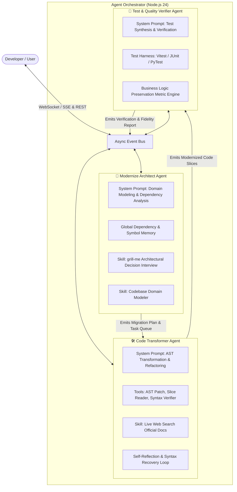

# 🤖 Agent Orchestration & Protocol Specification

<p align="center">
  <a href="./agent-orchestration.md">English Version</a> | <a href="./zh/agent-orchestration.md">简体中文版</a>
</p>

---

## 1. Tri-Agent Team & Division of Responsibilities

Inspired by modern autonomous coding agents (`Claude Code`, `grok-build`), the modernization engine coordinates three specialized agents operating in an asynchronous ReAct (Reasoning + Acting) loop.



---

## 2. ReAct Agent Lifecycle & State Machine

```mermaid
stateDiagram-v2
    [*] --> IDLE

    IDLE --> SCANNING: Ingestion Triggered
    state "Dependency Scanning" as SCANNING {
        [*] --> ParseASTSymbols
        ParseASTSymbols: Parse Global AST Symbols
        ParseASTSymbols --> ConstructDepGraph
        ConstructDepGraph: Construct Dependency Graph
        ConstructDepGraph --> DetectBranches
        DetectBranches: Detect Architectural Branches
    }

    SCANNING --> GRILL_ME_INTERVIEW: Major Decision Ambiguity Detected
    state "Decision Interview (grill-me)" as GRILL_ME_INTERVIEW {
        [*] --> EmitCard
        EmitCard: Emit Structured Decision Card
        EmitCard --> AwaitChoice
        AwaitChoice: Await User Selection
        AwaitChoice --> FreezePlan
        FreezePlan: Freeze Modernization Roadmap
    }

    SCANNING --> DISPATCH_PLAN: Clean Dependency Graph Ready
    GRILL_ME_INTERVIEW --> DISPATCH_PLAN

    state "Plan Dispatch" as DISPATCH_PLAN {
        [*] --> TopoSort
        TopoSort: Bottom-Up Topological Sort
        TopoSort --> QueueTasks
        QueueTasks: Queue Migration Tasks
    }

    DISPATCH_PLAN --> TRANSFORMING

    state "Code Transformation" as TRANSFORMING {
        [*] --> ReadSlice
        ReadSlice: Read Source Code Slices
        ReadSlice --> FetchDoc
        FetchDoc: Live Web Search Official Docs
        FetchDoc --> GenPatch
        GenPatch: Generate Modernized Code
        GenPatch --> ApplyPatch
        ApplyPatch: Apply AST Code Patch
        ApplyPatch --> VerifySyntax
        VerifySyntax: Verify Syntax & Type Integrity
        VerifySyntax --> FixSyntax: Error Encountered
        FixSyntax: Self-Reflection & Fix Loop
        FixSyntax --> ApplyPatch
        VerifySyntax --> FinalizeFile: Syntax Passed
        FinalizeFile: Finalize Modern File
    }

    TRANSFORMING --> VERIFYING: All Files Modernized

    state "Testing & Verification" as VERIFYING {
        [*] --> GenTests
        GenTests: Synthesize Regression Tests
        GenTests --> RunSandbox
        RunSandbox: Execute Sandbox Tests
        RunSandbox --> CalcScore
        CalcScore: Compute Fidelity Score
    }

    VERIFYING --> READY_FOR_REVIEW: Score Meets Threshold

    state "Diff Review" as READY_FOR_REVIEW {
        [*] --> StreamDiff
        StreamDiff: Stream Diff to Monaco Editor
        StreamDiff --> HumanReview
        HumanReview: Line-by-Line Human Review
        HumanReview --> GeneratePR: Accept All
        HumanReview --> RejectPatch: Partial Rejection
        RejectPatch: Re-Prompt Transformer Agent
    }

    RejectPatch --> TRANSFORMING
    GeneratePR --> [*]
```



---

## 3. The `grill-me` Architectural Decision Skill

When processing legacy systems, significant architectural forks exist where no single "correct" answer exists without business input. The **`grill-me`** skill prevents catastrophic assumption errors by engaging the user at critical junctures.

### Decision Triggers & Examples
1. **JSP Architecture Fork**:
   - *Question*: "Should this legacy JSP module be refactored into a decoupled **Spring Boot 3 REST API + Vue 3 Frontend**, or a consolidated **Spring Boot 3 + Thymeleaf MVC** application?"
   - *Recommendation*: "Spring Boot REST + Vue 3 (Recommended for modern scalability and SPA frontend decoupling)."
2. **State Management Fork (Vue 2 -> 3)**:
   - *Question*: "The legacy code relies heavily on global `EventBus` and `Vuex 3`. Migrate to **Pinia** (standard Vue 3 store) or lightweight **Vue Composables**?"
   - *Recommendation*: "Pinia (Recommended for type safety and DevTools integration)."
3. **Python Concurrency Fork**:
   - *Question*: "Legacy Python 2 sync worker detected. Modernize with **`asyncio` + FastAPI** or maintain **Sync Flask + Gunicorn Thread Pool**?"
   - *Recommendation*: "asyncio + FastAPI (Recommended for high I/O throughput)."

---

## 4. SSE (Server-Sent Events) Stream Protocol

The backend streams live events to the frontend VS Code workbench over a persistent `text/event-stream` connection at `GET /api/workspace/:sessionId/events`.

### Event Payload Schema

```typescript
export type ModernizerSSEEvent =
  | {
      type: "agent_thought";
      agent: "architect" | "transformer" | "verifier";
      step: number;
      thought: string;
      timestamp: number;
    }
  | {
      type: "tool_call";
      agent: "architect" | "transformer" | "verifier";
      toolName: string;
      parameters: Record<string, unknown>;
      timestamp: number;
    }
  | {
      type: "tool_result";
      toolName: string;
      output: string;
      status: "success" | "error";
      timestamp: number;
    }
  | {
      type: "doc_search_snippet";
      query: string;
      url: string;
      title: string;
      summary: string;
      timestamp: number;
    }
  | {
      type: "grill_me_question";
      questionId: string;
      title: string;
      context: string;
      options: Array<{
        id: string;
        label: string;
        recommended?: boolean;
        description: string;
      }>;
    }
  | {
      type: "file_diff_chunk";
      filePath: string;
      status: "in_progress" | "completed";
      originalContent: string;
      modifiedContent: string;
      rationale: string;
    }
  | {
      type: "test_suite_result";
      totalTests: number;
      passed: number;
      failed: number;
      preservationScore: number; // e.g. 99.4
      testCases: Array<{
        name: string;
        status: "pass" | "fail";
        durationMs: number;
        assertion: string;
      }>;
    };
```
