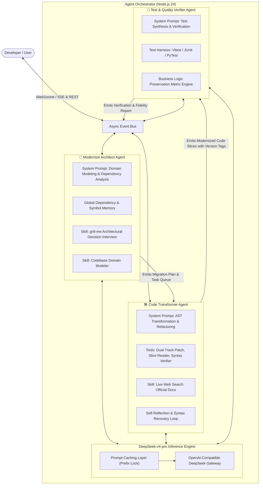
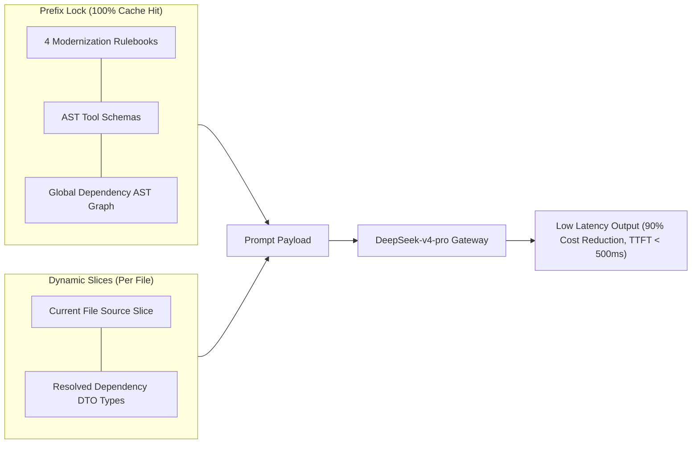

# 🤖 Agent Orchestration & Protocol Specification

<p align="center">
  <a href="./agent-orchestration.md">English Version</a> | <a href="./zh/agent-orchestration.md">简体中文版</a>
</p>

---

## 1. Tri-Agent Team & Division of Responsibilities

Inspired by modern autonomous coding agents (`Claude Code`, `grok-build`), the modernization engine coordinates three specialized agents operating in an asynchronous ReAct (Reasoning + Acting) loop powered by **DeepSeek-v4-pro**.



---

## 2. ReAct Agent Lifecycle & State Machine

```mermaid
stateDiagram-v2
    [*] --> IDLE

    IDLE --> SCANNING: Ingestion Triggered
    state "Dependency Scanning" as SCANNING {
        [*] --> ParseASTSymbols
        ParseASTSymbols: Parse Global AST Symbols
        ParseASTSymbols --> ConstructDepGraph
        ConstructDepGraph: Construct Dependency Graph
        ConstructDepGraph --> DetectBranches
        DetectBranches: Detect Architectural Branches
    }

    SCANNING --> GRILL_ME_INTERVIEW: Major Decision Ambiguity Detected
    state "Decision Interview (grill-me)" as GRILL_ME_INTERVIEW {
        [*] --> EmitCard
        EmitCard: Emit Structured Decision Card
        EmitCard --> AwaitChoice
        AwaitChoice: Await User Selection
        AwaitChoice --> FreezePlan
        FreezePlan: Freeze Modernization Roadmap
    }

    SCANNING --> DISPATCH_PLAN: Clean Dependency Graph Ready
    GRILL_ME_INTERVIEW --> DISPATCH_PLAN

    state "Plan Dispatch" as DISPATCH_PLAN {
        [*] --> TopoSort
        TopoSort: Bottom-Up Topological Sort
        TopoSort --> QueueTasks
        QueueTasks: Queue Migration Tasks
    }

    DISPATCH_PLAN --> TRANSFORMING

    state "Code Transformation" as TRANSFORMING {
        [*] --> ReadSlice
        ReadSlice: Read Source Code Slices
        ReadSlice --> FetchDoc
        FetchDoc: Live Web Search Official Docs
        FetchDoc --> AcquireLock
        AcquireLock: Acquire File Lock & Record vN Snapshot
        AcquireLock --> GenPatch
        GenPatch: Generate Dual-Track Patch via DeepSeek-v4-pro
        GenPatch --> ApplyPatch
        ApplyPatch: Apply AST Patch (Whole-File or Search/Replace)
        ApplyPatch --> VerifySyntax
        VerifySyntax: Verify Syntax & Type Integrity
        VerifySyntax --> FixSyntax: Error Encountered
        FixSyntax: Auto Rollback to vN & Re-attempt
        FixSyntax --> ApplyPatch
        VerifySyntax --> FinalizeFile: Syntax Passed
        FinalizeFile: Commit vN+1 Snapshot & Release Lock
    }

    TRANSFORMING --> VERIFYING: All Files Modernized

    state "Testing & Verification" as VERIFYING {
        [*] --> GenTests
        GenTests: Synthesize Regression Tests
        GenTests --> RunSandbox
        RunSandbox: Execute Sandbox Tests
        RunSandbox --> CalcScore
        CalcScore: Compute Fidelity Score
    }

    VERIFYING --> READY_FOR_REVIEW: Score Meets Threshold

    state "Diff Review" as READY_FOR_REVIEW {
        [*] --> StreamDiff
        StreamDiff: Stream Versioned Diff to Monaco Editor
        StreamDiff --> HumanReview
        HumanReview: Line-by-Line Review & Snapshot Stepping
        HumanReview --> GeneratePR: Accept All
        HumanReview --> RollbackStep: Rollback to vN
        RollbackStep --> RePromptTransformer
        RePromptTransformer: Re-Prompt Transformer Agent
    }

    RePromptTransformer --> TRANSFORMING
    GeneratePR --> [*]
```



---

## 3. Dual-Track Code Patching & Version Snapshot Protocol

To eliminate off-by-one line number hallucinations and support instant rollback, the **Code Transformer Agent** uses a **Dual-Track Code Patching Strategy**:

### 3.1 Dual-Track Patch Specification
1. **Track A: Whole-File Generation (For Extracted / New Components)**
   - Used when extracting decoupled controllers, DTO records, Pinia stores, or new TypeScript modules.
   - Outputs full file content directly into `/target` workspace.
2. **Track B: Structured Search & Replace Blocks (For Existing File Refactoring)**
   - Used when modifying legacy utility functions, class methods, or component logic.
   - Uses strict syntax:
     ```text
     <<<<<<< SEARCH
     String action = request.getParameter("action");
     =======
     String action = request.getAction();
     >>>>>>> REPLACE
     ```
   - Processed by a backend Fuzzy Block Matcher in Node 24, avoiding fragile line number indexing.

---

## 4. DeepSeek-v4-pro Inference Strategy & Optimization

The system adopts **DeepSeek-v4-pro** as its core foundation model, configuring differentiated inference parameters and prompt caching strategies per agent role.

### 4.1 Tri-Agent Inference Parameter Matrix

| Agent Role | Primary Objective | Temperature | Top_P | Max Tokens | Reasoning Mode | Rationale |
| :--- | :--- | :---: | :---: | :---: | :---: | :--- |
| 🧠 **Architect Agent** | Global dependency planning, domain modeling, `grill-me` | `0.2` | `0.95` | `8,192` | Enabled (Thinking Mode) | High reasoning depth, strictly ordered task queues |
| 🛠️ **Transformer Agent** | AST code rewrite, surgical patch creation, self-healing | `0.0` | `1.0` | `16,384` | Precision Coding Mode | **Zero randomness**, eliminates deprecated API hallucinations |
| 🧪 **Verifier Agent** | Test case synthesis, edge case coverage, assertion checking | `0.1` | `0.9` | `8,192` | Strict Validation Mode | Comprehensive assertion coverage and logic preservation |

### 4.2 DeepSeek Native Prompt Caching (Prefix Lock)



---

## 5. SSE (Server-Sent Events) Stream Protocol

The backend streams live events to the frontend VS Code workbench over a persistent `text/event-stream` connection at `GET /api/workspace/:sessionId/events`.

### Event Payload Schema

```typescript
export type ModernizerSSEEvent =
  | {
      type: "agent_thought";
      agent: "architect" | "transformer" | "verifier";
      step: number;
      thought: string;
      timestamp: number;
    }
  | {
      type: "tool_call";
      agent: "architect" | "transformer" | "verifier";
      toolName: string;
      parameters: Record<string, unknown>;
      timestamp: number;
    }
  | {
      type: "tool_result";
      toolName: string;
      output: string;
      status: "success" | "error";
      timestamp: number;
    }
  | {
      type: "file_diff_chunk";
      filePath: string;
      status: "in_progress" | "completed";
      patchType: "whole_file" | "search_replace";
      fileVersion: number;        // e.g. 1, 2, 3
      previousVersion: number;    // e.g. 0, 1, 2
      rollbackSupported: boolean;
      originalContent: string;
      modifiedContent: string;
      rationale: string;
      timestamp: number;
    }
  | {
      type: "file_lock_status";
      filePath: string;
      state: "acquired" | "waiting" | "released";
      heldByAgent: "transformer" | "verifier";
      timestamp: number;
    }
  | {
      type: "doc_search_snippet";
      query: string;
      url: string;
      title: string;
      summary: string;
      timestamp: number;
    }
  | {
      type: "grill_me_question";
      questionId: string;
      title: string;
      context: string;
      options: Array<{
        id: string;
        label: string;
        recommended?: boolean;
        description: string;
      }>;
    }
  | {
      type: "test_suite_result";
      totalTests: number;
      passed: number;
      failed: number;
      preservationScore: number; // e.g. 99.4
      testCases: Array<{
        name: string;
        status: "pass" | "fail";
        durationMs: number;
        assertion: string;
      }>;
    };
```
