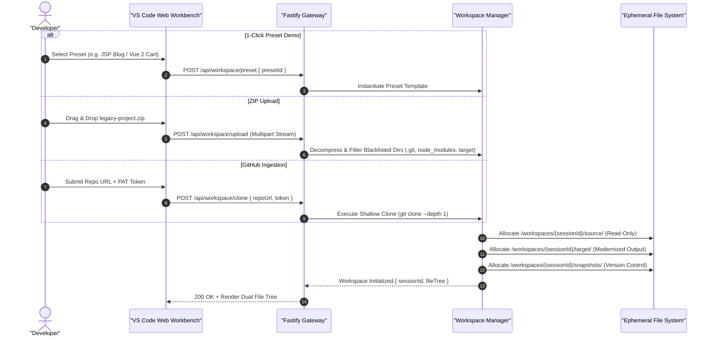
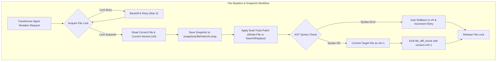
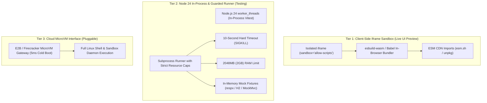
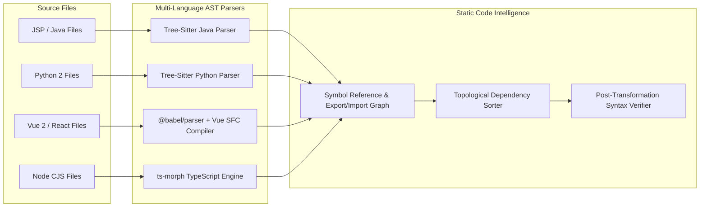
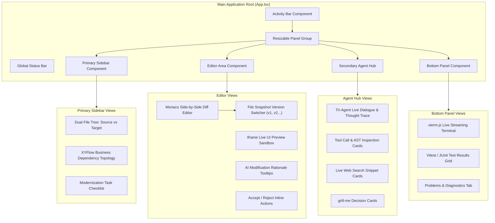

# 📐 System Architecture & Runtime Specification

<p align="center">
  <a href="./architecture.md">English Version</a> | <a href="./zh/architecture.md">简体中文版</a>
</p>

---

## 1. System Overview & Layered Architecture

**Legacy Code Modernizer** is built on a high-throughput, event-driven fullstack architecture centered around **Node.js 24 LTS** and powered by **DeepSeek-v4-pro**. The presentation layer is decoupled from the agentic execution core via bidirectional RESTful APIs and Server-Sent Events (SSE).

```mermaid
graph TD
    subgraph ClientLayer ["Presentation Layer (VS Code Web Workbench)"]
        UI["React 19 + Vite Application"]
        Panels["react-resizable-panels Layout Engine"]
        Monaco["Monaco Diff & Code Editor Engine"]
        LivePreview["Isolated Iframe Live Rendering Sandbox"]
        Xterm["xterm.js Streaming Console"]
        Flow["XYFlow Business Dependency Visualizer"]
        UI --> Panels
        Panels --> Monaco
        Panels --> LivePreview
        Panels --> Xterm
        Panels --> Flow
    end

    subgraph NetworkLayer ["Transport & Streaming Layer"]
        REST["RESTful API: Repo Ingestion, Config, PR Trigger"]
        SSE["Server-Sent Events: Realtime Thought & Diff Streams"]
        UI <-->|JSON / Multipart| REST
        UI <--|text/event-stream| SSE
    end

    subgraph BackendRuntime ["Node.js 24 LTS Core Runtime Engine"]
        Gateway["Fastify HTTP & SSE Gateway"]
        REST --> Gateway
        Gateway --> SSE

        subgraph WorkspaceManager ["Workspace & Storage Isolation"]
            WM["Session-Isolated Workspace Controller"]
            FS_Source["/workspaces/:id/source (Readonly)"]
            FS_Target["/workspaces/:id/target (Mutable)"]
            Snapshots["/workspaces/:id/snapshots (Versioned History)"]
            LockMgr["File Lock & Concurrency Controller"]
            WM --> FS_Source
            WM --> FS_Target
            WM --> Snapshots
            WM --> LockMgr
        end

        subgraph AgentCore ["Autonomous Agent Orchestrator"]
            Orch["ReAct Multi-Agent Dispatcher"]
            Arch["🧠 Modernize Architect Agent"]
            Trans["🛠️ Code Transformer Agent"]
            Test["🧪 Test & Quality Verifier Agent"]
            Orch --> Arch
            Orch --> Trans
            Orch --> Test
        end

        subgraph LLM_Layer ["LLM Inference & Cache Layer"]
            DS["DeepSeek-v4-pro Engine"]
            Cache["Prompt Caching (Prefix Lock)"]
            Cache --> DS
        end

        Arch <--> LLM_Layer
        Trans <--> LLM_Layer
        Test <--> LLM_Layer

        subgraph ASTToolchain ["Deterministic AST & Static Analysis"]
            TS["Tree-Sitter Multi-Language Engine"]
            Babel["@babel/parser & @babel/traverse"]
            Morph["ts-morph TypeScript Compiler Engine"]
            VueCompiler["vue-template-compiler & @vue/compiler-sfc"]
        end

        subgraph TieredSandbox ["Tiered Verification Sandbox"]
            WorkerPool["Node 24 Worker Threads (In-Process Vitest)"]
            SubprocessRunner["Guarded Subprocess (Java/PyTest with 10s Timeout)"]
            MicroVMAdapter["Pluggable MicroVM Adapter (E2B / Firecracker)"]
            TieredSandbox --> WorkerPool
            TieredSandbox --> SubprocessRunner
            TieredSandbox --> MicroVMAdapter
        end

        Gateway --> WM
        Gateway --> Orch
        Orch --> ASTToolchain
        Orch --> TieredSandbox
    end

    subgraph CloudVCS ["External Ecosystems & VCS"]
        GitHub["GitHub REST / GraphQL API - PR Pipeline"]
        WebDoc["Web Search Engine / Official Documentation CDNs"]
        Gateway <--> GitHub
        Orch <--> WebDoc
    end
```

---

## 2. Ingestion & Workspace Isolation Pipeline

To guarantee data safety and performance during code analysis, every repository ingestion generates an ephemeral, isolated workspace session:



---

## 3. Code Snapshot Versioning & Optimistic Lock Engine

To support one-click rollback in the Monaco Diff editor and prevent race conditions when multiple agent steps touch the same file, the backend maintains a **File-Level Snapshot & Lock Control Protocol**:



---

## 4. Tiered Sandbox & Live Rendering Architecture (Claude-Inspired)

Inspired by Anthropic Claude's Artifacts and Cloud Sandbox architectures, execution is tiered into browser-side zero-latency isolation and backend resource-guarded runners:



### 4.1 Client-Side Live Component Preview
- Modernized Vue 3 and React 19 components render inside a strictly isolated `<iframe sandbox="allow-scripts allow-forms">` without `allow-same-origin`.
- Dependencies (Tailwind, Lucide icons, Vue, React) are dynamically imported via `https://esm.sh`, providing instant visual verification of zero UI disruption.

### 4.2 Backend Test Execution Guardrails
- **Vitest In-Process Runner**: JS/TS tests run within Node.js 24 `worker_threads` with zero process-spawn overhead.
- **Java / Python Subprocess Guard**:
  - **10s Hard Timeout**: Kills runaway loops instantly.
  - **Memory Limits**: Caps heap allocations at 2048MB (2GB).
  - **Mock Fixtures**: Injects mock network and in-memory database adapters to run tests without external database dependencies.

---

## 5. AST Toolchain & Static Code Analysis

The backend integrates specialized Abstract Syntax Tree (AST) parsers to parse, validate, and manipulate code without losing formatting or introducing syntax hallucinations:



---

## 6. Frontend Workbench Component Architecture

The frontend is modeled after the VS Code workbench to maximize information density and developer familiarity:


