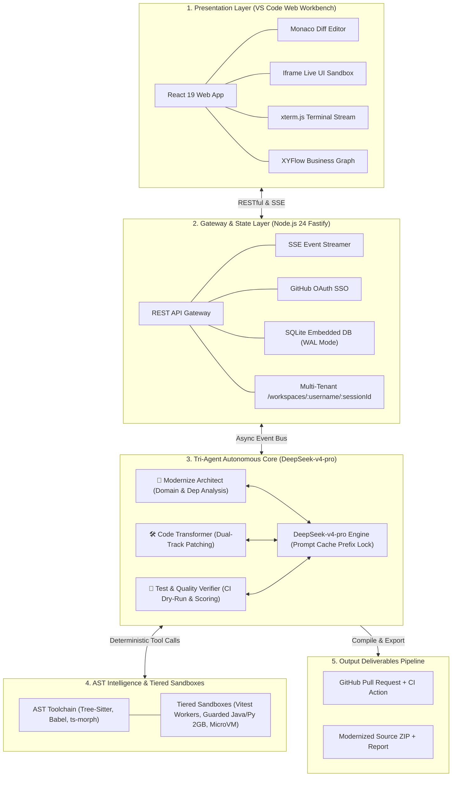
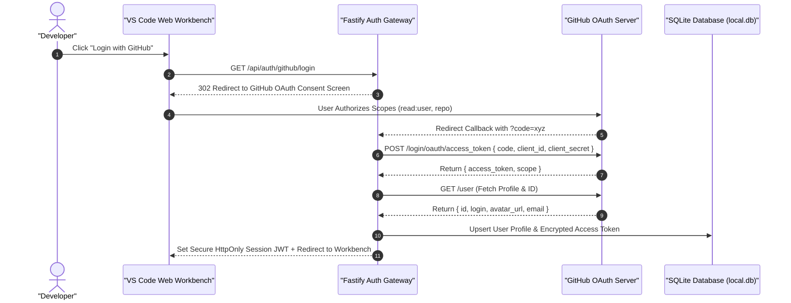
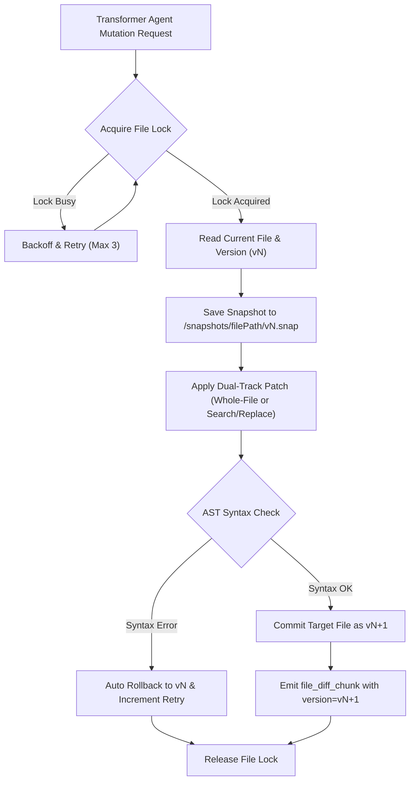
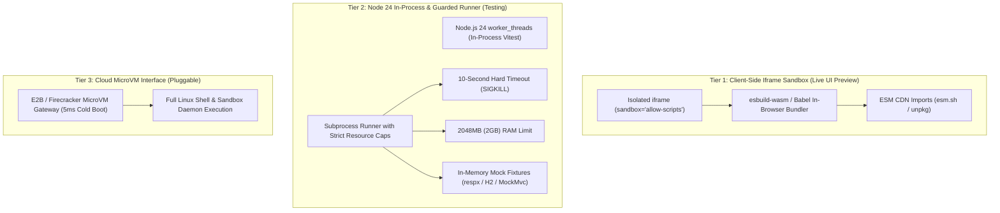
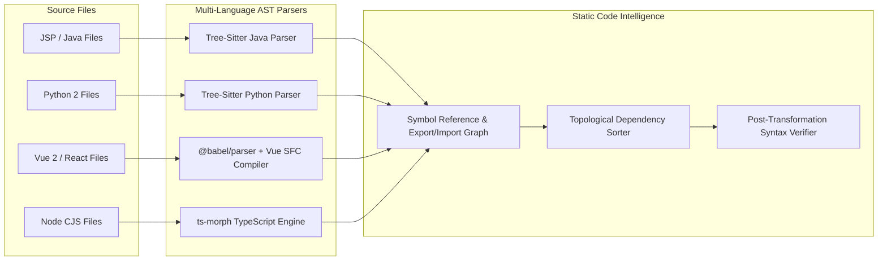
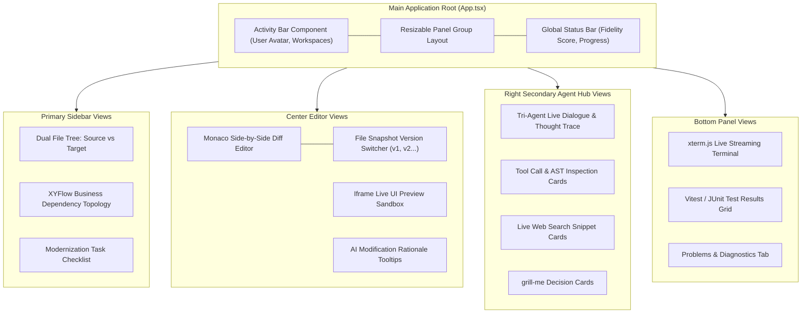

# 📐 System Architecture & Runtime Specification

<p align="center">
  <a href="./architecture.md">English Version</a> | <a href="./zh/architecture.md">简体中文版</a>
</p>

---

## 1. System Overview & Layered Architecture

**Legacy Code Modernizer** is built on a high-throughput, event-driven fullstack architecture centered around **Node.js 24 LTS** and powered by **DeepSeek-v4-pro**. The presentation layer is decoupled from the agentic execution core via bidirectional RESTful APIs and Server-Sent Events (SSE).



---

## 2. GitHub OAuth Authentication & SQLite Metadata Architecture

The system eliminates conventional username/password registration in favor of **1-Click GitHub OAuth SSO**, which securely provides user identity and grants automated repository/PR access without requiring manual Personal Access Tokens (PAT).



### 2.1 Embedded SQLite Database Schema (`local.db`)

```sql
-- Users & Preferences Table
CREATE TABLE IF NOT EXISTS users (
    id TEXT PRIMARY KEY,
    github_id INTEGER UNIQUE NOT NULL,
    username TEXT NOT NULL,
    avatar_url TEXT,
    access_token TEXT NOT NULL,
    deepseek_api_key TEXT, -- User-provided DeepSeek API key (encrypted at rest)
    deepseek_base_url TEXT DEFAULT 'https://api.deepseek.com/v1',
    created_at DATETIME DEFAULT CURRENT_TIMESTAMP,
    updated_at DATETIME DEFAULT CURRENT_TIMESTAMP
);

-- Workspaces Metadata Table
CREATE TABLE IF NOT EXISTS workspaces (
    id TEXT PRIMARY KEY,
    user_id TEXT NOT NULL,
    name TEXT NOT NULL,
    track TEXT NOT NULL, -- 'jsp_spring', 'python', 'vue_react', 'node'
    source_type TEXT NOT NULL, -- 'preset_demo', 'zip_upload', 'github_repo'
    repo_url TEXT,
    status TEXT DEFAULT 'initialized', -- 'scanning', 'transforming', 'verifying', 'completed'
    fidelity_score REAL,
    created_at DATETIME DEFAULT CURRENT_TIMESTAMP,
    updated_at DATETIME DEFAULT CURRENT_TIMESTAMP,
    FOREIGN KEY(user_id) REFERENCES users(id) ON DELETE CASCADE
);

-- File Mutation Snapshots & Audit Trail
CREATE TABLE IF NOT EXISTS file_snapshots (
    id INTEGER PRIMARY KEY AUTOINCREMENT,
    workspace_id TEXT NOT NULL,
    file_path TEXT NOT NULL,
    version INTEGER NOT NULL,
    patch_type TEXT NOT NULL, -- 'whole_file', 'search_replace'
    snapshot_path TEXT NOT NULL,
    created_at DATETIME DEFAULT CURRENT_TIMESTAMP,
    FOREIGN KEY(workspace_id) REFERENCES workspaces(id) ON DELETE CASCADE
);
```

### 2.2 Bring Your Own Key (BYOK) & Secure Multi-Tenant Persistence

To prevent context loss on page refresh or cross-device login while supporting long-running background tasks, the workbench implements a **Dual-Tier Persistence Model**:
- **Client-Side Settings**: Developers configure their `DEEPSEEK_API_KEY` (and optional custom Base URL) in the Workbench settings modal, submitted via `POST /api/user/settings`.
- **Encrypted SQLite Persistence**: The key is stored in the user's record in `users.deepseek_api_key` (encrypted at rest using `JWT_SECRET`). Even if the developer refreshes the browser, switches machines, or temporarily disconnects, their authenticated session retains the key, ensuring background ReAct tasks proceed uninterrupted.
- **Per-User Client Isolation**: Backend workers dynamically retrieve the authenticated user's key to instantiate isolated `OpenAI` client instances per session, preventing billing or quota interference.
- **Global Fallback**: The server `.env` `DEEPSEEK_API_KEY` serves solely as an optional fallback for 1-Click demo evaluation.

---

## 3. Ingestion & User-Isolated Workspace Storage

Every modernization session is strictly isolated by user handle (`username`) to eliminate data contamination between concurrent users:

```text
/workspaces
  ├── /octocat/                               # User: octocat
  │     └── /sess_9a8b7c6d/                   # Session ID
  │           ├── /source/                    # Read-only original legacy source
  │           ├── /target/                    # Mutable modernized target source
  │           └── /snapshots/                 # Versioned file history (v1, v2...)
  │                 └── /src/App.vue/
  │                       ├── v1.snap
  │                       └── v2.snap
  └── /sakuracianna/                          # User: sakuracianna
        └── /sess_1e2f3a4b/
              ├── /source/
              ├── /target/
              └── /snapshots/
```

---

## 4. Code Snapshot Versioning & Optimistic Lock Engine

To support one-click rollback in the Monaco Diff editor and prevent race conditions when multiple agent steps touch the same file, the backend maintains a **File-Level Snapshot & Lock Control Protocol**:



---

## 5. Tiered Sandbox & Live Rendering Architecture (Claude-Inspired)



---

## 6. AST Toolchain & Static Code Analysis



---

## 7. Frontend Workbench Component Architecture


