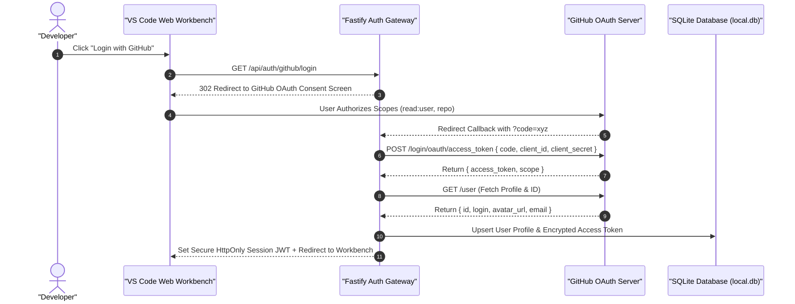
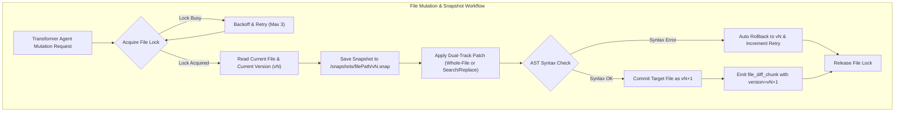
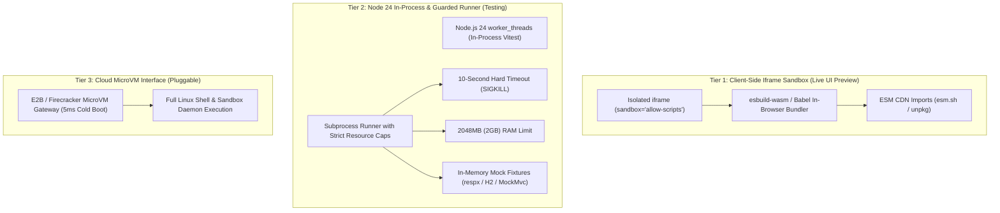
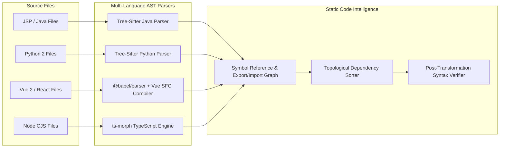
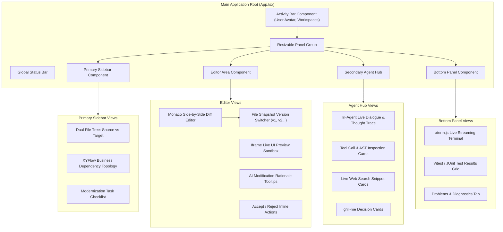

# 📐 System Architecture & Runtime Specification

<p align="center">
  <a href="./architecture.md">English Version</a> | <a href="./zh/architecture.md">简体中文版</a>
</p>

---

## 1. System Overview & Layered Architecture

**Legacy Code Modernizer** is built on a high-throughput, event-driven fullstack architecture centered around **Node.js 24 LTS** and powered by **DeepSeek-v4-pro**. The presentation layer is decoupled from the agentic execution core via bidirectional RESTful APIs and Server-Sent Events (SSE).

```mermaid
graph TD
    subgraph ClientLayer ["Presentation Layer (VS Code Web Workbench)"]
        UI["React 19 + Vite Application"]
        Panels["react-resizable-panels Layout Engine"]
        Monaco["Monaco Diff & Code Editor Engine"]
        LivePreview["Isolated Iframe Live Rendering Sandbox"]
        Xterm["xterm.js Streaming Console"]
        Flow["XYFlow Business Dependency Visualizer"]
        UI --> Panels
        Panels --> Monaco
        Panels --> LivePreview
        Panels --> Xterm
        Panels --> Flow
    end

    subgraph NetworkLayer ["Transport & Streaming Layer"]
        REST["RESTful API: GitHub OAuth, Workspace Ingestion, PR Trigger"]
        SSE["Server-Sent Events: Realtime Thought & Diff Streams"]
        UI <-->|JSON / Multipart| REST
        UI <--|text/event-stream| SSE
    end

    subgraph BackendRuntime ["Node.js 24 LTS Core Runtime Engine"]
        Gateway["Fastify HTTP & SSE Gateway"]
        AuthService["GitHub OAuth Authentication Service"]
        DB["Embedded SQLite Database (better-sqlite3 / WAL Mode)"]
        REST --> Gateway
        Gateway --> AuthService
        Gateway --> DB
        Gateway --> SSE

        subgraph WorkspaceManager ["Workspace & Storage Isolation"]
            WM["Session-Isolated Workspace Controller"]
            FS_Source["/workspaces/:username/:id/source (Readonly)"]
            FS_Target["/workspaces/:id/target (Mutable)"]
            Snapshots["/workspaces/:id/snapshots (Versioned History)"]
            LockMgr["File Lock & Concurrency Controller"]
            WM --> FS_Source
            WM --> FS_Target
            WM --> Snapshots
            WM --> LockMgr
        end

        subgraph AgentCore ["Autonomous Agent Orchestrator"]
            Orch["ReAct Multi-Agent Dispatcher"]
            Arch["🧠 Modernize Architect Agent"]
            Trans["🛠️ Code Transformer Agent"]
            Test["🧪 Test & Quality Verifier Agent"]
            Orch --> Arch
            Orch --> Trans
            Orch --> Test
        end

        subgraph LLM_Layer ["LLM Inference & Cache Layer"]
            DS["DeepSeek-v4-pro Engine"]
            Cache["Prompt Caching (Prefix Lock)"]
            Cache --> DS
        end

        Arch <--> LLM_Layer
        Trans <--> LLM_Layer
        Test <--> LLM_Layer

        subgraph ASTToolchain ["Deterministic AST & Static Analysis"]
            TS["Tree-Sitter Multi-Language Engine"]
            Babel["@babel/parser & @babel/traverse"]
            Morph["ts-morph TypeScript Compiler Engine"]
            VueCompiler["vue-template-compiler & @vue/compiler-sfc"]
        end

        subgraph TieredSandbox ["Tiered Verification Sandbox"]
            WorkerPool["Node 24 Worker Threads (In-Process Vitest)"]
            SubprocessRunner["Guarded Subprocess (Java/PyTest with 2GB Cap & 10s Timeout)"]
            MicroVMAdapter["Pluggable MicroVM Adapter (E2B / Firecracker)"]
            TieredSandbox --> WorkerPool
            TieredSandbox --> SubprocessRunner
            TieredSandbox --> MicroVMAdapter
        end

        Gateway --> WM
        Gateway --> Orch
        Orch --> ASTToolchain
        Orch --> TieredSandbox
    end

    subgraph CloudVCS ["External Ecosystems & VCS"]
        GitHub["GitHub REST / GraphQL API - PR Pipeline"]
        WebDoc["Web Search Engine / Official Documentation CDNs"]
        AuthService <--> GitHub
        Gateway <--> GitHub
        Orch <--> WebDoc
    end
```

---

## 2. GitHub OAuth Authentication & SQLite Metadata Architecture

The system eliminates conventional username/password registration in favor of **1-Click GitHub OAuth SSO**, which securely provides user identity and grants automated repository/PR access without requiring manual Personal Access Tokens (PAT).



### 2.1 Embedded SQLite Database Schema (`local.db`)

```sql
-- Users Table
CREATE TABLE IF NOT EXISTS users (
    id TEXT PRIMARY KEY,
    github_id INTEGER UNIQUE NOT NULL,
    username TEXT NOT NULL,
    avatar_url TEXT,
    access_token TEXT NOT NULL,
    created_at DATETIME DEFAULT CURRENT_TIMESTAMP,
    updated_at DATETIME DEFAULT CURRENT_TIMESTAMP
);

-- Workspaces Table
CREATE TABLE IF NOT EXISTS workspaces (
    id TEXT PRIMARY KEY,
    user_id TEXT NOT NULL,
    name TEXT NOT NULL,
    track TEXT NOT NULL, -- 'jsp_spring', 'python', 'vue_react', 'node'
    source_type TEXT NOT NULL, -- 'preset_demo', 'zip_upload', 'github_repo'
    repo_url TEXT,
    status TEXT DEFAULT 'initialized', -- 'scanning', 'transforming', 'verifying', 'completed'
    fidelity_score REAL,
    created_at DATETIME DEFAULT CURRENT_TIMESTAMP,
    updated_at DATETIME DEFAULT CURRENT_TIMESTAMP,
    FOREIGN KEY(user_id) REFERENCES users(id) ON DELETE CASCADE
);

-- Snapshots & Audit Log Table
CREATE TABLE IF NOT EXISTS file_snapshots (
    id INTEGER PRIMARY KEY AUTOINCREMENT,
    workspace_id TEXT NOT NULL,
    file_path TEXT NOT NULL,
    version INTEGER NOT NULL,
    patch_type TEXT NOT NULL, -- 'whole_file', 'search_replace'
    snapshot_path TEXT NOT NULL,
    created_at DATETIME DEFAULT CURRENT_TIMESTAMP,
    FOREIGN KEY(workspace_id) REFERENCES workspaces(id) ON DELETE CASCADE
);
```

---

## 3. Ingestion & User-Isolated Workspace Storage

Every modernization session is strictly isolated by user handle (`username`) to eliminate data contamination between concurrent users:

```text
/workspaces
  ├── /octocat/                               # User: octocat
  │     └── /sess_9a8b7c6d/                   # Session ID
  │           ├── /source/                    # Read-only original legacy source
  │           ├── /target/                    # Mutable modernized target source
  │           └── /snapshots/                 # Versioned file history (v1, v2...)
  │                 └── /src/App.vue/
  │                       ├── v1.snap
  │                       └── v2.snap
  └── /sakuracianna/                          # User: sakuracianna
        └── /sess_1e2f3a4b/
              ├── /source/
              ├── /target/
              └── /snapshots/
```

---

## 4. Code Snapshot Versioning & Optimistic Lock Engine

To support one-click rollback in the Monaco Diff editor and prevent race conditions when multiple agent steps touch the same file, the backend maintains a **File-Level Snapshot & Lock Control Protocol**:



---

## 5. Tiered Sandbox & Live Rendering Architecture (Claude-Inspired)



---

## 6. AST Toolchain & Static Code Analysis



---

## 7. Frontend Workbench Component Architecture


