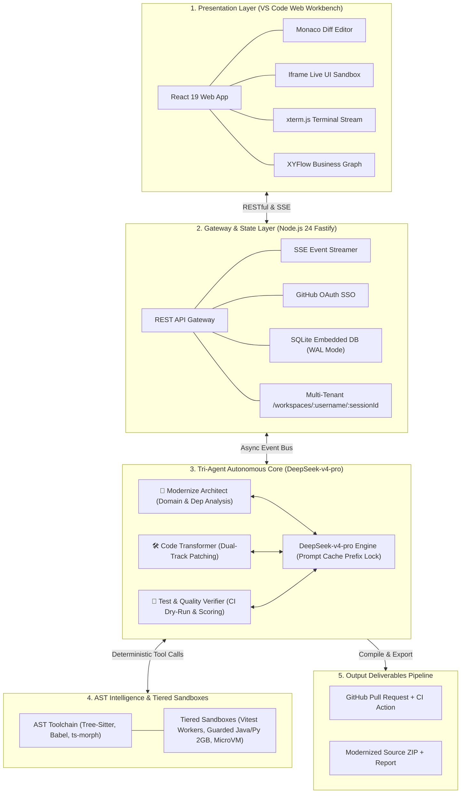
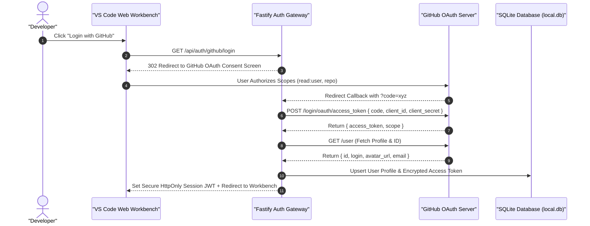
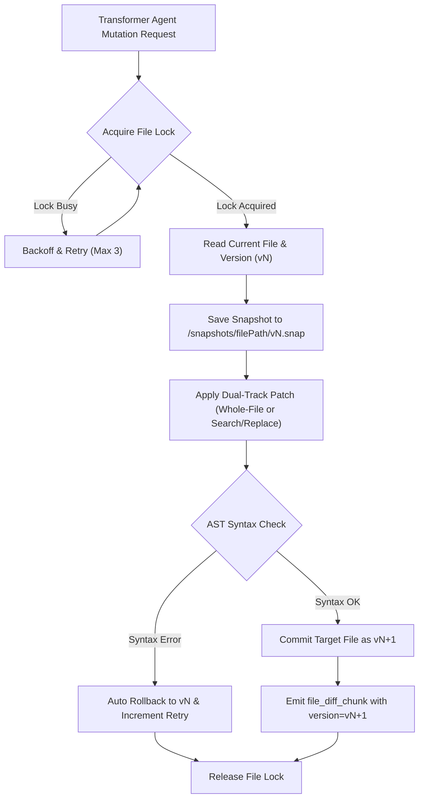
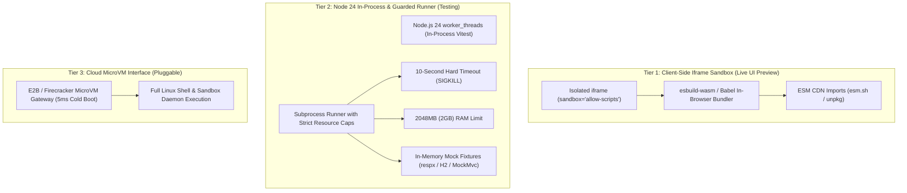
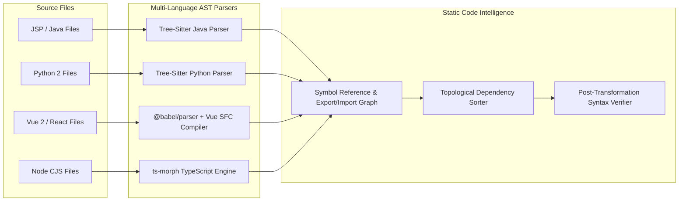
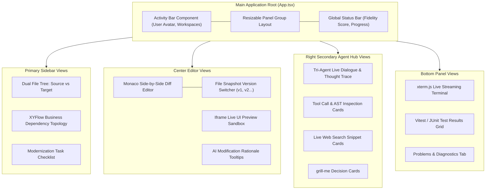

# 📐 System Architecture & Runtime Specification

<p align="center">
  <a href="./architecture.md">English Version</a> | <a href="./zh/architecture.md">简体中文版</a>
</p>

---

## 1. System Overview & Layered Architecture

**Legacy Code Modernizer** is built on a high-throughput, event-driven fullstack architecture centered around **Node.js 24 LTS** and powered by **DeepSeek-v4-pro**. The presentation layer is decoupled from the agentic execution core via bidirectional RESTful APIs and Server-Sent Events (SSE).



---

## 2. GitHub OAuth Authentication & SQLite Metadata Architecture

The system eliminates conventional username/password registration in favor of **1-Click GitHub OAuth SSO**, which securely provides user identity and grants automated repository/PR access without requiring manual Personal Access Tokens (PAT).



### 2.1 Embedded SQLite Database Architecture (`better-sqlite3` WAL Mode)

The system adopts **`better-sqlite3`** as its embedded database engine, automatically enabling Write-Ahead Logging (WAL) mode and memory cache to support high-frequency concurrent state persistence and zero-latency session recovery across the Tri-Agent team:

```sql
-- Users & Preferences Table
CREATE TABLE IF NOT EXISTS users (
    id TEXT PRIMARY KEY,
    github_id INTEGER UNIQUE NOT NULL,
    username TEXT NOT NULL,
    avatar_url TEXT,
    access_token TEXT NOT NULL,
    deepseek_api_key TEXT, -- User-provided DeepSeek API key (encrypted at rest)
    deepseek_base_url TEXT DEFAULT 'https://api.deepseek.com/v1',
    created_at DATETIME DEFAULT CURRENT_TIMESTAMP,
    updated_at DATETIME DEFAULT CURRENT_TIMESTAMP
);

-- Workspaces Metadata Table (Supporting GitHub Users & Guest Anonymous Sessions)
CREATE TABLE IF NOT EXISTS workspaces (
    id TEXT PRIMARY KEY,
    user_id TEXT, -- Nullable to allow unauthenticated Guest Mode
    is_guest INTEGER DEFAULT 0, -- 1: Anonymous Guest Session; 0: Authenticated User
    name TEXT NOT NULL,
    track TEXT NOT NULL, -- 'jsp_spring', 'python', 'vue_react', 'node', 'springboot2_vue2'
    source_type TEXT NOT NULL, -- 'preset_demo', 'zip_upload', 'github_repo'
    repo_url TEXT,
    status TEXT DEFAULT 'initialized', -- 'scanning', 'grill_me', 'transforming', 'verifying', 'completed'
    fidelity_score REAL,
    created_at DATETIME DEFAULT CURRENT_TIMESTAMP,
    updated_at DATETIME DEFAULT CURRENT_TIMESTAMP,
    FOREIGN KEY(user_id) REFERENCES users(id) ON DELETE SET NULL
);

-- File Mutation Snapshots & Audit Trail
CREATE TABLE IF NOT EXISTS file_snapshots (
    id INTEGER PRIMARY KEY AUTOINCREMENT,
    workspace_id TEXT NOT NULL,
    file_path TEXT NOT NULL,
    version INTEGER NOT NULL,
    patch_type TEXT NOT NULL, -- 'whole_file', 'search_replace'
    snapshot_path TEXT NOT NULL,
    created_at DATETIME DEFAULT CURRENT_TIMESTAMP,
    FOREIGN KEY(workspace_id) REFERENCES workspaces(id) ON DELETE CASCADE
);
```

### 2.2 Bring Your Own Key (BYOK) & Secure Multi-Tenant Persistence

To prevent context loss on page refresh or cross-device login while supporting long-running background tasks, the workbench implements a **Dual-Tier Persistence Model**:
- **Client-Side Settings**: Developers configure their `DEEPSEEK_API_KEY` (and optional custom Base URL) in the Workbench settings modal, submitted via `POST /api/user/settings`.
- **Encrypted SQLite Persistence**: The key is stored in the user's record in `users.deepseek_api_key` (encrypted at rest using `JWT_SECRET`). Even if the developer refreshes the browser, switches machines, or temporarily disconnects, their authenticated session retains the key, ensuring background ReAct tasks proceed uninterrupted.
- **Per-User Client Isolation**: Backend workers dynamically retrieve the authenticated user's key to instantiate isolated `OpenAI` client instances per session, preventing billing or quota interference.
- **Global Fallback**: The server `.env` `DEEPSEEK_API_KEY` serves solely as an optional fallback for 1-Click demo evaluation.

---

## 3. Physical Dual-Project Isolation & Explorer Mapping Tree

### 3.1 Physical Dual-Project Isolation Architecture (Separated Fullstack Example)
The platform enforces a strict **`/source` (Read-Only Legacy Ground Truth) + `/target` (Standalone Modernized Executable Project)** dual-directory architecture on disk. Taking a typical **"Vue 2 + Spring Boot 1.5/Java 8 Legacy Monorepo" upgrading to "Vue 3/TS + Spring Boot 3/Java 21 Modern Project"** as a concrete example, the on-disk directory layout is structured as follows:

```text
/workspaces/:username/:sessionId/
   ├── /source/                                # 🔴 Original Legacy Source (Strictly Read-Only Ground Truth)
   │     ├── frontend/                         # Legacy Frontend (Vue 2 + Webpack + Options API)
   │     │    ├── src/
   │     │    │    ├── views/Login.vue
   │     │    │    └── store/index.js
   │     │    ├── package.json
   │     │    └── vue.config.js
   │     └── backend/                          # Legacy Backend (Spring Boot 1.5 + Java 8 + javax.*)
   │          ├── src/main/java/com/example/
   │          │    ├── controller/UserController.java
   │          │    └── model/User.java
   │          └── pom.xml
   │
   ├── /target/                                # 🟢 Modernized Output Project (Mutable, Standalone Project Scaffold)
   │     ├── frontend/                         # Modern Frontend (Vue 3 + Vite 6 + Pinia + TS)
   │     │    ├── src/
   │     │    │    ├── views/LoginView.vue     # Upgraded to <script setup lang="ts">
   │     │    │    └── stores/user.ts          # Upgraded to Pinia Store
   │     │    ├── package.json
   │     │    ├── vite.config.ts
   │     │    └── tsconfig.json
   │     ├── backend/                          # Modern Backend (Spring Boot 3.4 + Java 21 + Jakarta)
   │     │    ├── src/main/java/com/example/
   │     │    │    ├── controller/UserController.java  # Modern Jakarta REST API
   │     │    │    └── model/UserRecord.java           # Upgraded to Java 21 Record DTO
   │     │    ├── src/test/java/com/example/           # Synthesized JUnit 5 Unit Tests
   │     │    │    └── controller/UserControllerTest.java
   │     │    └── pom.xml                              # Spring Boot 3.4 Manifest
   │     ├── MODERNIZATION_REPORT.md           # Full audit log & architectural changelog
   │     └── .github/workflows/ci.yml          # Pre-verified Monorepo CI Pipeline
   │
   └── /snapshots/                             # 🛡️ File Snapshots (v1, v2 history for 1-click Monaco rollback)
```

### 3.2 Explorer Mapping Tree View
The Explorer sidebar organizes files strictly by **"Frontend/Backend Scope ➔ Business Feature ➔ Legacy-to-Modern Mapping Item"**:

```text
▼ 🌐 Frontend Module (Vue 2 Options ➔ Vue 3 Setup + TS)
   ▼ 📦 Auth & Session
      ├── 📄 [Old] frontend/src/views/Login.vue  ➔  📄 [New] frontend/src/views/LoginView.vue
      └── 📄 [Old] frontend/src/store/index.js   ➔  📄 [New] frontend/src/stores/user.ts
   ▼ ⚙️ Build Configuration
      └── 📄 [Old] frontend/vue.config.js        ➔  📄 [New] frontend/vite.config.ts

▼ ☕ Backend Module (Spring Boot 1.5/Java 8 ➔ Spring Boot 3/Java 21)
   ▼ 📦 Controllers & APIs
      ├── 📄 [Old] backend/src/.../UserController.java  ➔  📄 [New] backend/src/.../UserController.java
      └── 📄 [Old] backend/src/.../User.java            ➔  📄 [New] backend/src/.../UserRecord.java
   ▼ 🧪 Synthesized Regression Tests
      └── ✨ [Generated] backend/src/test/.../UserControllerTest.java
```
- **Interaction Linkage**: Clicking any mapping row automatically opens the Monaco Side-by-Side Diff View (left pane loads `/source/...` original file; right pane loads `/target/...` modernized file).

### 3.3 Guest Mode Lifecycle & BYOK Execution

To enable frictionless reviews, zero-setup hackathon demonstrations, and instant evaluation, the system fully supports **Guest Mode**:
1. **Isolated Anonymous Workspace**: Unauthenticated users are instantly assigned a dedicated session ID (`guest-:sessionId`), with isolated file paths under `/workspaces/guest/:sessionId/{source,target}`;
2. **Pure BYOK Agent Driver**: Users input their `DEEPSEEK_API_KEY` in the top-right settings modal (or leverage server-side fallback). All agent activities directly prompt the real **DeepSeek-v4-pro** model;
3. **Seamless OAuth Migration**: When a guest later signs in via "Login with GitHub", all active workspaces and code snapshots are atomically re-associated with their GitHub identity, allowing direct PR creation.

### 3.4 Incremental Streaming Modernization Protocol

The platform abandons opaque black-box batch processing in favor of **fine-grained, incremental, per-file modernization**:
1. **Topology-Driven Task Queue**: The Architect Agent parses AST dependencies and dispatches a bottom-up component queue into the SQLite `tasks` table;
2. **Immediate Per-File Commit**: The Transformer Agent converts and self-reflects on one file/slice at a time, immediately persisting successful transforms to `/target` and generating snapshots;
3. **Real-Time Monaco Diff Streaming**: SSE broadcasts `file_modernized` and `diff_ready` events to the client. The left tree nodes flip to green, and users can immediately review side-by-side diffs and line-by-line AI rationales;
4. **Interactive Decision Suspension**: When architectural divergence is detected, the Architect pushes a `grill_me_card` SSE event to pause execution and await explicit user selection.

---

## 4. Code Snapshot Versioning & Optimistic Lock Engine

To support one-click rollback in the Monaco Diff editor and prevent race conditions when multiple agent steps touch the same file, the backend maintains a **File-Level Snapshot & Lock Control Protocol**:



---

## 5. Tiered Sandbox & Live Rendering Architecture (Claude-Inspired)



---

## 6. AST Toolchain & Static Code Analysis



---

## 7. Frontend Workbench Component Architecture



### 7.1 Welcome Onboarding Hub & 1-Click Preset Selector

When users first launch the workbench (or before loading a workspace), the main editor displays the **Welcome Onboarding Hub**:
1. **Interactive 5-Preset Card Grid**:
   - Dynamically loaded from `Demo/presets.json` metadata;
   - Displays track badges (JSP / Python / Vue / Node / Spring Boot), LOC count, legacy smell characteristics, and target stack badges;
   - Prominently features a **"1-Click Load & Modernize"** action button to mount the demo into the user's isolated workspace in seconds and awaken the Tri-Agent team;
2. **Persistent Top-Bar Global Quick Actions**:
   - **`[⚙️ DeepSeek API Key]`**: Immediate BYOK settings modal writing to local browser context and syncing with the active backend session;
   - **`[🐙 Login with GitHub]`**: OAuth SSO trigger to upgrade anonymous guest sessions to authenticated multi-tenant users.

### 7.2 Monaco Diff In-Depth Review & AI Rationale Tooltip Protocol (HITL)

During incremental code generation, the central editor provides side-by-side verification:
1. **Side-by-Side Diff Highlighting**: Left pane displays legacy source (red highlights for removed antipatterns); right pane displays modernized code (green highlights for modern idioms);
2. **AI Rationale Hover Annotations (Decorations)**:
   - Critical modifications (e.g., `javax.* ➔ jakarta.*`, or Jedis Lua ➔ declarative `@DistributedLock`) display ✨ icons via Monaco Decorations;
   - Hovering triggers an AI decision tooltip detailing the architectural justification, security enhancement, and official Migration Guide reference;
3. **Snapshot Version Stepping & One-Click Rollback**:
   - Top toolbar provides a snapshot picker `[Snapshot: v3 (Current)]` with one-click rollback to `v1` or `v2`;
   - Explicit **"Accept All"** and **"Reject & Re-prompt"** controls empower developer-in-the-loop oversight.

---

## 8. Dual-Channel Output & Deliverables Pipeline

Upon achieving certified fidelity score ($S_{\text{fidelity}} \ge 95\%$) and green CI Dry-Run status, the workbench provides delivery exits governed by project scope and security rules:

### 8.1 Delivery Channel & Project Scope Permission Matrix

| Project Source Type (`source_type`) | Use Case | 1-Click Local ZIP Download | 1-Click GitHub PR Creation | Access Control & UX Interaction |
| :--- | :--- | :---: | :---: | :--- |
| **Built-in Demo Presets (`preset_demo`)** | Official 5 Modernization Benchmarks | **✅ Supported (Exclusive Exit)** | **❌ Disabled (Greyed Out)** | **Demo presets do NOT submit GitHub PRs**. The PR button is disabled with a hover tooltip: "Built-in benchmarks export as standalone modernized ZIP archives to prevent unwanted mutations to external repositories." |
| **User Imported Repositories (`github_repo`)** | Private/Public GitHub repos imported via OAuth | **✅ Supported** | **✅ Supported** | Full automated branch creation (`modernize/<timestamp>`), code push, and PR creation with markdown changelog. |
| **Custom ZIP Uploads (`zip_upload`)** | User-uploaded legacy archives | **✅ Supported** | ⚠️ Requires Binding | Defaults to ZIP download; becomes eligible for PR submission once linked to a target GitHub remote. |

### 8.2 Standardized Audit Report Specification (`MODERNIZATION_REPORT.md`)

Every exported ZIP bundle and generated GitHub PR description automatically includes a comprehensive audit report generated by the **Verifier Agent**, structured into four sections:
1. **Mathematical Preservation Scorecard**: Explicit breakdown of final $S_{\text{fidelity}}$, dynamic test pass rate $P_{\text{tests}}$, AST symbol coverage $C_{\text{ast}}$, and contract conformance $M_{\text{schema}}$;
2. **Deprecated API & Code Smell Ledger**: Line-by-line inventory of resolved antipatterns (e.g., `javax.* ➔ jakarta.*` substitution table, Jedis Lua ➔ `@DistributedLock`, CommonJS ➔ ESM mapping);
3. **Sandboxed Regression Test Run Log**: Granular list of executed test cases, assertions verified, sub-second execution timings, and test framework results (JUnit 5 / PyTest / Vitest);
4. **Target Project Local Run & Deployment Guide**: Clear instructions for local dependency installation, environment variable configuration, and one-command target startup.


