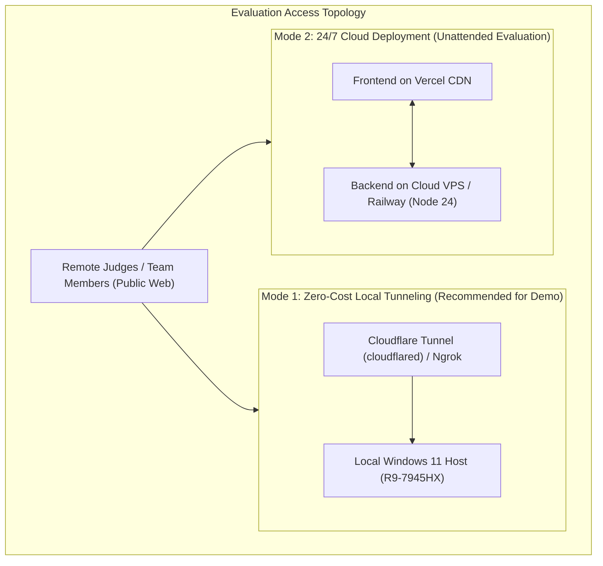

# 🌐 Deployment & Tunneling Specification

<p align="center">
  <a href="./deployment-and-tunneling.md">English Version</a> | <a href="./zh/deployment-and-tunneling.md">简体中文版</a>
</p>

---

## 1. Overview & Evaluation Access Modes

During hackathon presentations, judging sessions, or remote team reviews, the workbench can be exposed to the public internet via two primary architectures:



---

## 2. Mode 1: Intranet Reverse Tunneling (Cloudflare Tunnel & Ngrok)

### 2.1 Cloudflare Tunnel (Preferred - Free, Secure, Global CDN)
Cloudflare Tunnel establishes an encrypted outbound tunnel to Cloudflare Edge servers, requiring **zero public IP**, **zero router port-forwarding**, and providing **legitimate SSL/TLS certificates**.

#### Step 1: Install `cloudflared` on Windows
```powershell
winget install --id Cloudflare.cloudflared
```

#### Step 2: Instant Ephemeral Tunnel (Quick Demo)
Run the following command while the frontend (`5173`) and backend (`4000`) are running locally:
```powershell
# Expose frontend (with Vite reverse-proxying /api to 4000)
cloudflared tunnel --url http://localhost:5173
```
*Output will provide a secure public URL (e.g. `https://random-words.trycloudflare.com`).*

#### Step 3: Named Custom Domain (Persistent Link)
For official presentations with a custom domain (e.g. `demo.yourdomain.com`):
```powershell
cloudflared tunnel login
cloudflared tunnel create modernizer-tunnel
cloudflared tunnel route dns modernizer-tunnel demo.yourdomain.com
cloudflared tunnel run modernizer-tunnel
```

---

### 2.2 Ngrok Tunnel (Secondary Backup)
If Cloudflare encounters regional network restrictions, Ngrok serves as an instant fallback.

#### Step 1: Install & Authenticate
```powershell
winget install --id Inconshreveable.Ngrok
ngrok config add-authtoken <YOUR_NGROK_TOKEN>
```

#### Step 2: Launch Tunnel
```powershell
ngrok http 5173
```

---

## 3. Host Keep-Alive & Power Configuration

When using reverse tunnels, traffic is routed directly to the local Windows machine. To prevent tunnel drops during judging:

1. **Windows Power Management**:
   - Navigate to `Settings > System > Power > Sleep`: Set to **"Never"** when plugged in.
2. **Windows Terminal Keep-Alive**:
   - Use Windows PowerToys **"Awake"** mode or PowerShell keep-awake command to prevent screen locking or Wi-Fi sleep states.

---

## 4. Mode 2: 24/7 Unattended Cloud Deployment (Optional)

If judges require asynchronous 24/7 access when the local machine is powered off:

| Component | Target Platform | Build Command | Runtime |
| :--- | :--- | :--- | :--- |
| **Frontend UI** | Vercel / Cloudflare Pages | `pnpm build` | Static Edge CDN |
| **Backend API & Agents** | Railway / Render / DigitalOcean VPS | `pnpm start` | Node.js 24 LTS |
