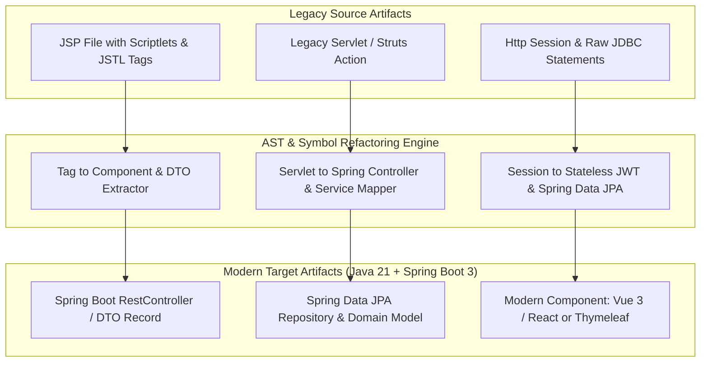
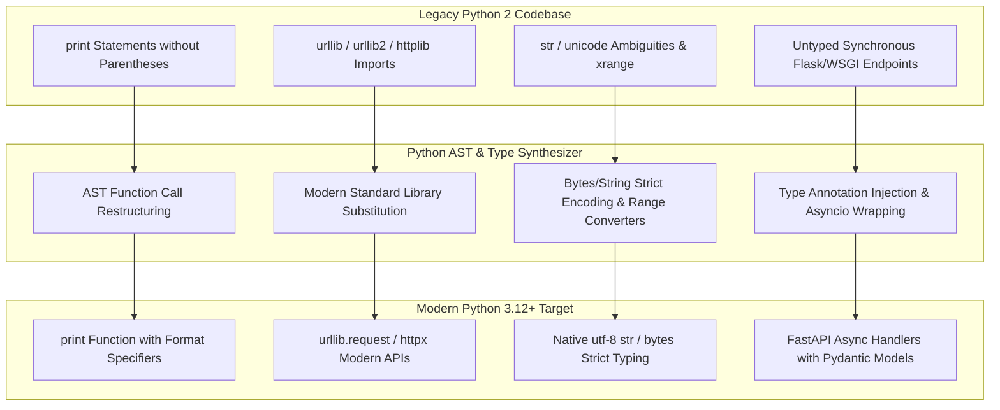
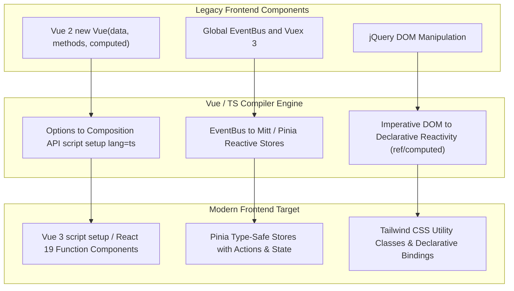
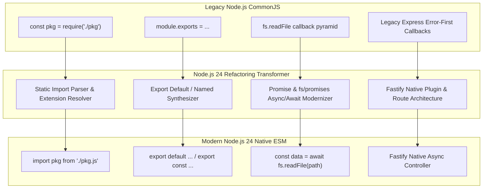

# 🗺️ Modernization Tracks & Transformation Matrix

  <a href="./migration-matrix.md">English Version</a> | <a href="./zh/migration-matrix.md">简体中文版</a>

---

## 1. Track 1: JSP ➔ Java / Spring Boot 3 & Modern Web

### Key Migration Rules
- **Scriptlet Decoupling**: Extract `<% ... %>` Java code into dedicated Spring `@Service` methods.
- **Form Bindings**: Convert `<form action="...">` and `<jsp:useBean>` into Java 21 `record` DTO classes with `@Valid` and Jakarta constraints.
- **SQL Sanitization**: Replace raw concatenated `Statement.executeQuery("SELECT ... " + var)` with Spring Data JPA parameterized queries or query methods.

---

## 2. Track 2: Python 2.x ➔ Python 3.12+ & FastAPI

### Key Migration Rules
- **Print / Exec**: Transform statements into function calls (`print("msg")`).
- **Standard Library Realignment**: `urllib2` ➔ `urllib.request` or modern `httpx`; `Queue` ➔ `queue`; `ConfigParser` ➔ `configparser`.
- **String & Byte Fidelity**: Explicitly encode/decode when interfacing with I/O sockets or files to prevent silent Python 3 `TypeError` regressions.

---

## 3. Track 3: Vue 2 / React Class / jQuery ➔ Vue 3 / React 19 + TypeScript

### Key Migration Rules
- **Reactivity Migration**: Convert `this.property` into `ref()` / `reactive()` with explicit TypeScript interfaces.
- **Lifecycle Mapping**: `beforeDestroy` ➔ `onBeforeUnmount`, `destroyed` ➔ `onUnmounted`, `mounted` ➔ `onMounted`.
- **Slot Syntax**: Convert deprecated `slot="header"` and `slot-scope="props"` to `#header="props"`.

---

## 4. Track 4: Node CommonJS / Callbacks ➔ Native ESM & Node.js 24 LTS

### Key Migration Rules
- **Import Specifiers**: Append explicit `.js` or `.ts` file extensions required by Node.js native ESM standard.
- **Top-Level Await**: Leverage Node.js 24 top-level await for database connections and configuration bootstrapping.
- **Callback Elimination**: Convert callback-heavy APIs to `node:util.promisify` or native promise namespaces (`node:fs/promises`, `node:stream/promises`).
