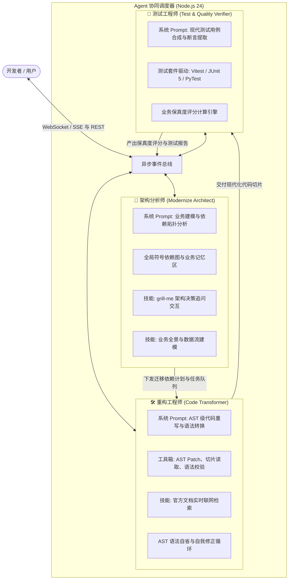

# 🤖 Agent 协同机制与协议规范 (Agent Orchestration & Protocol)

<p align="center">
  <a href="../agent-orchestration.md">English Version</a> | <a href="./agent-orchestration.md">简体中文版</a>
</p>

---

## 1. 三 Agent 专家团队分工与职责边界

系统借鉴 `Claude Code` 与 `grok-build` 等先进编程 Agent 的架构设计，在 Node.js 24 后端调度三个具备独立专长与上下文隔离的 Agent，形成紧密协作的 ReAct（Reasoning + Acting）闭环：



---

## 2. ReAct Agent 运行生命周期与状态机

```mermaid
stateDiagram-v2
    [*] --> IDLE

    IDLE --> SCANNING: 触发工程导入
    state "依赖扫描 (Scanning)" as SCANNING {
        [*] --> ParseASTSymbols
        ParseASTSymbols: 解析全局AST符号
        ParseASTSymbols --> ConstructDepGraph
        ConstructDepGraph: 构建拓扑依赖图
        ConstructDepGraph --> DetectBranches
        DetectBranches: 检测重大架构分支
    }

    SCANNING --> GRILL_ME_INTERVIEW: 检测到重大架构决策分歧
    state "架构决策追问 (grill-me)" as GRILL_ME_INTERVIEW {
        [*] --> EmitCard
        EmitCard: 弹出结构化决策卡片
        EmitCard --> AwaitChoice
        AwaitChoice: 等待用户选择确认
        AwaitChoice --> FreezePlan
        FreezePlan: 固化重构技术方案
    }

    SCANNING --> DISPATCH_PLAN: 拓扑图无歧义
    GRILL_ME_INTERVIEW --> DISPATCH_PLAN

    state "计划下发 (Dispatch)" as DISPATCH_PLAN {
        [*] --> TopoSort
        TopoSort: 自底向上拓扑排序
        TopoSort --> QueueTasks
        QueueTasks: 分发重构任务队列
    }

    DISPATCH_PLAN --> TRANSFORMING

    state "代码重构 (Transforming)" as TRANSFORMING {
        [*] --> ReadSlice
        ReadSlice: 按需读取源文件切片
        ReadSlice --> FetchDoc
        FetchDoc: 联网检索官方文档
        FetchDoc --> GenPatch
        GenPatch: 生成现代化重构代码
        GenPatch --> ApplyPatch
        ApplyPatch: 写入AST重构补丁
        ApplyPatch --> VerifySyntax
        VerifySyntax: 执行静态语法与类型校验
        VerifySyntax --> FixSyntax: 发现语法或类型错误
        FixSyntax: 自我反思与修复循环
        FixSyntax --> ApplyPatch
        VerifySyntax --> FinalizeFile: 校验通过
        FinalizeFile: 单文件重构完成
    }

    TRANSFORMING --> VERIFYING: 全仓文件重构完毕

    state "测试验证 (Verifying)" as VERIFYING {
        [*] --> GenTests
        GenTests: 提取历史逻辑并合成测试套件
        GenTests --> RunSandbox
        RunSandbox: 在轻量沙箱中执行测试
        RunSandbox --> CalcScore
        CalcScore: 计算业务保真度综合评分
    }

    VERIFYING --> READY_FOR_REVIEW: 评分达到准入阈值

    state "差异审查 (Review)" as READY_FOR_REVIEW {
        [*] --> StreamDiff
        StreamDiff: 流式推送到MonacoDiff视图
        StreamDiff --> HumanReview
        HumanReview: 开发者行级审查
        HumanReview --> GeneratePR: 全部确认
        HumanReview --> RejectPatch: 局部驳回
        RejectPatch: 指派Agent重新生成
    }

    RejectPatch --> TRANSFORMING
    GeneratePR --> [*]
```



---

## 3. `grill-me` 架构决策追问技能

在处理老旧系统时，常常存在重大的架构分歧点。内置的 **`grill-me`** 技能可防止 Agent 在缺少关键业务约束时“凭空自作主张”，确保迁移方向与企业长期技术演进目标一致。

### 核心触发场景与推荐决策案例
1. **JSP 架构解耦分歧**：
   - *追问内容*：“检测到老旧 JSP 页面包含大量表单与会话交互，应该将其重构为**前后端分离的 Spring Boot 3 REST API + Vue 3 前端**，还是**单体 Spring Boot 3 + Thymeleaf 模板工程**？”
   - *推荐选项*：“Spring Boot REST + Vue 3（推荐：利于系统微服务解耦与现代 SPA 交互）”。
2. **Vue 2 状态管理升级分歧**：
   - *追问内容*：“老旧代码中深度依赖全局 `EventBus` 与 `Vuex 3`，升级目标优先选择 **Pinia** 官方状态库，还是采用轻量级 **Vue Composables** 响应式组合？”
   - *推荐选项*：“Pinia（推荐：具备完整的 TypeScript 类型推导与 DevTools 支持）”。
3. **Python 异步化重构分歧**：
   - *追问内容*：“检测到老旧 Python 2 同步阻塞网络抓取任务，重构目标选择 **`asyncio` + FastAPI 异步并发**，还是保留**传统 Flask + Gunicorn 线程池**？”
   - *推荐选项*：“asyncio + FastAPI（推荐：在 I/O 密集型业务中吞吐量提升显著）”。

---

## 4. SSE（Server-Sent Events）实时流式通信协议

后端通过持久连接 `GET /api/workspace/:sessionId/events` 向上层 VS Code Web 工作台实时推送事件。

### TypeScript 事件类型定义

```typescript
export type ModernizerSSEEvent =
  | {
      type: "agent_thought";
      agent: "architect" | "transformer" | "verifier";
      step: number;
      thought: string;
      timestamp: number;
    }
  | {
      type: "tool_call";
      agent: "architect" | "transformer" | "verifier";
      toolName: string;
      parameters: Record<string, unknown>;
      timestamp: number;
    }
  | {
      type: "tool_result";
      toolName: string;
      output: string;
      status: "success" | "error";
      timestamp: number;
    }
  | {
      type: "doc_search_snippet";
      query: string;
      url: string;
      title: string;
      summary: string;
      timestamp: number;
    }
  | {
      type: "grill_me_question";
      questionId: string;
      title: string;
      context: string;
      options: Array<{
        id: string;
        label: string;
        recommended?: boolean;
        description: string;
      }>;
    }
  | {
      type: "file_diff_chunk";
      filePath: string;
      status: "in_progress" | "completed";
      originalContent: string;
      modifiedContent: string;
      rationale: string;
    }
  | {
      type: "test_suite_result";
      totalTests: number;
      passed: number;
      failed: number;
      preservationScore: number; // 例如 99.4
      testCases: Array<{
        name: string;
        status: "pass" | "fail";
        durationMs: number;
        assertion: string;
      }>;
    };
```
