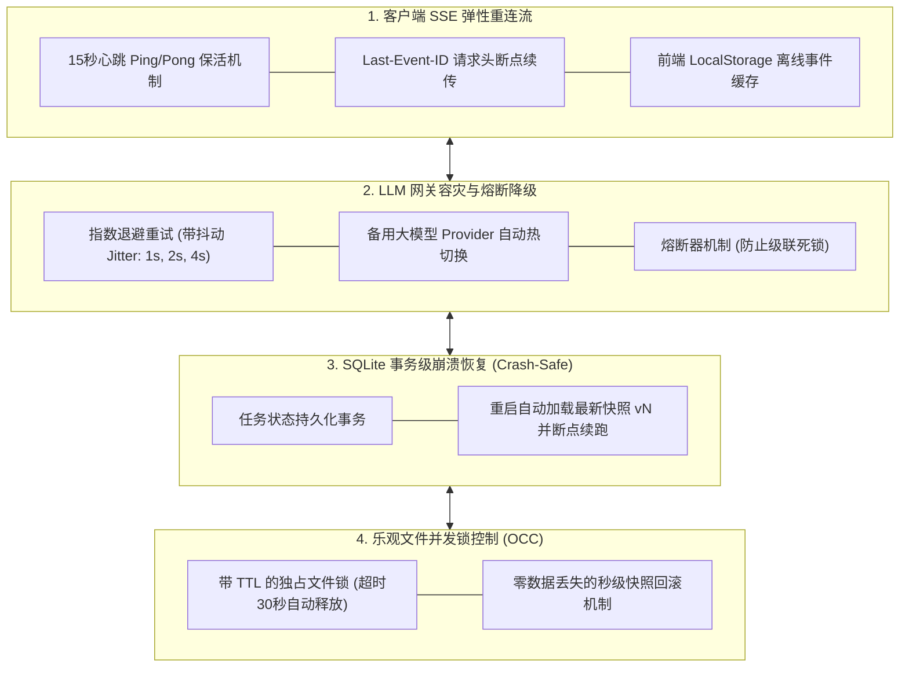
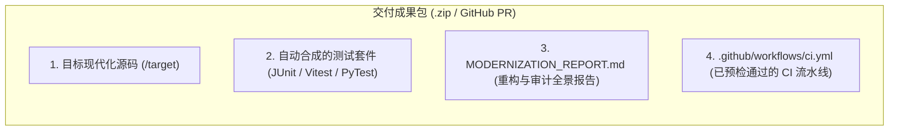

# 🤖 Agent 协同机制与协议规范 (Agent Orchestration & Protocol)

<p align="center">
  <a href="../agent-orchestration.md">English Version</a> | <a href="./agent-orchestration.md">简体中文版</a>
</p>

---

## 1. 三 Agent 专家团队分工与职责边界

系统借鉴 `Claude Code` 与 `grok-build` 等先进编程 Agent 的架构设计，在 Node.js 24 后端调度三个具备独立专长与上下文隔离的 Agent，全流程由 **DeepSeek-v4-pro** 提供高精度推理支撑，形成紧密协作的 ReAct（Reasoning + Acting）闭环：


---

## 2. ReAct Agent 运行生命周期与状态机

```mermaid
stateDiagram-v2
    [*] --> IDLE

    IDLE --> SCANNING: 触发工程导入
    state "依赖扫描 (Scanning)" as SCANNING {
        [*] --> ParseASTSymbols
        ParseASTSymbols: 解析全局AST符号
        ParseASTSymbols --> ConstructDepGraph
        ConstructDepGraph: 构建拓扑依赖图
        ConstructDepGraph --> DetectBranches
        DetectBranches: 检测重大架构分支
    }

    SCANNING --> GRILL_ME_INTERVIEW: 检测到重大架构决策分歧
    state "架构决策追问 (grill-me)" as GRILL_ME_INTERVIEW {
        [*] --> EmitCard
        EmitCard: 弹出多方案优缺点横向对比卡片
        EmitCard --> AwaitChoice
        AwaitChoice: 等待用户选择确认
        AwaitChoice --> FreezePlan
        FreezePlan: 固化重构技术方案
    }

    SCANNING --> DISPATCH_PLAN: 拓扑图无歧义
    GRILL_ME_INTERVIEW --> DISPATCH_PLAN

    state "计划下发 (Dispatch)" as DISPATCH_PLAN {
        [*] --> TopoSort
        TopoSort: 自底向上拓扑排序
        TopoSort --> QueueTasks
        QueueTasks: 分发重构任务队列入库 SQLite
    }

    DISPATCH_PLAN --> TRANSFORMING

    state "代码重构 (Transforming)" as TRANSFORMING {
        [*] --> ReadSlice
        ReadSlice: 按需读取源文件切片
        ReadSlice --> FetchDoc
        FetchDoc: 联网检索官方文档
        FetchDoc --> AcquireLock
        AcquireLock: 获取文件锁并记录当前 vN 快照
        AcquireLock --> GenPatch
        GenPatch: DeepSeek-v4-pro 生成双轨补丁
        GenPatch --> ApplyPatch
        ApplyPatch: 写入AST补丁(新建全量/局部替换)
        ApplyPatch --> VerifySyntax
        VerifySyntax: 执行静态语法与类型校验
        VerifySyntax --> FixSyntax: 发现语法或类型错误
        FixSyntax: 自动回退至快照 vN 并重新尝试
        FixSyntax --> ApplyPatch
        VerifySyntax --> FinalizeFile: 校验通过
        FinalizeFile: 提交 vN+1 快照并释放文件锁
    }

    TRANSFORMING --> VERIFYING: 全仓文件重构完毕

    state "测试验证 (Verifying)" as VERIFYING {
        [*] --> GenTests
        GenTests: 提取历史逻辑并合成测试套件
        GenTests --> ToolCallExec
        ToolCallExec: Agent自主调用execute_command执行沙箱测试
        ToolCallExec --> StreamTerminal
        StreamTerminal: 输出流式推送到底部xterm终端与聊天卡片
        StreamTerminal --> EvalExitCode
        EvalExitCode --> AutoHealLoop: 测试失败(非零退出码)
        AutoHealLoop: 最多3轮读取报错堆栈自主修补代码
        AutoHealLoop --> ToolCallExec: 自愈重测
        AutoHealLoop --> GrillMeCard: 3轮未收敛触发人机协同卡片
        GrillMeCard --> ToolCallExec: 用户决策后执行
        EvalExitCode --> CalcScore: 测试全部绿灯
        CalcScore: 计算业务保真度综合评分
    }

    VERIFYING --> CI_DRY_RUN: 保真度达标

    state "本地 CI 预检沙箱 (CI Dry-Run)" as CI_DRY_RUN {
        [*] --> CheckPathCasing
        CheckPathCasing: Linux 大小写敏感路径核查
        CheckPathCasing --> RunTypecheck
        RunTypecheck: 严格类型检查 (tsc --noEmit / mypy)
        RunTypecheck --> RunLinter
        RunLinter: 代码风格与 Lockfile 锁定检查
        RunLinter --> FixCIError: 检查失败
        FixCIError: 触发 Transformer 针对性自愈
        FixCIError --> RunTypecheck
        RunLinter --> CIPassed: 全部绿灯通过
        CIPassed: 获得 CI 交付认证
    }

    CI_DRY_RUN --> READY_FOR_REVIEW

    state "差异审查 (Review)" as READY_FOR_REVIEW {
        [*] --> StreamDiff
        StreamDiff: 流式推送到MonacoDiff视图
        StreamDiff --> HumanReview
        HumanReview: 开发者行级审查与版本步进
        HumanReview --> GeneratePR: 全部确认
        HumanReview --> RollbackStep: 回退到历史快照 vN
        RollbackStep --> RePromptTransformer
        RePromptTransformer: 指派Agent重新生成
    }

    RePromptTransformer --> TRANSFORMING
    GeneratePR --> [*]
```



---

## 3. `grill-me` 架构决策追问机制与方案优缺点横向对比表

在处理老旧系统时，常常存在多条可选的现代化演进路径。内置的 **`grill-me`** 技能在追问用户时，会主动呈现**候选方案优缺点横向对比表（Pros & Cons Matrix）**，列明各项方案的优势、劣势、演进成本及适用场景：

### 3.1 核心架构分支横向对比案例

#### 案例 1：JSP 单体工程现代化重构分支
| 候选技术方案 | 推荐标记 | 方案优点 (Pros) | 方案缺点 (Cons) | 最佳适用场景 |
| :--- | :---: | :--- | :--- | :--- |
| **方案 A：Spring Boot 3 REST + Vue 3 SPA** | **(推荐)** | • 实现前后端解耦<br>• 现代化组件交互与流畅 SPA 体验<br>• 便于未来对接移动端与开放平台 | • 需独立的前端编译与构建流水线<br>• Session 需改造为无状态 JWT | 长期演进、重视用户体验与高扩展性的核心系统 |
| **方案 B：Spring Boot 3 + Thymeleaf 模板** | 备选 | • 单仓库单体工程，零前端构建依赖<br>• 保留原有服务端渲染会话心智<br>• 部署链路简单 | • 服务端强耦合渲染<br>• 动态复杂交互受限<br>• 难以平滑适配多端 API | 内部运维后台、低维护频率的工具型系统 |
| **方案 C：Quarkus 3 + React 19 SPA** | 备选 | • 极低内存占用与 GraalVM 原生秒级启动<br>• 现代化反应式后端 | • 传统 Spring 生态团队学习成本相对较高 | 云原生 Serverless 或高密度微服务架构 |

#### 案例 2：Vue 2 状态管理升级分支
| 候选技术方案 | 推荐标记 | 方案优点 (Pros) | 方案缺点 (Cons) | 最佳适用场景 |
| :--- | :---: | :--- | :--- | :--- |
| **方案 A：Pinia 官方状态树** | **(推荐)** | • 完整的 TypeScript 类型推导与自动补全<br>• 支持 Vue DevTools 时间旅行调试<br>• Vue 3 官方推荐标准 | • 极其简单的小状态会有轻微样板代码 | 具备跨组件、多模块复杂全局状态的大型应用 |
| **方案 B：Vue 3 响应式 Composables** | 备选 | • 零第三方库依赖，纯原生组合式 API<br>• 极轻量，Tree-shaking 友好 | • 缺乏开箱即用的 DevTools 集中调试视图<br>• 需自行设计单例状态模式 | 中小型项目、状态边界清晰的局部模块 |

---

## 4. 全链路容灾、断网自愈与故障恢复架构 (Resilience Engine)

针对网络抖动、客户端掉线、LLM 服务端限流超时及后端服务崩溃重启等不稳定因素，系统构建了**四层容灾防护引擎**：



### 4.1 SSE 弹性流式断点续传（解决掉线问题）
- **心跳保活**：Fastify 服务端每 15 秒向客户端推送 `:ping` 心跳注释，防止反向代理（Nginx/Cloudflare）或浏览器因长时间无数据而切断连接。
- **`Last-Event-ID` 历史回放**：当浏览器由于 Wi-Fi 切换或电脑休眠导致断连并重连时，客户端自动携带 `Last-Event-ID: <事件序列号>`。后端直接从 SQLite 事件队列中**重放断连期间的所有丢失事件**，保障前端终端日志和 Diff 差异的完整性。

### 4.2 LLM 推理网关容灾（解决大模型超时/挂掉问题）
- **指数退避重试（Exponential Backoff with Jitter）**：遇到大模型 429 限流或 5xx 网关超时，自动按 1s、2s、4s 指数退避并在区间内加入随机抖动，防止惊群重试；
- **备用 Provider 热切换**：连续重试 3 次失败后，系统自动透明切换至备用代理通道（如 Azure OpenAI 或 OpenRouter 降级通道），保证重构流水线不中断。

### 4.3 进程崩溃与断电自愈（解决后端挂掉问题）
- 所有的任务队列分发、文件重构进度均以 ACID 事务记录在 SQLite 中；
- 若后端进程意外崩溃或机器断电，重启后自动扫描 `status = 'in_progress'` 的工作区，加载该文件最近一次校验通过的 `vN` 快照，**自动从中断的文件节点继续向下执行，无需推倒重来**。

---

## 5. 本地 CI 预检机制（消除跨环境与跨平台构建兼容性问题）

| CI 失败根因 | 典型现象 | Modernizer 确定性防御机制 |
| :--- | :--- | :--- |
| **1. 文件路径大小写敏感（Case-Sensitivity）** | Windows 开发环境对大小写不敏感（`import './user'` 能找到 `User.ts`），但 GitHub Actions 的 Linux 环境（`ubuntu-latest`）报错 `Module not found`。 | **AST 路径正规化器**：在提交前扫描所有 import/require 语句，与磁盘真实文件名进行严格二进制大小写比对。 |
| **2. 依赖版本漂移（Lockfile Drift）** | CI 在执行 `npm install` 或 `pip install` 时拉取了最新子版本，导致 API 发生 Breaking Change。 | **确定性 Lockfile 生成器**：由沙箱自动固化生成已校验的 `package-lock.json` 或 `poetry.lock`，锁定精确版本。 |
| **3. 严格类型与 Linter 检查报错** | CI 启用了 `tsc --noEmit` 和 `eslint --max-warnings=0`，纯大模型生成的代码经常漏掉细微泛型或留下未使用的 import。 | **沙箱本地 Typecheck 预跑**：本地直接预执行 `tsc --noEmit`，报错时直接将编译器诊断信息反馈给 Transformer Agent 自愈。 |
| **4. 异步测试执行时序不稳定（Flaky Tests）** | 测试用例依赖写死的 `sleep(500)`，在 CI 共享 CPU 核心下降速导致超时失败。 | **标准断言等待结构**：强制测试套件使用 `vi.waitFor` 或 MockMvc 异步锁机制，杜绝偶发性超时。 |

---

## 6. 全要素交付成果流水线 (Full-Asset Deliverables)



---

## 7. SSE（Server-Sent Events）实时流式通信协议

### TypeScript 事件类型定义

```typescript
export type ModernizerSSEEvent =
  | {
      type: "agent_thought";
      agent: "architect" | "transformer" | "verifier";
      step: number;
      thought: string;
      timestamp: number;
    }
  | {
      type: "tool_call";
      agent: "architect" | "transformer" | "verifier";
      toolName: string;
      parameters: Record<string, unknown>;
      timestamp: number;
    }
  | {
      type: "tool_result";
      toolName: string;
      output: string;
      status: "success" | "error";
      timestamp: number;
    }
  | {
      type: "file_diff_chunk";
      filePath: string;
      status: "in_progress" | "completed";
      patchType: "whole_file" | "search_replace";
      fileVersion: number;
      previousVersion: number;
      rollbackSupported: boolean;
      originalContent: string;
      modifiedContent: string;
      rationale: string;
      timestamp: number;
    }
  | {
      type: "file_lock_status";
      filePath: string;
      state: "acquired" | "waiting" | "released";
      heldByAgent: "transformer" | "verifier";
      timestamp: number;
    }
  | {
      type: "ci_dry_run_progress";
      stepName: "case_sensitivity" | "typecheck" | "lint" | "test";
      status: "running" | "passed" | "failed";
      errorLogs?: string;
      timestamp: number;
    }
  | {
      type: "grill_me_question";
      questionId: string;
      title: string;
      context: string;
      options: Array<{
        id: string;
        label: string;
        recommended?: boolean;
        description: string;
        pros: string[];           // ✅ 明确优势列表
        cons: string[];           // ✅ 明确劣势列表
        tradeoffs: string;        // ✅ 横向比对总结
      }>;
    }
  | {
      type: "test_suite_result";
      totalTests: number;
      passed: number;
      failed: number;
      preservationScore: number;
      testCases: Array<{
        name: string;
        status: "pass" | "fail";
        durationMs: number;
        assertion: string;
      }>;
    };
```
