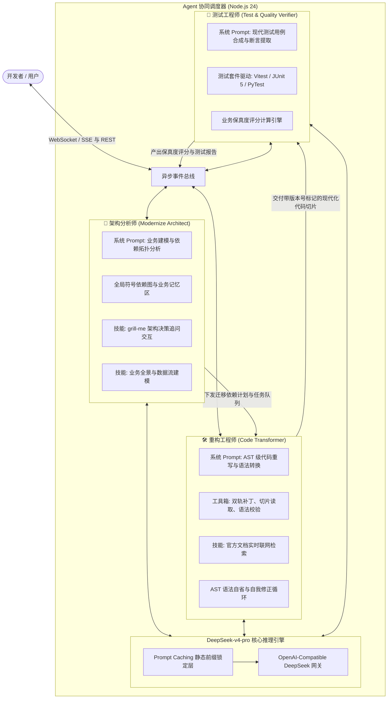
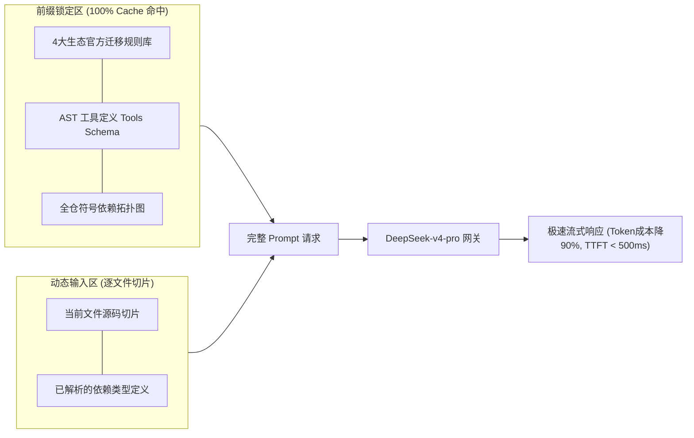

# 🤖 Agent 协同机制与协议规范 (Agent Orchestration & Protocol)

<p align="center">
  <a href="../agent-orchestration.md">English Version</a> | <a href="./agent-orchestration.md">简体中文版</a>
</p>

---

## 1. 三 Agent 专家团队分工与职责边界

系统借鉴 `Claude Code` 与 `grok-build` 等先进编程 Agent 的架构设计，在 Node.js 24 后端调度三个具备独立专长与上下文隔离的 Agent，全流程由 **DeepSeek-v4-pro** 提供高精度推理支撑，形成紧密协作的 ReAct（Reasoning + Acting）闭环：



---

## 2. ReAct Agent 运行生命周期与状态机

```mermaid
stateDiagram-v2
    [*] --> IDLE

    IDLE --> SCANNING: 触发工程导入
    state "依赖扫描 (Scanning)" as SCANNING {
        [*] --> ParseASTSymbols
        ParseASTSymbols: 解析全局AST符号
        ParseASTSymbols --> ConstructDepGraph
        ConstructDepGraph: 构建拓扑依赖图
        ConstructDepGraph --> DetectBranches
        DetectBranches: 检测重大架构分支
    }

    SCANNING --> GRILL_ME_INTERVIEW: 检测到重大架构决策分歧
    state "架构决策追问 (grill-me)" as GRILL_ME_INTERVIEW {
        [*] --> EmitCard
        EmitCard: 弹出结构化决策卡片
        EmitCard --> AwaitChoice
        AwaitChoice: 等待用户选择确认
        AwaitChoice --> FreezePlan
        FreezePlan: 固化重构技术方案
    }

    SCANNING --> DISPATCH_PLAN: 拓扑图无歧义
    GRILL_ME_INTERVIEW --> DISPATCH_PLAN

    state "计划下发 (Dispatch)" as DISPATCH_PLAN {
        [*] --> TopoSort
        TopoSort: 自底向上拓扑排序
        TopoSort --> QueueTasks
        QueueTasks: 分发重构任务队列
    }

    DISPATCH_PLAN --> TRANSFORMING

    state "代码重构 (Transforming)" as TRANSFORMING {
        [*] --> ReadSlice
        ReadSlice: 按需读取源文件切片
        ReadSlice --> FetchDoc
        FetchDoc: 联网检索官方文档
        FetchDoc --> AcquireLock
        AcquireLock: 获取文件锁并记录当前 vN 快照
        AcquireLock --> GenPatch
        GenPatch: DeepSeek-v4-pro 生成双轨补丁
        GenPatch --> ApplyPatch
        ApplyPatch: 写入AST补丁(新建全量/局部替换)
        ApplyPatch --> VerifySyntax
        VerifySyntax: 执行静态语法与类型校验
        VerifySyntax --> FixSyntax: 发现语法或类型错误
        FixSyntax: 自动回退至快照 vN 并重新尝试
        FixSyntax --> ApplyPatch
        VerifySyntax --> FinalizeFile: 校验通过
        FinalizeFile: 提交 vN+1 快照并释放文件锁
    }

    TRANSFORMING --> VERIFYING: 全仓文件重构完毕

    state "测试验证 (Verifying)" as VERIFYING {
        [*] --> GenTests
        GenTests: 提取历史逻辑并合成测试套件
        GenTests --> RunSandbox
        RunSandbox: 在轻量沙箱中执行测试
        RunSandbox --> CalcScore
        CalcScore: 计算业务保真度综合评分
    }

    VERIFYING --> READY_FOR_REVIEW: 评分达到准入阈值

    state "差异审查 (Review)" as READY_FOR_REVIEW {
        [*] --> StreamDiff
        StreamDiff: 流式推送到MonacoDiff视图
        StreamDiff --> HumanReview
        HumanReview: 开发者行级审查与版本步进
        HumanReview --> GeneratePR: 全部确认
        HumanReview --> RollbackStep: 回退到历史快照 vN
        RollbackStep --> RePromptTransformer
        RePromptTransformer: 指派Agent重新生成
    }

    RePromptTransformer --> TRANSFORMING
    GeneratePR --> [*]
```



---

## 3. 双轨代码补丁写入与版本快照协议 (Dual-Track Patching)

为彻底杜绝大模型在输出 Git Unified Diff 时常见的“行号偏移幻觉（Off-by-one Error）”，并支持毫秒级历史快照回退，**Code Transformer Agent** 严格采用**双轨代码补丁策略**：

### 3.1 双轨补丁机制设计
1. **轨道 A：新建/解耦文件走全量生成（Whole-File Generation）**
   - 适用于抽离的 Spring Boot REST Controller、Pinia Store 状态树、TypeScript DTO Record 等全新目标文件；
   - 直接将完整现代化源码输出至 `/target` 目录。
2. **轨道 B：现有文件局部重构走结构化 Search/Replace 块（Block Replacement）**
   - 适用于在已有老旧工具类、组件上进行针对性方法升级；
   - 采用标准结构化标记块：
     ```text
     <<<<<<< SEARCH
     String action = request.getParameter("action");
     =======
     String action = request.getAction();
     >>>>>>> REPLACE
     ```
   - 后端 Node 24 内置模糊匹配算法（忽略多余空白/缩进），直接在目标代码上完成精确替换，规避行号计算错误。

---

## 4. DeepSeek-v4-pro 推理策略与缓存优化设计

系统选用 **DeepSeek-v4-pro** 作为全栈 Agent 的大模型底座，针对三 Agent 角色进行差异化的推理参数配置与上下文缓存加速优化。

### 4.1 三 Agent 差异化推理参数矩阵 (Parameter Matrix)

| Agent 角色 | 核心任务 | Temperature | Top_P | Max Tokens | Reasoning 模式 | 目标诉求 |
| :--- | :--- | :---: | :---: | :---: | :---: | :--- |
| 🧠 **Architect Agent** | 全局依赖扫描、业务流建模、`grill-me` 追问 | `0.2` | `0.95` | `8,192` | 开启深度推导 (Thinking Mode) | 保证架构决策严谨、依赖拓扑无环 |
| 🛠️ **Transformer Agent** | AST 级代码改写、精确 Patch 生成、语法自纠错 | `0.0` | `1.0` | `16,384` | 极速精准代码生成 | **0 随机性**，杜绝变量与废弃 API 幻觉 |
| 🧪 **Verifier Agent** | 提取逻辑分支、合成测试套件、断言回归校验 | `0.1` | `0.9` | `8,192` | 严密校验模式 | 确保测试断言完备、边界覆盖严苛 |

### 4.2 DeepSeek 原生 Prompt Caching 前缀锁定架构



---

## 5. SSE（Server-Sent Events）实时流式通信协议

后端通过持久连接 `GET /api/workspace/:sessionId/events` 向上层 VS Code Web 工作台实时推送事件。

### TypeScript 事件类型定义

```typescript
export type ModernizerSSEEvent =
  | {
      type: "agent_thought";
      agent: "architect" | "transformer" | "verifier";
      step: number;
      thought: string;
      timestamp: number;
    }
  | {
      type: "tool_call";
      agent: "architect" | "transformer" | "verifier";
      toolName: string;
      parameters: Record<string, unknown>;
      timestamp: number;
    }
  | {
      type: "tool_result";
      toolName: string;
      output: string;
      status: "success" | "error";
      timestamp: number;
    }
  | {
      type: "file_diff_chunk";
      filePath: string;
      status: "in_progress" | "completed";
      patchType: "whole_file" | "search_replace";
      fileVersion: number;        // 例如 1, 2, 3
      previousVersion: number;    // 例如 0, 1, 2
      rollbackSupported: boolean;
      originalContent: string;
      modifiedContent: string;
      rationale: string;
      timestamp: number;
    }
  | {
      type: "file_lock_status";
      filePath: string;
      state: "acquired" | "waiting" | "released";
      heldByAgent: "transformer" | "verifier";
      timestamp: number;
    }
  | {
      type: "doc_search_snippet";
      query: string;
      url: string;
      title: string;
      summary: string;
      timestamp: number;
    }
  | {
      type: "grill_me_question";
      questionId: string;
      title: string;
      context: string;
      options: Array<{
        id: string;
        label: string;
        recommended?: boolean;
        description: string;
      }>;
    }
  | {
      type: "test_suite_result";
      totalTests: number;
      passed: number;
      failed: number;
      preservationScore: number; // 例如 99.4
      testCases: Array<{
        name: string;
        status: "pass" | "fail";
        durationMs: number;
        assertion: string;
      }>;
    };
```
