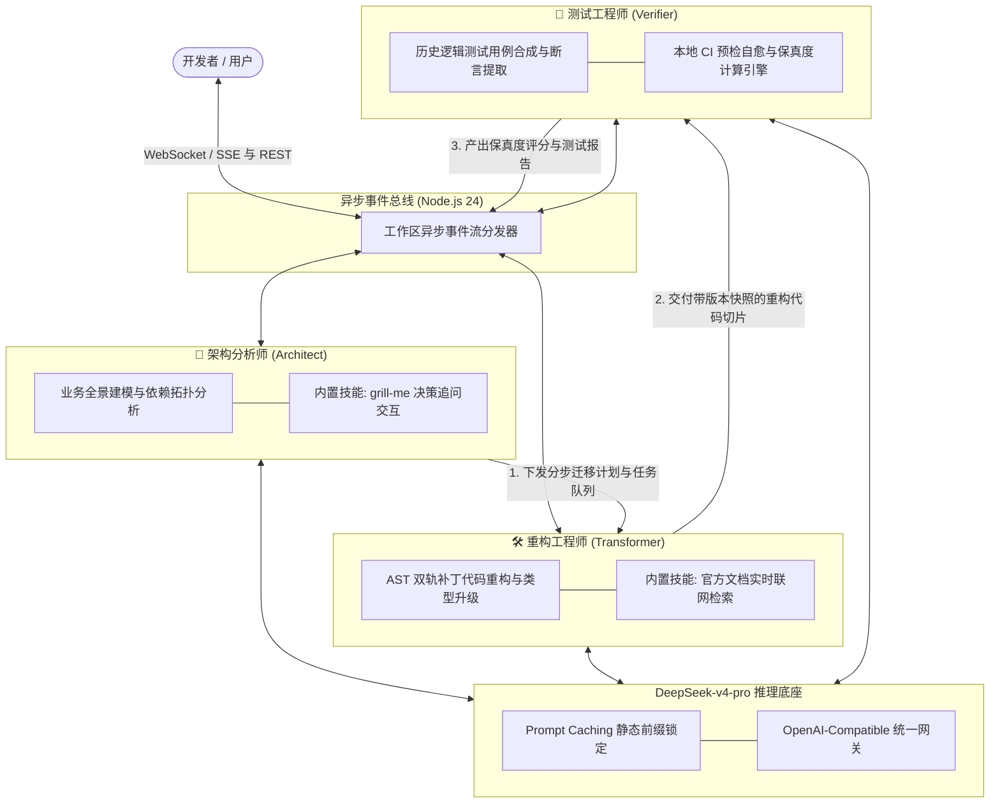
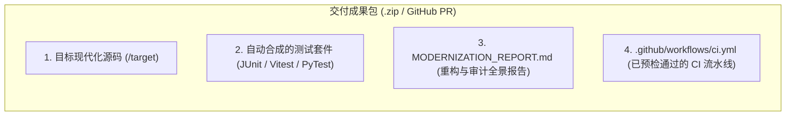

# 🤖 Agent 协同机制与协议规范 (Agent Orchestration & Protocol)

<p align="center">
  <a href="../agent-orchestration.md">English Version</a> | <a href="./agent-orchestration.md">简体中文版</a>
</p>

---

## 1. 三 Agent 专家团队分工与职责边界

系统借鉴 `Claude Code` 与 `grok-build` 等先进编程 Agent 的架构设计，在 Node.js 24 后端调度三个具备独立专长与上下文隔离的 Agent，全流程由 **DeepSeek-v4-pro** 提供高精度推理支撑，形成紧密协作的 ReAct（Reasoning + Acting）闭环：



---

## 2. ReAct Agent 运行生命周期与状态机

```mermaid
stateDiagram-v2
    [*] --> IDLE

    IDLE --> SCANNING: 触发工程导入
    state "依赖扫描 (Scanning)" as SCANNING {
        [*] --> ParseASTSymbols
        ParseASTSymbols: 解析全局AST符号
        ParseASTSymbols --> ConstructDepGraph
        ConstructDepGraph: 构建拓扑依赖图
        ConstructDepGraph --> DetectBranches
        DetectBranches: 检测重大架构分支
    }

    SCANNING --> GRILL_ME_INTERVIEW: 检测到重大架构决策分歧
    state "架构决策追问 (grill-me)" as GRILL_ME_INTERVIEW {
        [*] --> EmitCard
        EmitCard: 弹出结构化决策卡片
        EmitCard --> AwaitChoice
        AwaitChoice: 等待用户选择确认
        AwaitChoice --> FreezePlan
        FreezePlan: 固化重构技术方案
    }

    SCANNING --> DISPATCH_PLAN: 拓扑图无歧义
    GRILL_ME_INTERVIEW --> DISPATCH_PLAN

    state "计划下发 (Dispatch)" as DISPATCH_PLAN {
        [*] --> TopoSort
        TopoSort: 自底向上拓扑排序
        TopoSort --> QueueTasks
        QueueTasks: 分发重构任务队列
    }

    DISPATCH_PLAN --> TRANSFORMING

    state "代码重构 (Transforming)" as TRANSFORMING {
        [*] --> ReadSlice
        ReadSlice: 按需读取源文件切片
        ReadSlice --> FetchDoc
        FetchDoc: 联网检索官方文档
        FetchDoc --> AcquireLock
        AcquireLock: 获取文件锁并记录当前 vN 快照
        AcquireLock --> GenPatch
        GenPatch: DeepSeek-v4-pro 生成双轨补丁
        GenPatch --> ApplyPatch
        ApplyPatch: 写入AST补丁(新建全量/局部替换)
        ApplyPatch --> VerifySyntax
        VerifySyntax: 执行静态语法与类型校验
        VerifySyntax --> FixSyntax: 发现语法或类型错误
        FixSyntax: 自动回退至快照 vN 并重新尝试
        FixSyntax --> ApplyPatch
        VerifySyntax --> FinalizeFile: 校验通过
        FinalizeFile: 提交 vN+1 快照并释放文件锁
    }

    TRANSFORMING --> VERIFYING: 全仓文件重构完毕

    state "测试验证 (Verifying)" as VERIFYING {
        [*] --> GenTests
        GenTests: 提取历史逻辑并合成测试套件
        GenTests --> RunSandbox
        RunSandbox: 在轻量沙箱中执行测试
        RunSandbox --> CalcScore
        CalcScore: 计算业务保真度综合评分
    }

    VERIFYING --> CI_DRY_RUN: 保真度达标

    state "本地 CI 预检沙箱 (CI Dry-Run)" as CI_DRY_RUN {
        [*] --> CheckPathCasing
        CheckPathCasing: Linux 大小写敏感路径核查
        CheckPathCasing --> RunTypecheck
        RunTypecheck: 严格类型检查 (tsc --noEmit / mypy)
        RunTypecheck --> RunLinter
        RunLinter: 代码风格与 Lockfile 锁定检查
        RunLinter --> FixCIError: 检查失败
        FixCIError: 触发 Transformer 针对性自愈
        FixCIError --> RunTypecheck
        RunLinter --> CIPassed: 全部绿灯通过
        CIPassed: 获得 CI 交付认证
    }

    CI_DRY_RUN --> READY_FOR_REVIEW

    state "差异审查 (Review)" as READY_FOR_REVIEW {
        [*] --> StreamDiff
        StreamDiff: 流式推送到MonacoDiff视图
        StreamDiff --> HumanReview
        HumanReview: 开发者行级审查与版本步进
        HumanReview --> GeneratePR: 全部确认
        HumanReview --> RollbackStep: 回退到历史快照 vN
        RollbackStep --> RePromptTransformer
        RePromptTransformer: 指派Agent重新生成
    }

    RePromptTransformer --> TRANSFORMING
    GeneratePR --> [*]
```



---

## 3. 本地 CI 预检机制（解决 AI 代码无法通过 CI 工作流的行业通病）

在实际使用大模型辅助编程时，代码在本地看似能跑但提交到 GitHub Actions CI 却经常报错失败。**Verifier Agent** 内置了**本地 CI 预检沙箱（Pre-Flight CI Dry-Run）**，在代码交付前逐一攻克四大失败根因：

### 3.1 AI 代码导致 CI 失败的四大根因与确定性防御方案

| CI 失败根因 | 典型现象 | Modernizer 确定性防御机制 |
| :--- | :--- | :--- |
| **1. 文件路径大小写敏感（Case-Sensitivity）** | Windows 开发环境对大小写不敏感（`import './user'` 能找到 `User.ts`），但 GitHub Actions 的 Linux 环境（`ubuntu-latest`）报错 `Module not found`。 | **AST 路径正规化器**：在提交前扫描所有 import/require 语句，与磁盘真实文件名进行严格二进制大小写比对。 |
| **2. 依赖版本漂移（Lockfile Drift）** | CI 在执行 `npm install` 或 `pip install` 时拉取了最新子版本，导致 API 发生 Breaking Change。 | **确定性 Lockfile 生成器**：由沙箱自动固化生成已校验的 `package-lock.json` 或 `poetry.lock`，锁定精确版本。 |
| **3. 严格类型与 Linter 检查报错** | CI 启用了 `tsc --noEmit` 和 `eslint --max-warnings=0`，纯大模型生成的代码经常漏掉细微泛型或留下未使用的 import。 | **沙箱本地 Typecheck 预跑**：本地直接预执行 `tsc --noEmit`，报错时直接将编译器诊断信息反馈给 Transformer Agent 自愈。 |
| **4. 异步测试执行时序不稳定（Flaky Tests）** | 测试用例依赖写死的 `sleep(500)`，在 CI 共享 CPU 核心下降速导致超时失败。 | **标准断言等待结构**：强制测试套件使用 `vi.waitFor` 或 MockMvc 异步锁机制，杜绝偶发性超时。 |

---

## 4. 全要素交付成果流水线 (Full-Asset Deliverables)

当重构成果通过审查后，系统打包输出一套符合顶级开源标准的交付物：



---

## 5. 双轨代码补丁写入与版本快照协议 (Dual-Track Patching)

### 5.1 双轨补丁机制设计
1. **轨道 A：新建/解耦文件走全量生成（Whole-File Generation）**：直接输出至 `/target` 目录。
2. **轨道 B：现有文件局部重构走结构化 Search/Replace 块（Block Replacement）**：
   ```text
   <<<<<<< SEARCH
   String action = request.getParameter("action");
   =======
   String action = request.getAction();
   >>>>>>> REPLACE
   ```
   后端 Node 24 模糊匹配算法执行替换，规避行号计算错误。

---

## 6. DeepSeek-v4-pro 推理策略与参数矩阵

| Agent 角色 | 核心任务 | Temperature | Top_P | Max Tokens | Reasoning 模式 | 目标诉求 |
| :--- | :--- | :---: | :---: | :---: | :---: | :--- |
| 🧠 **Architect Agent** | 全局依赖扫描、业务流建模、`grill-me` 追问 | `0.2` | `0.95` | `8,192` | 开启深度推导 (Thinking Mode) | 保证架构决策严谨、依赖拓扑无环 |
| 🛠️ **Transformer Agent** | AST 级代码改写、精确 Patch 生成、语法自纠错 | `0.0` | `1.0` | `16,384` | 极速精准代码生成 | **0 随机性**，杜绝变量与废弃 API 幻觉 |
| 🧪 **Verifier Agent** | 提取逻辑分支、CI预检、断言回归校验 | `0.1` | `0.9` | `8,192` | 严密校验模式 | 确保测试断言完备、本地 CI 预检绿灯 |

---

## 7. SSE（Server-Sent Events）实时流式通信协议

### TypeScript 事件类型定义

```typescript
export type ModernizerSSEEvent =
  | {
      type: "agent_thought";
      agent: "architect" | "transformer" | "verifier";
      step: number;
      thought: string;
      timestamp: number;
    }
  | {
      type: "tool_call";
      agent: "architect" | "transformer" | "verifier";
      toolName: string;
      parameters: Record<string, unknown>;
      timestamp: number;
    }
  | {
      type: "tool_result";
      toolName: string;
      output: string;
      status: "success" | "error";
      timestamp: number;
    }
  | {
      type: "file_diff_chunk";
      filePath: string;
      status: "in_progress" | "completed";
      patchType: "whole_file" | "search_replace";
      fileVersion: number;
      previousVersion: number;
      rollbackSupported: boolean;
      originalContent: string;
      modifiedContent: string;
      rationale: string;
      timestamp: number;
    }
  | {
      type: "file_lock_status";
      filePath: string;
      state: "acquired" | "waiting" | "released";
      heldByAgent: "transformer" | "verifier";
      timestamp: number;
    }
  | {
      type: "ci_dry_run_progress";
      stepName: "case_sensitivity" | "typecheck" | "lint" | "test";
      status: "running" | "passed" | "failed";
      errorLogs?: string;
      timestamp: number;
    }
  | {
      type: "test_suite_result";
      totalTests: number;
      passed: number;
      failed: number;
      preservationScore: number;
      testCases: Array<{
        name: string;
        status: "pass" | "fail";
        durationMs: number;
        assertion: string;
      }>;
    };
```
