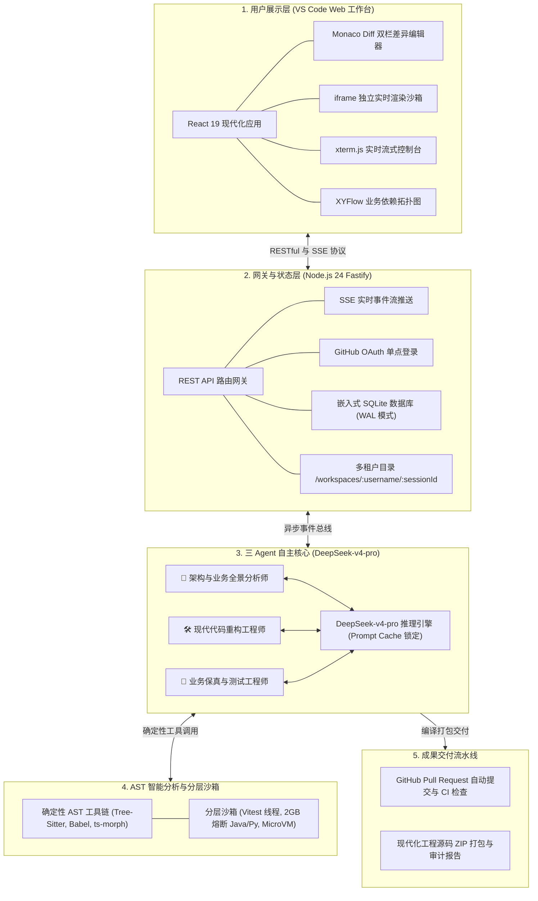
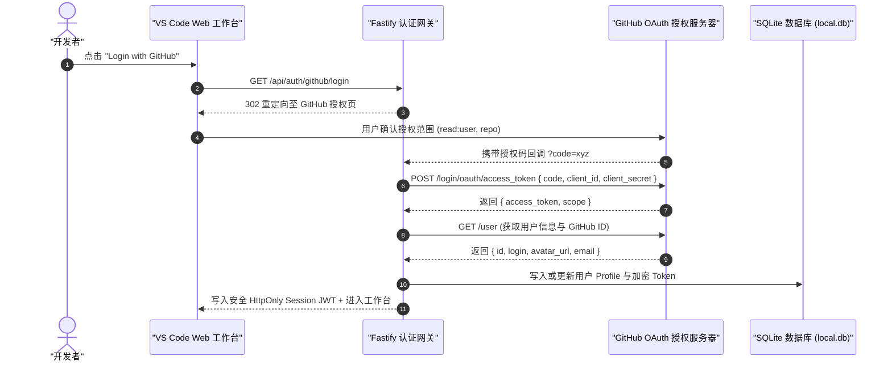
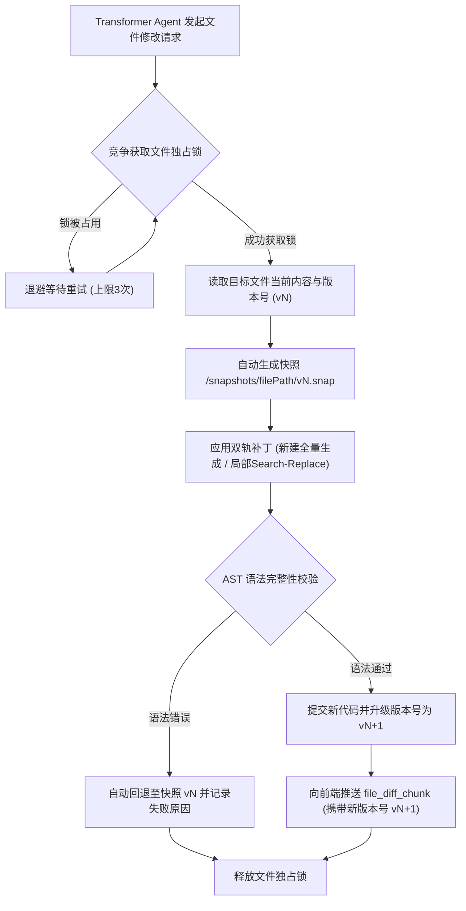
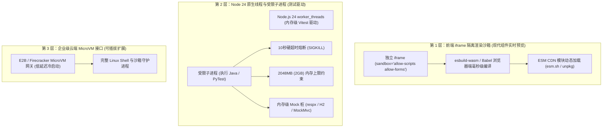
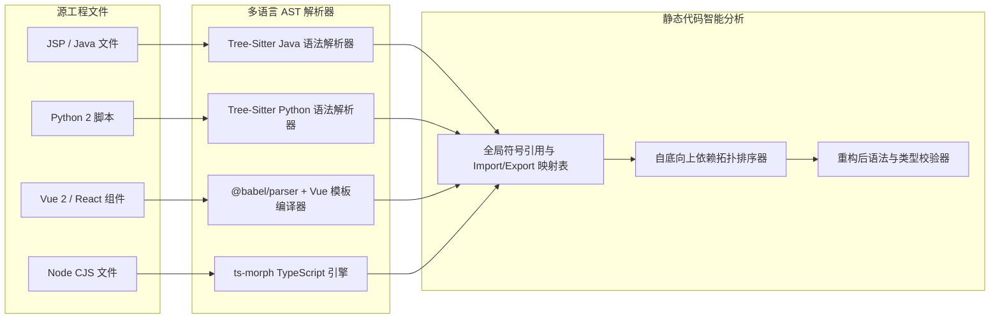
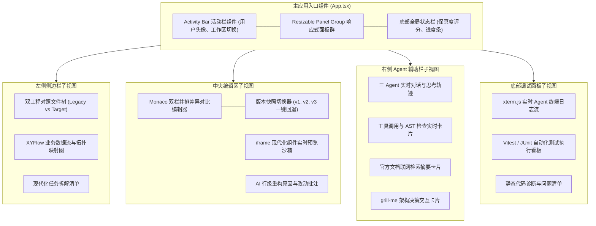

# 📐 系统架构与运行时规范 (System Architecture & Runtime)

<p align="center">
  <a href="../architecture.md">English Version</a> | <a href="./architecture.md">简体中文版</a>
</p>

---

## 1. 系统全景与分层架构

**Legacy Code Modernizer** 是一个基于 **Node.js 24 LTS** 与 **DeepSeek-v4-pro** 的高吞吐、事件驱动全栈系统。展示层与 Agent 执行核心通过 RESTful API 与 Server-Sent Events (SSE) 保持双向解耦与实时流式互通。



---

## 2. GitHub OAuth 统一认证与 SQLite 存储架构

系统采用 **GitHub OAuth 一键单点登录 (SSO)**。用户无需手动生成或配置 GitHub Personal Access Token (PAT)，OAuth 鉴权成功后系统即可直接以用户身份安全拉取私有代码库并自动创建 PR：



### 2.1 嵌入式 SQLite 数据库架构 (`better-sqlite3` WAL 模式)

系统选用经过深度验证的 **`better-sqlite3`** 作为嵌入式数据库引擎，启动时自动开启 Write-Ahead Logging (WAL) 模式与内存高速缓存，以极低延迟支撑三 Agent 高频并发状态写入与会话恢复：

```sql
-- 用户表与偏好设置
CREATE TABLE IF NOT EXISTS users (
    id TEXT PRIMARY KEY,
    github_id INTEGER UNIQUE NOT NULL,
    username TEXT NOT NULL,
    avatar_url TEXT,
    access_token TEXT NOT NULL,
    deepseek_api_key TEXT, -- 用户绑定的专属 DeepSeek API 密钥 (加密存储)
    deepseek_base_url TEXT DEFAULT 'https://api.deepseek.com/v1',
    created_at DATETIME DEFAULT CURRENT_TIMESTAMP,
    updated_at DATETIME DEFAULT CURRENT_TIMESTAMP
);

-- 工作区元数据表 (兼容 GitHub 登录用户与 Guest 访客模式)
CREATE TABLE IF NOT EXISTS workspaces (
    id TEXT PRIMARY KEY,
    user_id TEXT, -- 允许为 NULL (未登录访客模式)
    is_guest INTEGER DEFAULT 0, -- 1: 匿名访客体验; 0: GitHub 授权用户
    name TEXT NOT NULL,
    track TEXT NOT NULL, -- 'jsp_spring', 'python', 'vue_react', 'node', 'springboot2_vue2'
    source_type TEXT NOT NULL, -- 'preset_demo', 'zip_upload', 'github_repo'
    repo_url TEXT,
    status TEXT DEFAULT 'initialized', -- 'scanning', 'grill_me', 'transforming', 'verifying', 'completed'
    fidelity_score REAL,
    created_at DATETIME DEFAULT CURRENT_TIMESTAMP,
    updated_at DATETIME DEFAULT CURRENT_TIMESTAMP,
    FOREIGN KEY(user_id) REFERENCES users(id) ON DELETE SET NULL
);

-- 文件快照与审计日志表
CREATE TABLE IF NOT EXISTS file_snapshots (
    id INTEGER PRIMARY KEY AUTOINCREMENT,
    workspace_id TEXT NOT NULL,
    file_path TEXT NOT NULL,
    version INTEGER NOT NULL,
    patch_type TEXT NOT NULL, -- 'whole_file', 'search_replace'
    snapshot_path TEXT NOT NULL,
    created_at DATETIME DEFAULT CURRENT_TIMESTAMP,
    FOREIGN KEY(workspace_id) REFERENCES workspaces(id) ON DELETE CASCADE
);
```

### 2.2 用户端自主输入与安全持久化机制 (BYOK & Persistent Storage)

为保障多用户环境下的密钥安全、防止浏览器刷新/切换设备导致上下文丢失，并支持长耗时后台 Agent 任务连续运行，系统采用 **“前端设置 + SQLite 用户表安全入库”双层持久化机制**：
- **用户自主输入 (BYOK)**：用户在 VS Code 工作台顶栏设置弹窗中输入自己的 `DEEPSEEK_API_KEY`（与可选自定义 Base URL），通过 `POST /api/user/settings` 保存；
- **SQLite 用户级加密持久化**：密钥写入当前登录用户的 SQLite `users.deepseek_api_key` 字段（结合服务端 `JWT_SECRET` 加密），与用户的 GitHub 账号终身绑定。即使用户刷新浏览器、更换电脑或清除浏览器缓存，登录后依然无缝读取，保证长耗时重构任务不中断；
- **会话级客户端实例化**：后端在执行 Agent 任务时，按用户 ID 动态取出对应的专属密钥实例化 `OpenAI` 客户端，实现多租户之间严格的算力与账单隔离；
- **服务端全局兜底配置**：后端 `.env` 中的 `DEEPSEEK_API_KEY` 仅作为可选的全局演示兜底配置（例如为未绑卡评委体验 1-Click Demo 准备）。

---

## 3. 多租户物理双工程隔离与映射对照树规范

### 3.1 物理磁盘双工程隔离架构 (前后端分离标准工程范例)
系统在底层采用 **`/source` (只读老工程基准) + `/target` (独立现代化新工程)** 双目录隔离架构。以典型的**“Vue 2 + Spring Boot 1.5/Java 8 老旧前后端分离系统”升级至“Vue 3/TS + Spring Boot 3/Java 21 现代前后端分离系统”**为例，真实磁盘目录结构如下：

```text
/workspaces/:username/:sessionId/
   ├── /source/                                # 🔴 原始老工程 (严格只读 Read-Only，黄金真理源)
   │     ├── frontend/                         # 老前端工程 (Vue 2 + Webpack + Options API)
   │     │    ├── src/
   │     │    │    ├── views/Login.vue
   │     │    │    └── store/index.js
   │     │    ├── package.json
   │     │    └── vue.config.js
   │     └── backend/                          # 老后端工程 (Spring Boot 1.5 + Java 8 + javax.*)
   │          ├── src/main/java/com/example/
   │          │    ├── controller/UserController.java
   │          │    └── model/User.java
   │          └── pom.xml
   │
   ├── /target/                                # 🟢 现代化新工程 (可写 Mutable，独立全新工程骨架)
   │     ├── frontend/                         # 现代化前端工程 (Vue 3 + Vite 6 + Pinia + TS)
   │     │    ├── src/
   │     │    │    ├── views/LoginView.vue     # 升级为 <script setup lang="ts">
   │     │    │    └── stores/user.ts          # 升级为 Pinia 状态 Store
   │     │    ├── package.json
   │     │    ├── vite.config.ts
   │     │    └── tsconfig.json
   │     ├── backend/                          # 现代化后端工程 (Spring Boot 3.4 + Java 21 + Jakarta)
   │     │    ├── src/main/java/com/example/
   │     │    │    ├── controller/UserController.java  # 迁移为 Jakarta REST API
   │     │    │    └── model/UserRecord.java           # 升级为 Java 21 Record DTO
   │     │    ├── src/test/java/com/example/           # 自动合成的 JUnit 5 单元测试
   │     │    │    └── controller/UserControllerTest.java
   │     │    └── pom.xml                              # Spring Boot 3.4 依赖清单
   │     ├── MODERNIZATION_REPORT.md           # 全景审计与重构报告
   │     └── .github/workflows/ci.yml          # 预检通过的统一 CI 自动化流水线
   │
   └── /snapshots/                             # 🛡️ 文件版本快照 (记录 target 的 v1, v2 快照，用于一键回退)
```

### 3.2 左侧 Explorer 映射对照树 (Mapping Tree View)
工作台左侧 Explorer 严格按照**“前后端模块分级 ➔ 业务功能 ➔ 新老映射条目”**组织映射对照树：

```text
▼ 🌐 前端模块 (Frontend: Vue 2 Options ➔ Vue 3 Setup + TS)
   ▼ 📦 认证与会话 (Auth & Session)
      ├── 📄 [Old] frontend/src/views/Login.vue  ➔  📄 [New] frontend/src/views/LoginView.vue
      └── 📄 [Old] frontend/src/store/index.js   ➔  📄 [New] frontend/src/stores/user.ts
   ▼ ⚙️ 工程构建配置 (Build Config)
      └── 📄 [Old] frontend/vue.config.js        ➔  📄 [New] frontend/vite.config.ts

▼ ☕ 后端模块 (Backend: Spring Boot 1.5/Java 8 ➔ Spring Boot 3/Java 21)
   ▼ 📦 控制器与接口 (Controllers & APIs)
      ├── 📄 [Old] backend/src/.../UserController.java  ➔  📄 [New] backend/src/.../UserController.java
      └── 📄 [Old] backend/src/.../User.java            ➔  📄 [New] backend/src/.../UserRecord.java
   ▼ 🧪 自动化测试验证 (Synthesized Tests)
      └── ✨ [Generated] backend/src/test/.../UserControllerTest.java
```
- **交互联动**：点击任意一行映射条目，中央编辑器自动切换为 Monaco 双栏 Diff 视图（左侧载入 `/source/...` 原文件，右侧载入 `/target/...` 目标文件）。

### 3.3 访客免登录体验模式 (Guest Mode Lifecycle & BYOK)

为方便快速评审、黑客松演示与零配置体验，系统全面支持 **免登录访客模式（Guest Mode）**：
1. **匿名工作区隔离**：未登录用户进入前端直接分配唯一会话标识 `guest-:sessionId`，工作区物理目录为 `/workspaces/guest/:sessionId/{source,target}`；
2. **纯 BYOK 模式驱动**：用户在工作台右上方或弹窗中填入自己的 `DEEPSEEK_API_KEY`（或读取服务端全局配置），密钥由前端暂存或安全写入会话记录，全流程直接驱动真实 **DeepSeek-v4-pro** 专家 Agent；
3. **成果无缝迁移**：访客在完成重构后若点击 "Login with GitHub"，系统可一键将该 guest 会话及所有历史代码快照迁移绑定至其 GitHub 账号，支持直接创建 GitHub PR。

### 3.4 增量流式步进重构协议 (Incremental Streaming Protocol)

系统彻底摈弃传统的“全仓黑盒重构”模式，采用类似资深工程师工作流的**单文件/单组件增量步进重构**：
1. **拓扑驱动任务流**：Architect Agent 解析完全仓依赖后，生成自底向上的组件拓扑任务队列入库 SQLite `tasks` 表；
2. **单文件即时交付**：Transformer Agent 每次针对单一文件/模块进行重构与自反思校验，校验通过即刻写入 `/target` 并生成版本快照；
3. **实时 Monaco Diff 响应**：后端通过 SSE 实时向前端广播 `file_modernized` 与 `diff_ready` 事件，左侧映射对照树相应节点即刻亮起绿灯状态，用户可立即点击对比新老代码并审查行级 AI Rationale；
4. **决策挂起与恢复**：当 Architect 识别到重大架构分支时，向前端派发 `grill_me_card` 暂停执行，等待用户点击确认后即刻恢复队列。

---

## 4. 代码版本快照与文件并发锁控制引擎



---

## 5. 分层执行与实时渲染沙箱架构 (借鉴 Claude Artifacts)



---

## 6. 多语言 AST 解析与静态分析流水线



---

## 7. 前端 VS Code 风格工作台组件架构



### 7.1 工作台首屏引导中心 (Welcome Onboarding & 1-Click Preset Hub)

当用户初次进入工作台（或尚未载入任何工作区）时，主编辑区默认呈现 **Welcome 欢迎中心**：
1. **5 大工业级预置靶场卡片墙**：
   - 动态从 `Demo/presets.json` 读取元数据渲染交互式卡片；
   - 每张卡片清晰陈列：赛道徽标（JSP / Python / Vue / Node / Spring Boot）、代码行数、源坏味道特征与现代化目标栈标签；
   - 提供显眼的 **“一键装载现代化 (1-Click Load & Modernize)”** 按钮，点击后秒级在当前访客/用户会话下完成工程挂载并唤醒三 Agent；
2. **顶栏常驻全局快捷设置 (Global Quick Settings)**：
   - **`[⚙️ DeepSeek API Key]`**：支持随时调起 BYOK 弹窗，用户输入密钥后写入浏览器安全上下文并同步至后端 session；
   - **`[🐙 Login with GitHub]`**：未登录时展示，点击即可跳转 OAuth 授权，将当前会话一键升级为持久化用户会话。

### 7.2 Monaco Diff 深度审查与行级 AI Rationale 批注交互 (HITL Review)

在代码逐步生成与重构过程中，中央主编辑区提供兼具效率与深度的并排审查机制：
1. **并排差异高亮 (Side-by-Side Diff)**：左侧只读展示老旧源文件（红色高亮已移除的坏味道逻辑），右侧展示现代化目标文件（绿色高亮升级后的现代语法）；
2. **AI Rationale 行级批注卡片 (Hover/Decorations)**：
   - 在关键重构代码段（例如 `javax.* ➔ jakarta.*`，或 Jedis 手写 Lua ➔ 声明式分布式锁），通过 Monaco Decoration 显示 ✨ 图标；
   - 鼠标悬停时弹出 AI 决策卡片，详述修改原因、安全隐患消除逻辑及官方 Migration Guide 依据；
3. **版本快照步进与一键回退 (Snapshot Rollback)**：
   - 编辑器顶部提供版本控制器 `[快照: v3 (当前)]`，下拉可回退至 `v1`、`v2`；
   - 提供 **“采纳全部改动 (Accept All)”** 与 **“驳回本文件并重试 (Reject & Re-prompt)”** 交互，赋予开发者最高掌控权。

---

## 8. 双通道成果交付与导出流水线 (Dual-Channel Delivery Pipeline)

重构与 CI 预检绿灯后，工作台右侧结算面板与顶栏提供交付出口。系统严格遵循工程合规与靶场边界规则：

### 8.1 交付通道与工程类型权限矩阵

| 工程源类型 (`source_type`) | 适用场景 | 1-Click 本地 ZIP 下载 | 1-Click GitHub PR 提交 | 权限控制与 UI 交互说明 |
| :--- | :--- | :---: | :---: | :--- |
| **内置 Demo 演示靶场 (`preset_demo`)** | 官方 5 套基准演示工程 | **✅ 支持 (唯一出口)** | **❌ 不支持 (禁用置灰)** | **Demo 演示项目不走 GitHub PR**，界面上 PR 按钮自动置灰并悬浮提示：“内置靶场仅支持直接导出独立现代化 ZIP 包，避免对外部仓库产生非预期写入” |
| **用户自有导入工程 (`github_repo`)** | 用户 GitHub 授权导入的真实仓库 | **✅ 支持** | **✅ 支持** | 支持在远程仓库自动拉取 `modernize/<timestamp>` 分支并提交带完整审计报告的 PR |
| **本地 ZIP 自定义上传 (`zip_upload`)** | 用户自行打包上传的老旧系统 | **✅ 支持** | ⚠️ 需绑定远端 | 默认支持 ZIP 下载；若用户在工作台点击绑定 GitHub 远端仓库，可升级开启 PR 提交 |

### 8.2 全要素审计报告规范 (`MODERNIZATION_REPORT.md`)

无论是导出的 ZIP 压缩包根目录，还是自动开启的 GitHub PR 描述主体，均统一内嵌由 **Verifier Agent** 自动编译沉淀的标准化审计报告，固定包含以下四大核心版块：
1. **确定性数学保真度评分表**：列出 $S_{\text{fidelity}}$ 最终得分、动态测试通过率 $P_{\text{tests}}$、AST 符号覆盖率 $C_{\text{ast}}$ 及契约一致性 $M_{\text{schema}}$ 的各项实测值；
2. **弃用 API 与坏味道消解清单**：详述全仓消除的坏味道点（如 `javax.* ➔ jakarta.*` 替换清单、Jedis Lua ➔ 声明式锁、CommonJS ➔ 原生 ESM 映射表）；
3. **沙箱回归测试执行详报**：列明每个被执行测试用例的名称、对应断言逻辑、毫秒级耗时与测试框架（JUnit 5 / PyTest / Vitest）执行报告；
4. **现代化工程本地启动与部署指引**：清晰提供现代化后目标工程的依赖安装命令、环境变量说明与一键启动运行指南。


