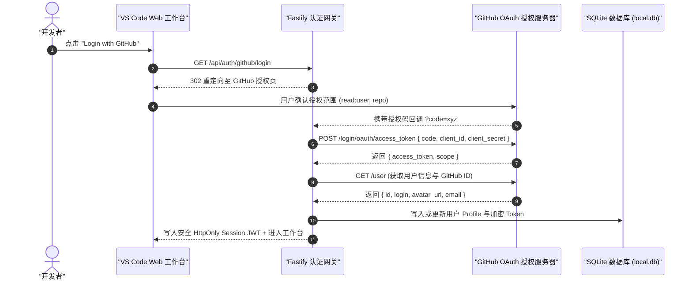
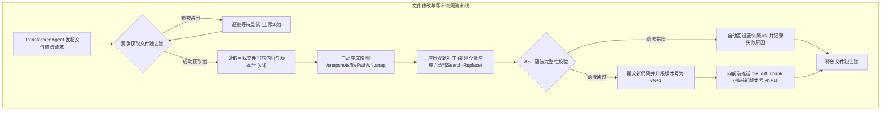
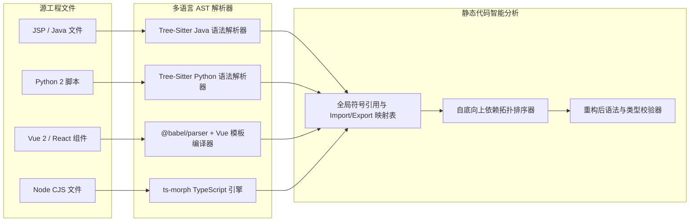
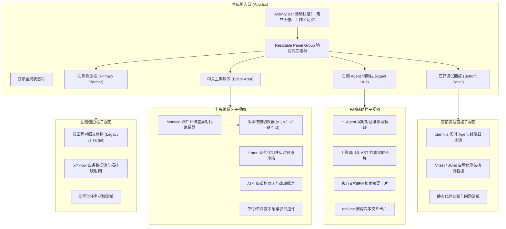

# 📐 系统架构与运行时规范 (System Architecture & Runtime)

<p align="center">
  <a href="../architecture.md">English Version</a> | <a href="./architecture.md">简体中文版</a>
</p>

---

## 1. 系统全景与分层架构

**Legacy Code Modernizer** 是一个基于 **Node.js 24 LTS** 与 **DeepSeek-v4-pro** 的高吞吐、事件驱动全栈系统。展示层与 Agent 执行核心通过 RESTful API 与 Server-Sent Events (SSE) 保持双向解耦与实时流式互通。

```mermaid
graph TD
    subgraph ClientLayer ["用户展示层 (VS Code Web 工作台)"]
        UI["React 19 + Vite 现代化应用"]
        Panels["react-resizable-panels 布局引擎"]
        Monaco["Monaco Diff 双栏差异编辑器"]
        LivePreview["iframe 独立实时渲染沙箱"]
        Xterm["xterm.js 实时流式控制台"]
        Flow["XYFlow 业务依赖拓扑图"]
        UI --> Panels
        Panels --> Monaco
        Panels --> LivePreview
        Panels --> Xterm
        Panels --> Flow
    end

    subgraph NetworkLayer ["传输与实时推送层"]
        REST["RESTful API: GitHub OAuth 认证、代码库导入、PR 触发"]
        SSE["Server-Sent Events: 实时推送 Agent 思考与 Diff 流"]
        UI <-->|JSON / Multipart| REST
        UI <--|text/event-stream| SSE
    end

    subgraph BackendRuntime ["Node.js 24 LTS 后端核心运行时"]
        Gateway["Fastify 高性能 HTTP & SSE 网关"]
        AuthService["GitHub OAuth 统一认证服务"]
        DB["嵌入式 SQLite 数据库 (better-sqlite3 / WAL 模式)"]
        REST --> Gateway
        Gateway --> AuthService
        Gateway --> DB
        Gateway --> SSE

        subgraph WorkspaceManager ["多租户工作区与数据安全隔离"]
            WM["用户级会话工作区控制器"]
            FS_Source["/workspaces/:username/:id/source (只读原工程)"]
            FS_Target["/workspaces/:id/target (现代化产物)"]
            Snapshots["/workspaces/:id/snapshots (历史版本快照)"]
            LockMgr["文件并发锁与版本控制器"]
            WM --> FS_Source
            WM --> FS_Target
            WM --> Snapshots
            WM --> LockMgr
        end

        subgraph AgentCore ["自主 Agent 协同调度引擎"]
            Orch["ReAct 多 Agent 分发调度器"]
            Arch["🧠 架构与业务全景分析师"]
            Trans["🛠️ 现代代码重构工程师"]
            Test["🧪 业务保真与测试工程师"]
            Orch --> Arch
            Orch --> Trans
            Orch --> Test
        end

        subgraph LLM_Layer ["LLM 推理与上下文缓存层"]
            DS["DeepSeek-v4-pro 推理引擎"]
            Cache["Prompt Caching 静态前缀锁定"]
            Cache --> DS
        end

        Arch <--> LLM_Layer
        Trans <--> LLM_Layer
        Test <--> LLM_Layer

        subgraph ASTToolchain ["确定性 AST 与静态分析工具链"]
            TS["Tree-Sitter 多语言统一解析引擎"]
            Babel["@babel/parser 与 @babel/traverse"]
            Morph["ts-morph TypeScript 编译器"]
            VueCompiler["vue-template-compiler 与 @vue/compiler-sfc"]
        end

        subgraph TieredSandbox ["分层测试与验证沙箱"]
            WorkerPool["Node 24 Worker Threads (进程内 Vitest 驱动)"]
            SubprocessRunner["受限子进程 (Java/PyTest 2GB上限 & 10秒超时)"]
            MicroVMAdapter["可插拔云端 MicroVM 接口 (E2B / Firecracker)"]
            TieredSandbox --> WorkerPool
            TieredSandbox --> SubprocessRunner
            TieredSandbox --> MicroVMAdapter
        end

        Gateway --> WM
        Gateway --> Orch
        Orch --> ASTToolchain
        Orch --> TieredSandbox
    end

    subgraph CloudVCS ["外部生态与代码托管平台"]
        GitHub["GitHub REST / GraphQL API - PR 提交"]
        WebDoc["官方文档检索 CDN / 搜索引擎 API"]
        AuthService <--> GitHub
        Gateway <--> GitHub
        Orch <--> WebDoc
    end
```

---

## 2. GitHub OAuth 统一认证与 SQLite 存储架构

系统彻底摒弃传统的账号/密码注册机制，全站采用 **GitHub OAuth 一键单点登录 (SSO)**。用户无需手动生成或配置 GitHub Personal Access Token (PAT)，OAuth 鉴权成功后系统即可直接以用户身份安全拉取私有代码库并自动创建 PR：



### 2.1 嵌入式 SQLite 数据库表结构 (`local.db`)

```sql
-- 用户表
CREATE TABLE IF NOT EXISTS users (
    id TEXT PRIMARY KEY,
    github_id INTEGER UNIQUE NOT NULL,
    username TEXT NOT NULL,
    avatar_url TEXT,
    access_token TEXT NOT NULL,
    created_at DATETIME DEFAULT CURRENT_TIMESTAMP,
    updated_at DATETIME DEFAULT CURRENT_TIMESTAMP
);

-- 工作区元数据表
CREATE TABLE IF NOT EXISTS workspaces (
    id TEXT PRIMARY KEY,
    user_id TEXT NOT NULL,
    name TEXT NOT NULL,
    track TEXT NOT NULL, -- 'jsp_spring', 'python', 'vue_react', 'node'
    source_type TEXT NOT NULL, -- 'preset_demo', 'zip_upload', 'github_repo'
    repo_url TEXT,
    status TEXT DEFAULT 'initialized', -- 'scanning', 'transforming', 'verifying', 'completed'
    fidelity_score REAL,
    created_at DATETIME DEFAULT CURRENT_TIMESTAMP,
    updated_at DATETIME DEFAULT CURRENT_TIMESTAMP,
    FOREIGN KEY(user_id) REFERENCES users(id) ON DELETE CASCADE
);

-- 文件快照与审计日志表
CREATE TABLE IF NOT EXISTS file_snapshots (
    id INTEGER PRIMARY KEY AUTOINCREMENT,
    workspace_id TEXT NOT NULL,
    file_path TEXT NOT NULL,
    version INTEGER NOT NULL,
    patch_type TEXT NOT NULL, -- 'whole_file', 'search_replace'
    snapshot_path TEXT NOT NULL,
    created_at DATETIME DEFAULT CURRENT_TIMESTAMP,
    FOREIGN KEY(workspace_id) REFERENCES workspaces(id) ON DELETE CASCADE
);
```

---

## 3. 多租户物理目录隔离规范

磁盘工作区按用户登录名 (`username`) 进行物理隔离，从底层切断跨用户文件越权风险：

```text
/workspaces
  ├── /octocat/                               # GitHub 用户: octocat
  │     └── /sess_9a8b7c6d/                   # 会话 ID
  │           ├── /source/                    # 只读原工程目录
  │           ├── /target/                    # 可写现代化产物目录
  │           └── /snapshots/                 # 版本历史快照 (v1, v2...)
  │                 └── /src/App.vue/
  │                       ├── v1.snap
  │                       └── v2.snap
  └── /sakuracianna/                          # GitHub 用户: sakuracianna
        └── /sess_1e2f3a4b/
              ├── /source/
              ├── /target/
              └── /snapshots/
```

---

## 4. 代码版本快照与文件并发锁控制引擎



---

## 5. 分层执行与实时渲染沙箱架构 (借鉴 Claude Artifacts)


---

## 6. 多语言 AST 解析与静态分析流水线



---

## 7. 前端 VS Code 风格工作台组件架构


