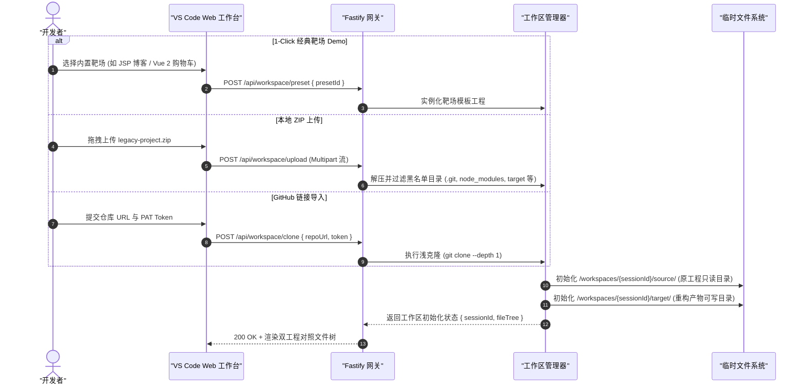
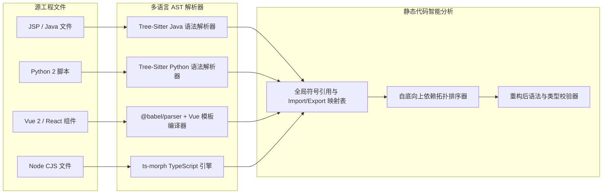
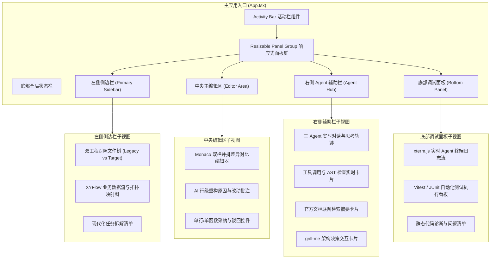

# 📐 系统架构与运行时规范 (System Architecture & Runtime)

<p align="center">
  <a href="../architecture.md">English Version</a> | <a href="./architecture.md">简体中文版</a>
</p>

---

## 1. 系统全景与分层架构

**Legacy Code Modernizer** 是一个基于 **Node.js 24 LTS** 与 **DeepSeek-v4-pro** 的高吞吐、事件驱动全栈系统。展示层与 Agent 执行核心通过 RESTful API 与 Server-Sent Events (SSE) 保持双向解耦与实时流式互通。

```mermaid
graph TD
    subgraph ClientLayer ["用户展示层 (VS Code Web 工作台)"]
        UI["React 19 + Vite 现代化应用"]
        Panels["react-resizable-panels 布局引擎"]
        Monaco["Monaco Diff 双栏差异编辑器"]
        Xterm["xterm.js 实时流式控制台"]
        Flow["XYFlow 业务依赖拓扑图"]
        UI --> Panels
        Panels --> Monaco
        Panels --> Xterm
        Panels --> Flow
    end

    subgraph NetworkLayer ["传输与实时推送层"]
        REST["RESTful API: 代码库导入、配置、PR 触发"]
        SSE["Server-Sent Events: 实时推送 Agent 思考与 Diff 流"]
        UI <-->|JSON / Multipart| REST
        UI <--|text/event-stream| SSE
    end

    subgraph BackendRuntime ["Node.js 24 LTS 后端核心运行时"]
        Gateway["Fastify 高性能 HTTP & SSE 网关"]
        REST --> Gateway
        Gateway --> SSE

        subgraph WorkspaceManager ["工作区与数据安全隔离"]
            WM["会话级临时工作区控制器"]
            FS_Source["/workspaces/:id/source (只读原工程)"]
            FS_Target["/workspaces/:id/target (现代化产物)"]
            WM --> FS_Source
            WM --> FS_Target
        end

        subgraph AgentCore ["自主 Agent 协同调度引擎"]
            Orch["ReAct 多 Agent 分发调度器"]
            Arch["🧠 架构与业务全景分析师"]
            Trans["🛠️ 现代代码重构工程师"]
            Test["🧪 业务保真与测试工程师"]
            Orch --> Arch
            Orch --> Trans
            Orch --> Test
        end

        subgraph LLM_Layer ["LLM 推理与上下文缓存层"]
            DS["DeepSeek-v4-pro 推理引擎"]
            Cache["Prompt Caching 静态前缀锁定"]
            Cache --> DS
        end

        Arch <--> LLM_Layer
        Trans <--> LLM_Layer
        Test <--> LLM_Layer

        subgraph ASTToolchain ["确定性 AST 与静态分析工具链"]
            TS["Tree-Sitter 多语言统一解析引擎"]
            Babel["@babel/parser 与 @babel/traverse"]
            Morph["ts-morph TypeScript 编译器"]
            VueCompiler["vue-template-compiler 与 @vue/compiler-sfc"]
        end

        subgraph VerificationSandbox ["轻量测试与验证沙箱"]
            Runner["进程沙箱与测试执行器"]
            Vitest["Vitest / Jest 运行器"]
            PyTest["PyTest Python 运行器"]
            JUnit["JUnit 5 测试套件驱动"]
            Runner --> Vitest
            Runner --> PyTest
            Runner --> JUnit
        end

        Gateway --> WM
        Gateway --> Orch
        Orch --> ASTToolchain
        Orch --> VerificationSandbox
    end

    subgraph CloudVCS ["外部生态与代码托管平台"]
        GitHub["GitHub REST / GraphQL API - PR 提交"]
        WebDoc["官方文档检索 CDN / 搜索引擎 API"]
        Gateway <--> GitHub
        Orch <--> WebDoc
    end
```

---

## 2. 仓库导入与工作区会话隔离时序

为确保代码绝对安全与重构前后的对照完整性，每次导入均生成独立的会话工作区目录：



---

## 3. 多语言 AST 解析与静态分析流水线

后端结合底层 Tree-Sitter 与专用编译器，实现高保真语法树解析与符号映射：



---

## 4. 前端 VS Code 风格工作台组件架构


