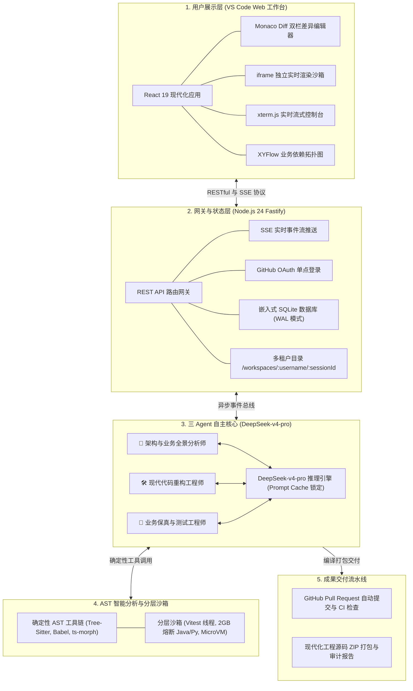
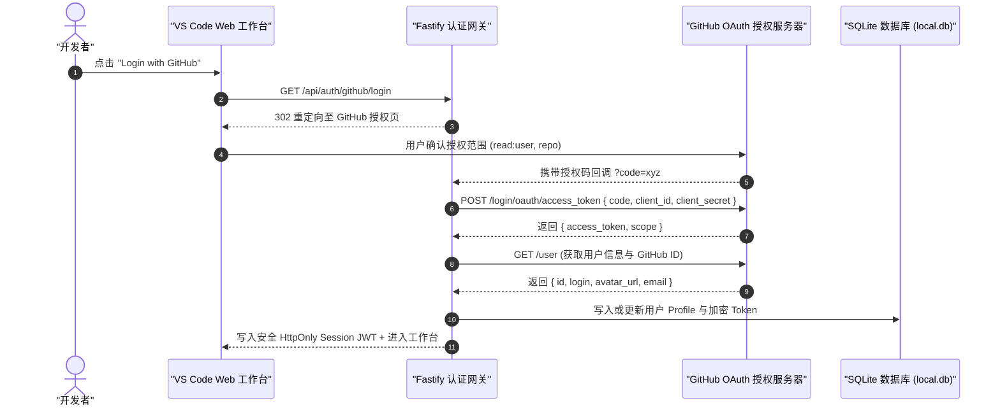
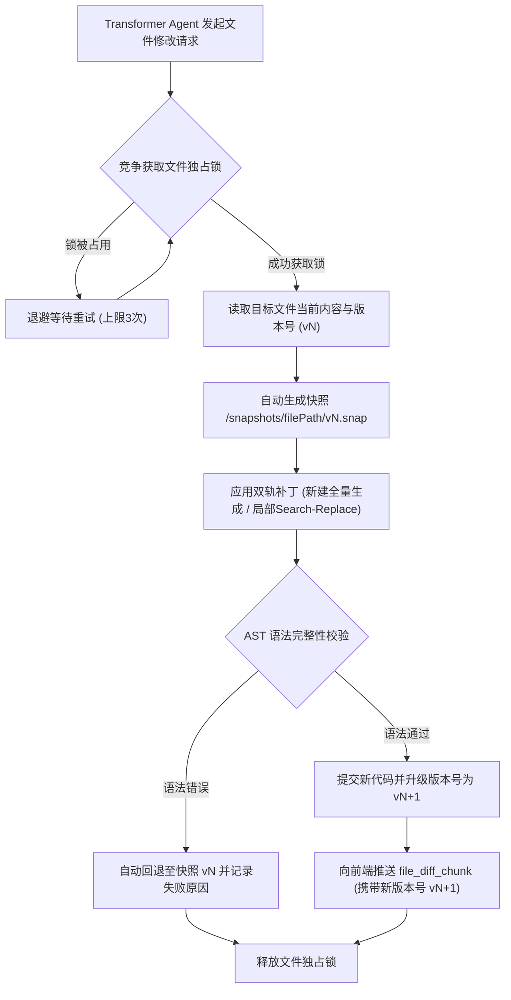
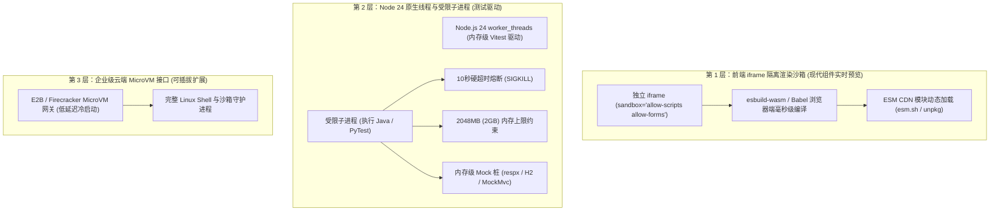
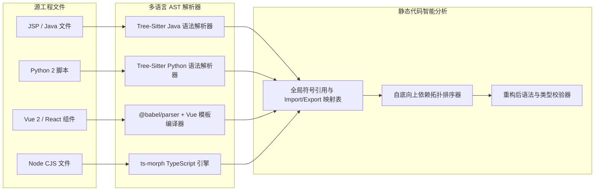
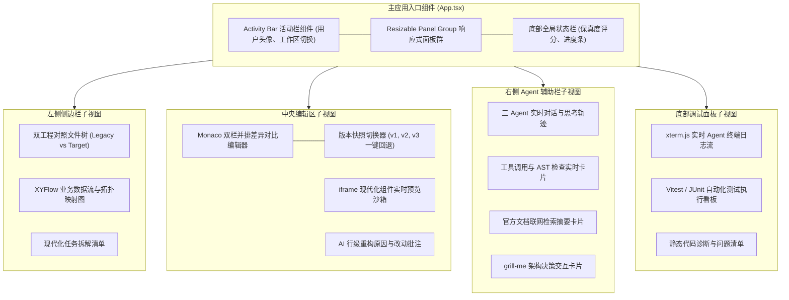

# 📐 系统架构与运行时规范 (System Architecture & Runtime)

<p align="center">
  <a href="../architecture.md">English Version</a> | <a href="./architecture.md">简体中文版</a>
</p>

---

## 1. 系统全景与分层架构

**Legacy Code Modernizer** 是一个基于 **Node.js 24 LTS** 与 **DeepSeek-v4-pro** 的高吞吐、事件驱动全栈系统。展示层与 Agent 执行核心通过 RESTful API 与 Server-Sent Events (SSE) 保持双向解耦与实时流式互通。



---

## 2. GitHub OAuth 统一认证与 SQLite 存储架构

系统采用 **GitHub OAuth 一键单点登录 (SSO)**。用户无需手动生成或配置 GitHub Personal Access Token (PAT)，OAuth 鉴权成功后系统即可直接以用户身份安全拉取私有代码库并自动创建 PR：



### 2.1 嵌入式 SQLite 数据库表结构 (`local.db`)

```sql
-- 用户表与偏好设置
CREATE TABLE IF NOT EXISTS users (
    id TEXT PRIMARY KEY,
    github_id INTEGER UNIQUE NOT NULL,
    username TEXT NOT NULL,
    avatar_url TEXT,
    access_token TEXT NOT NULL,
    deepseek_api_key TEXT, -- 用户绑定的专属 DeepSeek API 密钥 (加密存储)
    deepseek_base_url TEXT DEFAULT 'https://api.deepseek.com/v1',
    created_at DATETIME DEFAULT CURRENT_TIMESTAMP,
    updated_at DATETIME DEFAULT CURRENT_TIMESTAMP
);

-- 工作区元数据表
CREATE TABLE IF NOT EXISTS workspaces (
    id TEXT PRIMARY KEY,
    user_id TEXT NOT NULL,
    name TEXT NOT NULL,
    track TEXT NOT NULL, -- 'jsp_spring', 'python', 'vue_react', 'node'
    source_type TEXT NOT NULL, -- 'preset_demo', 'zip_upload', 'github_repo'
    repo_url TEXT,
    status TEXT DEFAULT 'initialized', -- 'scanning', 'transforming', 'verifying', 'completed'
    fidelity_score REAL,
    created_at DATETIME DEFAULT CURRENT_TIMESTAMP,
    updated_at DATETIME DEFAULT CURRENT_TIMESTAMP,
    FOREIGN KEY(user_id) REFERENCES users(id) ON DELETE CASCADE
);

-- 文件快照与审计日志表
CREATE TABLE IF NOT EXISTS file_snapshots (
    id INTEGER PRIMARY KEY AUTOINCREMENT,
    workspace_id TEXT NOT NULL,
    file_path TEXT NOT NULL,
    version INTEGER NOT NULL,
    patch_type TEXT NOT NULL, -- 'whole_file', 'search_replace'
    snapshot_path TEXT NOT NULL,
    created_at DATETIME DEFAULT CURRENT_TIMESTAMP,
    FOREIGN KEY(workspace_id) REFERENCES workspaces(id) ON DELETE CASCADE
);
```

### 2.2 用户端自主输入与安全持久化机制 (BYOK & Persistent Storage)

为保障多用户环境下的密钥安全、防止浏览器刷新/切换设备导致上下文丢失，并支持长耗时后台 Agent 任务连续运行，系统采用 **“前端设置 + SQLite 用户表安全入库”双层持久化机制**：
- **用户自主输入 (BYOK)**：用户在 VS Code 工作台顶栏设置弹窗中输入自己的 `DEEPSEEK_API_KEY`（与可选自定义 Base URL），通过 `POST /api/user/settings` 保存；
- **SQLite 用户级加密持久化**：密钥写入当前登录用户的 SQLite `users.deepseek_api_key` 字段（结合服务端 `JWT_SECRET` 加密），与用户的 GitHub 账号终身绑定。即使用户刷新浏览器、更换电脑或清除浏览器缓存，登录后依然无缝读取，保证长耗时重构任务不中断；
- **会话级客户端实例化**：后端在执行 Agent 任务时，按用户 ID 动态取出对应的专属密钥实例化 `OpenAI` 客户端，实现多租户之间严格的算力与账单隔离；
- **服务端全局兜底配置**：后端 `.env` 中的 `DEEPSEEK_API_KEY` 仅作为可选的全局演示兜底配置（例如为未绑卡评委体验 1-Click Demo 准备）。

---

## 3. 多租户物理双工程隔离与映射对照树规范

### 3.1 物理磁盘双工程隔离架构 (前后端分离标准工程范例)
系统在底层采用 **`/source` (只读老工程基准) + `/target` (独立现代化新工程)** 双目录隔离架构。以典型的**“Vue 2 + Spring Boot 1.5/Java 8 老旧前后端分离系统”升级至“Vue 3/TS + Spring Boot 3/Java 21 现代前后端分离系统”**为例，真实磁盘目录结构如下：

```text
/workspaces/:username/:sessionId/
   ├── /source/                                # 🔴 原始老工程 (严格只读 Read-Only，黄金真理源)
   │     ├── frontend/                         # 老前端工程 (Vue 2 + Webpack + Options API)
   │     │    ├── src/
   │     │    │    ├── views/Login.vue
   │     │    │    └── store/index.js
   │     │    ├── package.json
   │     │    └── vue.config.js
   │     └── backend/                          # 老后端工程 (Spring Boot 1.5 + Java 8 + javax.*)
   │          ├── src/main/java/com/example/
   │          │    ├── controller/UserController.java
   │          │    └── model/User.java
   │          └── pom.xml
   │
   ├── /target/                                # 🟢 现代化新工程 (可写 Mutable，独立全新工程骨架)
   │     ├── frontend/                         # 现代化前端工程 (Vue 3 + Vite 6 + Pinia + TS)
   │     │    ├── src/
   │     │    │    ├── views/LoginView.vue     # 升级为 <script setup lang="ts">
   │     │    │    └── stores/user.ts          # 升级为 Pinia 状态 Store
   │     │    ├── package.json
   │     │    ├── vite.config.ts
   │     │    └── tsconfig.json
   │     ├── backend/                          # 现代化后端工程 (Spring Boot 3.4 + Java 21 + Jakarta)
   │     │    ├── src/main/java/com/example/
   │     │    │    ├── controller/UserController.java  # 迁移为 Jakarta REST API
   │     │    │    └── model/UserRecord.java           # 升级为 Java 21 Record DTO
   │     │    ├── src/test/java/com/example/           # 自动合成的 JUnit 5 单元测试
   │     │    │    └── controller/UserControllerTest.java
   │     │    └── pom.xml                              # Spring Boot 3.4 依赖清单
   │     ├── MODERNIZATION_REPORT.md           # 全景审计与重构报告
   │     └── .github/workflows/ci.yml          # 预检通过的统一 CI 自动化流水线
   │
   └── /snapshots/                             # 🛡️ 文件版本快照 (记录 target 的 v1, v2 快照，用于一键回退)
```

### 3.2 左侧 Explorer 映射对照树 (Mapping Tree View)
工作台左侧 Explorer 严格按照**“前后端模块分级 ➔ 业务功能 ➔ 新老映射条目”**组织映射对照树：

```text
▼ 🌐 前端模块 (Frontend: Vue 2 Options ➔ Vue 3 Setup + TS)
   ▼ 📦 认证与会话 (Auth & Session)
      ├── 📄 [Old] frontend/src/views/Login.vue  ➔  📄 [New] frontend/src/views/LoginView.vue
      └── 📄 [Old] frontend/src/store/index.js   ➔  📄 [New] frontend/src/stores/user.ts
   ▼ ⚙️ 工程构建配置 (Build Config)
      └── 📄 [Old] frontend/vue.config.js        ➔  📄 [New] frontend/vite.config.ts

▼ ☕ 后端模块 (Backend: Spring Boot 1.5/Java 8 ➔ Spring Boot 3/Java 21)
   ▼ 📦 控制器与接口 (Controllers & APIs)
      ├── 📄 [Old] backend/src/.../UserController.java  ➔  📄 [New] backend/src/.../UserController.java
      └── 📄 [Old] backend/src/.../User.java            ➔  📄 [New] backend/src/.../UserRecord.java
   ▼ 🧪 自动化测试验证 (Synthesized Tests)
      └── ✨ [Generated] backend/src/test/.../UserControllerTest.java
```
- **交互联动**：点击任意一行映射条目，中央编辑器自动切换为 Monaco 双栏 Diff 视图（左侧载入 `/source/...` 原文件，右侧载入 `/target/...` 目标文件）。

---

## 4. 代码版本快照与文件并发锁控制引擎



---

## 5. 分层执行与实时渲染沙箱架构 (借鉴 Claude Artifacts)



---

## 6. 多语言 AST 解析与静态分析流水线



---

## 7. 前端 VS Code 风格工作台组件架构



---

## 8. 双通道成果交付与导出流水线 (Dual-Channel Delivery Pipeline)

重构与 CI 预检绿灯后，工作台右侧结算面板与顶栏提供双通道交付出口：

| 交付通道 | 触发方式 | 底层实现细节 | 交付产物 |
| :--- | :--- | :--- | :--- |
| **通道 1：1-Click GitHub PR** | 点击 `🚀 创建 GitHub Pull Request` | 基于用户 OAuth `access_token`，自动在远程仓库创建 `modernize/<timestamp>` 分支，并推送 `/target` 全部代码与 CI 工作流 | 包含完整 Changelog 的 GitHub PR + 自动触发的 GitHub Actions CI |
| **通道 2：1-Click 本地 ZIP 下载** | 点击 `📦 下载现代化工程包 (ZIP)` | 后端将 `/target` 目录（含目标源码、测试套件、`MODERNIZATION_REPORT.md` 与 `.github/workflows/ci.yml`）压缩流式推送到浏览器 | 完整、可独立执行构建的 `.zip` 压缩包 |

