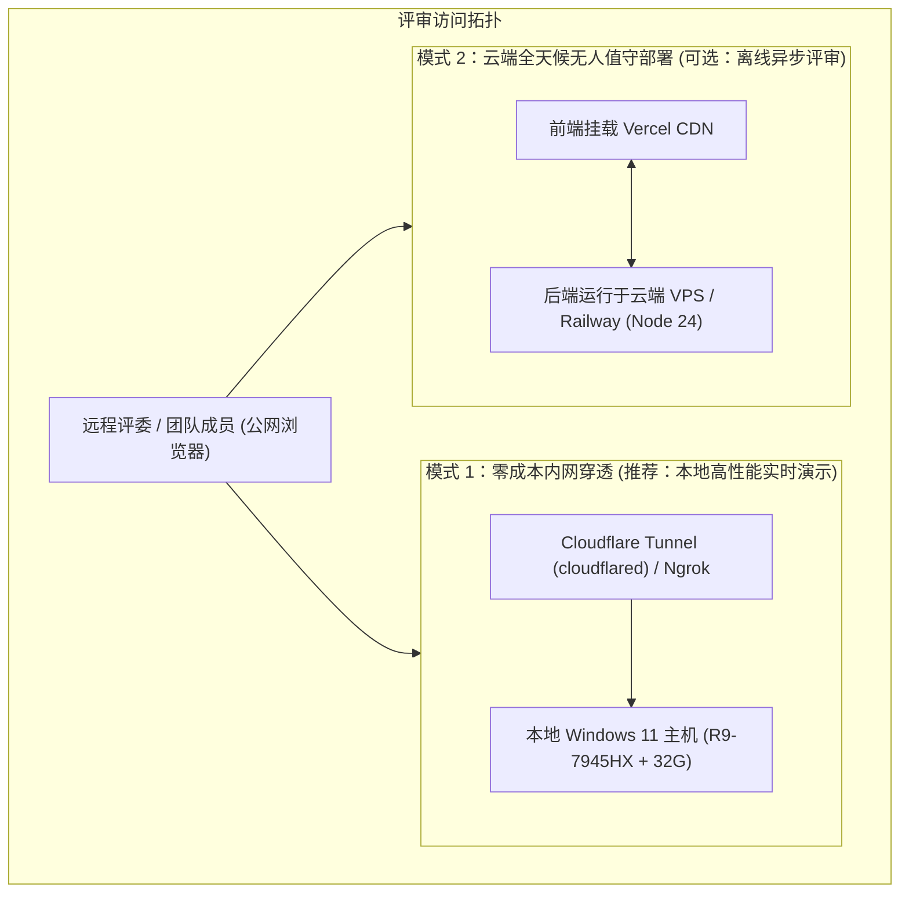

# 🌐 公网部署与内网穿透规范 (Deployment & Tunneling)

<p align="center">
  <a href="../deployment-and-tunneling.md">English Version</a> | <a href="./deployment-and-tunneling.md">简体中文版</a>
</p>

---

## 1. 访问拓扑与模式选型

在黑客松现场答辩、评委远程评审或多端协同场景下，系统支持两种公网访问架构：



---

## 2. 模式 1：内网反向穿透配置指引 (Cloudflare Tunnel 与 Ngrok)

### 2.1 Cloudflare Tunnel (首选推荐：免费、HTTPS 证书健全、全球 CDN)
Cloudflare Tunnel 采用由内向外的加密出站隧道直连 Cloudflare 边缘节点，**无需公网 IP**，**无需路由器端口映射**，且**自带合规 SSL/TLS 证书**。

#### 步骤 1：在 Windows 上安装 `cloudflared`
```powershell
winget install --id Cloudflare.cloudflared
```

#### 步骤 2：生成临时快速隧道 (即开即用)
确保本地前端 (`5173`) 与后端 (`4000`) 正常运行后，执行：
```powershell
# 穿透前端端口 (前端已通过 Vite 反代 /api 请求至 4000 后端)
cloudflared tunnel --url http://localhost:5173
```
*终端将输出随机分配的合规公网域名（例如 `https://random-words.trycloudflare.com`），直接复制发给评委即可打开。*

#### 步骤 3：绑定自定义域名 (正式比赛展示)
若持有自定义域名（如 `demo.yourdomain.com`）：
```powershell
cloudflared tunnel login
cloudflared tunnel create modernizer-tunnel
cloudflared tunnel route dns modernizer-tunnel demo.yourdomain.com
cloudflared tunnel run modernizer-tunnel
```

---

### 2.2 Ngrok 备用穿透通道
若遇到特定区域的网络策略限制，可使用 Ngrok 作为即时降级通道。

#### 步骤 1：安装与鉴权
```powershell
winget install --id Inconshreveable.Ngrok
ngrok config add-authtoken <你的_NGROK_TOKEN>
```

#### 步骤 2：启动穿透
```powershell
ngrok http 5173
```

---

## 3. 本地主机保活与电源策略防断连

采用内网穿透时，流量实时转发至本地电脑。为防止评审期间电脑休眠导致断连：

1. **电源策略配置**：
   - 进入 `Windows 设置 > 系统 > 电源与电池 > 屏幕和睡眠`，将“接通电源时，使我的设备进入睡眠状态”设置为 **“从不”**。
2. **终端保活工具**：
   - 开启 Windows PowerToys 的 **“Awake (保持唤醒)”** 模块，防止屏幕锁屏后网卡降频。

---

## 4. 模式 2：云端全天候托管方案 (可选备用)

若评委要求在本地电脑关机后依然能 24 小时随时访问：

| 模块组件 | 推荐托管平台 | 构建/启动命令 | 运行时环境 |
| :--- | :--- | :--- | :--- |
| **前端工作台** | Vercel / Cloudflare Pages | `pnpm build` | 边缘静态 CDN |
| **后端 Agent 运行时** | Railway / Render / 轻量云 VPS | `pnpm start` | Node.js 24 LTS |
