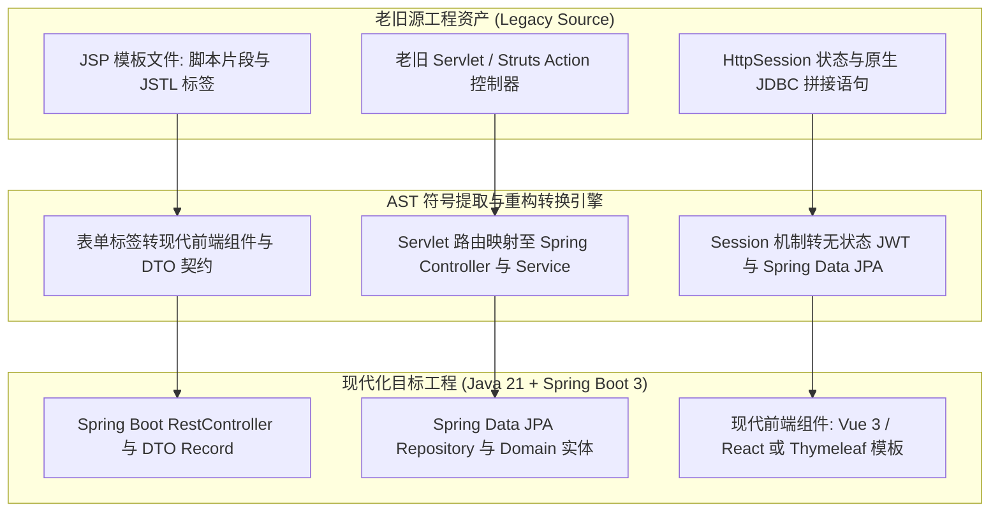
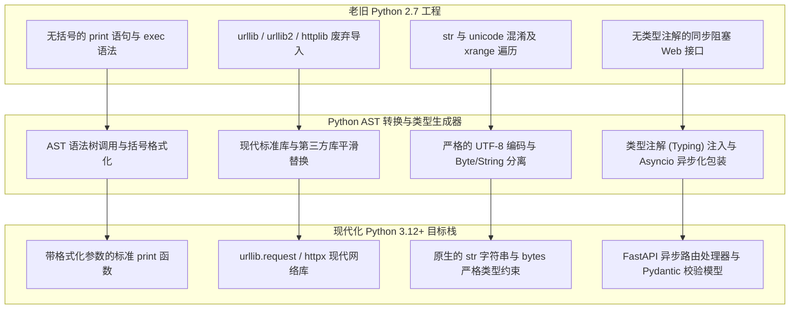
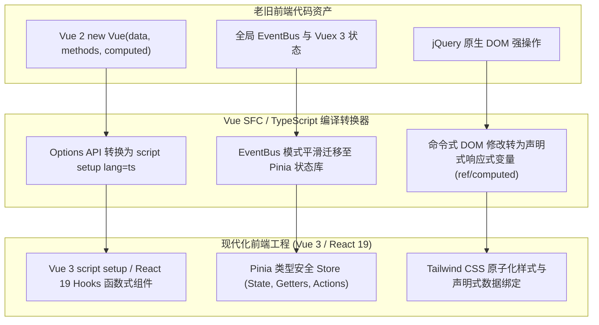
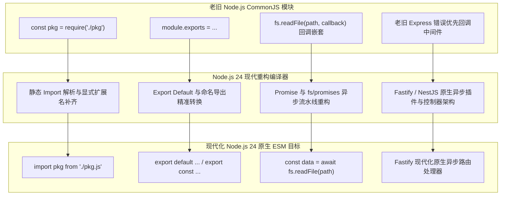

# 🗺️ 现代化赛道与转换矩阵 (Modernization Tracks & Migration Matrix)

  <a href="../migration-matrix.md">English Version</a> | <a href="./migration-matrix.md">简体中文版</a>

---

## 1. 赛道一：JSP ➔ Java 21 / Spring Boot 3 & 现代 Web

### 核心转换规则与业务保真守卫
- **脚本解耦（Scriptlet Decoupling）**：严格提取 `<% ... %>` 中的业务逻辑，封装为高内聚的 Spring `@Service` 业务方法。
- **表单对象绑定**：将 `<form action="...">` 与 `<jsp:useBean>` 映射为 Java 21 `record` 强类型 DTO，自动注入 `@Valid` 与 Jakarta 校验注解。
- **SQL 注入防范**：将字符串拼接的 `Statement.executeQuery("SELECT ... " + id)` 彻底重构为 Spring Data JPA 参数化查询或 ORM 方法。

---

## 2. 赛道二：Python 2.7 ➔ Python 3.12+ & FastAPI 异步化

### 核心转换规则与业务保真守卫
- **语法升级**：`print "text"` ➔ `print("text")`，`except Exception, e` ➔ `except Exception as e`。
- **标准库与依赖升级**：`urllib2` ➔ `httpx` / `urllib.request`；`Queue` ➔ `queue`；`ConfigParser` ➔ `configparser`；清除 `six` 过渡依赖。
- **字符串与字节流安全**：在文件操作与网络 Socket 交互处严格补齐 `encode('utf-8')` 与 `decode('utf-8')`，杜绝 Python 3 隐式 `TypeError`。

---

## 3. 赛道三：Vue 2 / React Class / jQuery ➔ Vue 3 / React 19 + TypeScript

### 核心转换规则与业务保真守卫
- **响应式重构**：将 `this.someData` 映射为 `ref()` / `reactive()`，并声明严格的 TypeScript Interface。
- **生命周期映射**：`beforeDestroy` ➔ `onBeforeUnmount`，`destroyed` ➔ `onUnmounted`，`mounted` ➔ `onMounted`。
- **插槽语法规范化**：将废弃的 `slot="header"` 与 `slot-scope="props"` 升级为现代 `#header="props"`。

---

## 4. 赛道四：Node CommonJS / 回调地狱 ➔ 原生 ESM & Node.js 24 LTS

### 核心转换规则与业务保真守卫
- **显式扩展名补齐**：Node.js 官方原生 ESM 规范要求相对路径导入必须附带 `.js` 或 `.ts` 扩展名。
- **顶级 Await 利用**：合理利用 Node 24 原生 Top-Level Await 简化数据库与配置的初始化启动流程。
- **消除回调嵌套**：使用 `node:fs/promises`、`node:stream/promises` 与 `node:util.promisify` 将回调金字塔彻底扁平化为 `async/await`。
